---

class: invert

---

# Willkommen bei Techstarter!

---

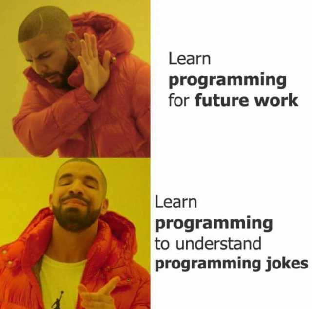

---

## Agenda

1. Euer Trainer Team
2. Was erwartet euch?
3. Was wird von euch erwartet?

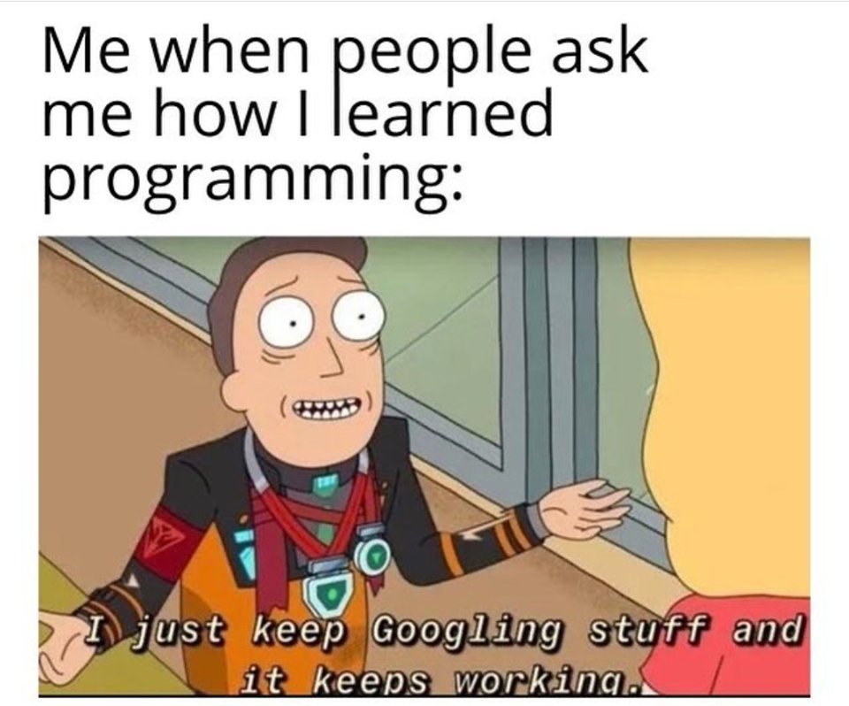

---

## Euer Trainer Team

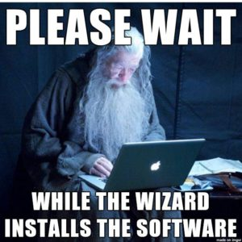

---

## Fabio: Lead Full-Stack Developer / DevOps Engineer

---

### Fabio: Mein Lebenslauf

- Aus Baden-Württemberg
- Eigentlich Musik gelernt (Gitarre, Klavier, Elektronische Musik Produktion)
- **Auch Quereinsteiger**: Selbst Programmieren gelernt
- Seit 2019 professionell in der IT-Branche
- Start als Frontend-Entwickler bei einem Raspberry Pi Online Shop
- Full-Stack Developer (PHP) dann Team Lead
- Durch Interesse in den DevOps / Cloud Bereich gewechselt
- Außerdem noch Senior DevOps Engineer bei einem AI/ML Startup
- Besitze alle AWS Associate Zertifikate

---

### Sound Engineer

---

### Musik Hardware Projekte

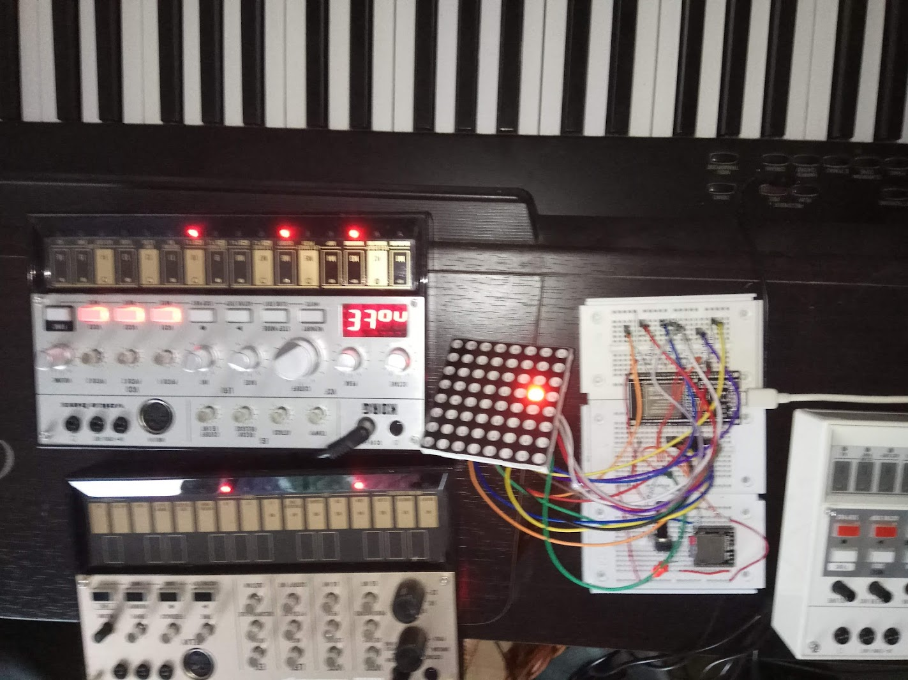

---

### Quereinstieg als Frontend Entwickler

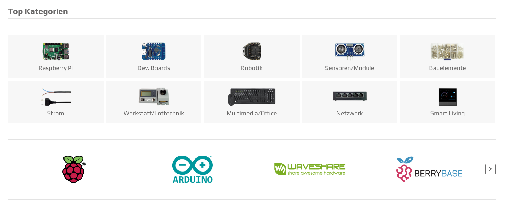

---

### Entwicklung einer Embedded Logistik Lösung

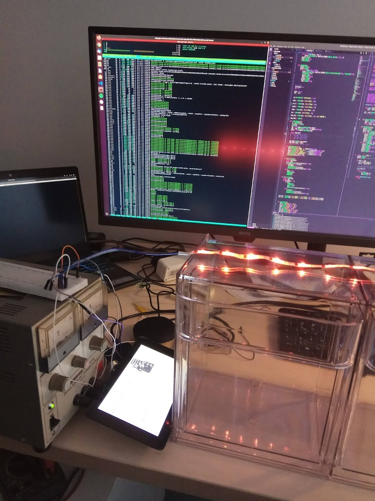

---

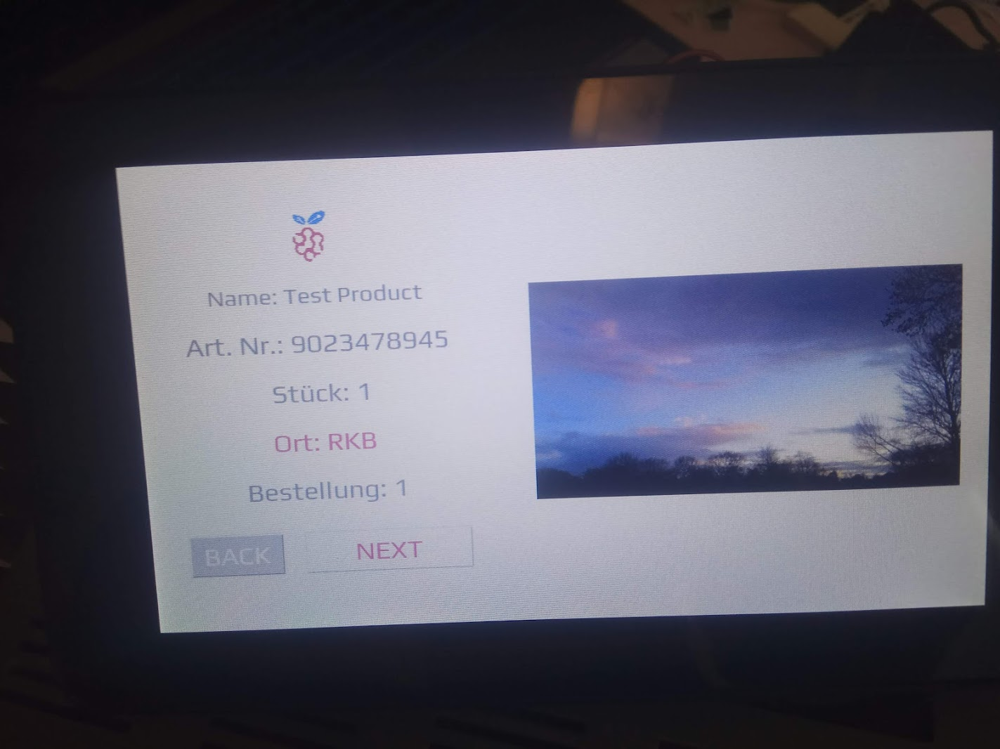

---

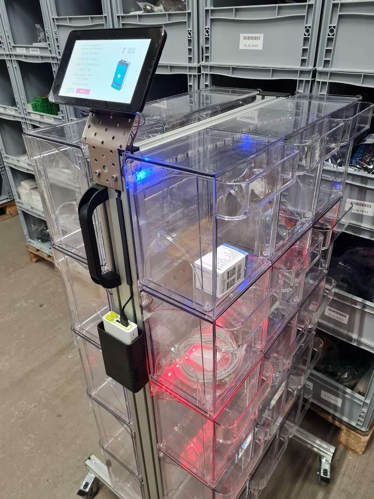

---

### Cloud Consulting

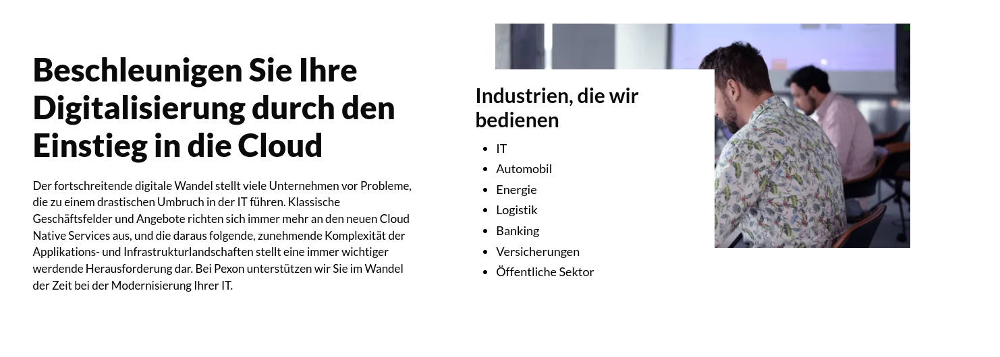

---

### AI/ML Startup

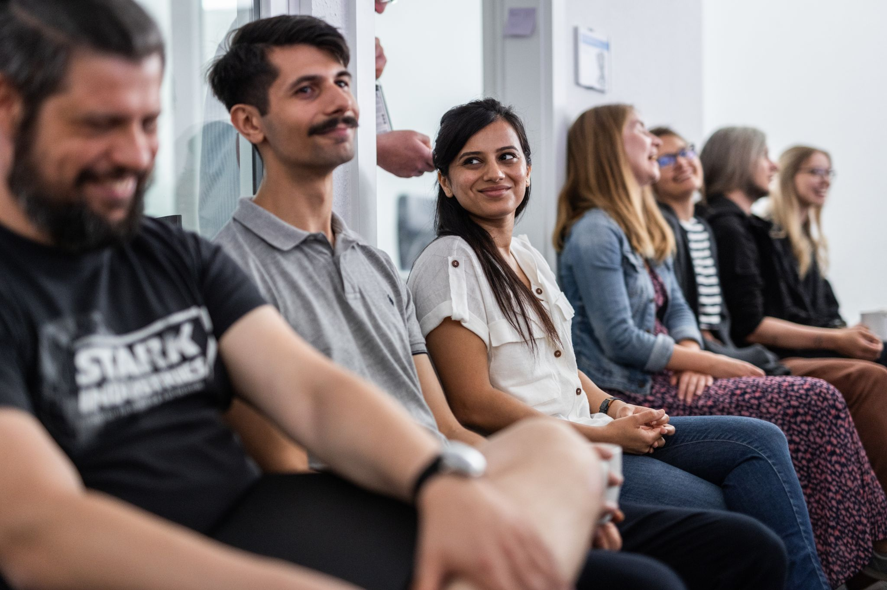

---

## Hani: Junior IT Trainer

---

## Was erwartet euch?

- **Intensives Training**: 1 Jahr; 7.5 Stunden pro Tag
- **Praxisorientiert**: ca. 70% Praxis, 30% Theorie
- **Orientierung an der Realität**: Projekte, die in der echten Welt vorkommen
- **Ziel**: Ihr sollt nach dem Training in der Lage sein, in einem Unternehmen zu arbeiten
- **Möglichkeit sich in verschiedene Richtungen zu entwickeln**: Frontend, Backend, DevOps, Cloud, AI/ML, ...

---

### Basics

- **Kurs**:
  - **Montag - Freitag** 
  - von **9:00 - 13:00**
  - und **13:30 - 17:00**
- **Pausen**
  - ca **10:30 - 10:45**
  - **13:00 - 13:30**
- **Feiertage in Bayern gelten**

---

### Inhalt

Insgesamt **3 Module**:

1. Grundlagen Computer, IT & Cloud Computing
2. Agile Softwareentwicklung in der Cloud
3. Cloud Automatisierung

---

#### Modul 1: Grundlagen Computer, IT & Cloud Computing

Technische Grundlagen der IT:

- mathematische und technische Grundlagen
- Linux Grundlagen
- IT Netzwerke
- Cybersecurity
- Python Basics,
- Datenbanken,
- Einführung in das Cloud Computing

AWS Basics:

- Jumpstart AWS
- Prüfungsvorbereitung AWS Cloud Practitioner Prüfung

---

#### Modul 2: Agile Softwareentwicklung in der Cloud

**Grundlagen der Programmierung**

- agile Softwareentwicklung mit Scrum
- Versionsverwaltung mit Git
- statische Website mit HTML und CSS
- Internet Protokolle
- HTTP Server
- Prototypen erstellen
- Frontends für das Web entwickeln
- JavaScript Programmierung
- Webentwicklung mit NodeJS
- Web Apps mit React entwickeln

---

**Softwaretesting**

- Unit Testing mit JestJS
- Testautomatisierung mit Selenium
- ISTQB Basics für CTFL
- Prüfungsvorbereitung CTFL

---

**Praxis 1: Web App Development**

**API Design: API Design mit Postman**

**Observability and Analysis**

- Grafana Basics
- Prometheus Basics

---

**Microsoft Azure Cloud**

- Microsoft Azure Basics
- Vergleich & Gegenüberstellung AWS und Microsoft Azure
- Microsoft Azure Prüfungsvorbereitung

---

#### Modul 3: Cloud Automatisierung

**Methodische Grundlagen DevOps: DevOps Basics**

**Containerisierung: Docker**

**Container Orchestrierung**

- Übersicht Container Orchestrierung
- Kubernetes

---

**Infrastructure as Code (IaC)**

- Terraform
- Ansible

**CI/CD**

- CICD Grundlagen
- CICD mit Jenkins
- CICD mit Github Actions

**PRAXIS 2: Abschlussprojekt**

---

### Was wird von euch erwartet?

- **Motivation**: Ihr müsst motiviert sein, um das Training zu schaffen
- **Eigeninitiative**: Um wirkling Experte in einem Bereich zu werden, müsst ihr auch selbstständig lernen
- **Teamarbeit**: Ihr seit ein Team und solltet euch gegenseitig unterstützen
- **Kommunikation**: Ihr müsst eure Gedanken und Ideen kommunizieren
- **Fragen**: Ihr sollt Fragen stellen, wenn ihr etwas nicht versteht

---

## Fragen?

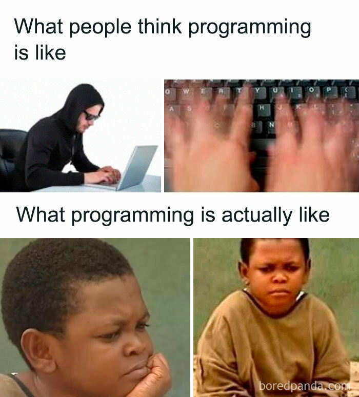
