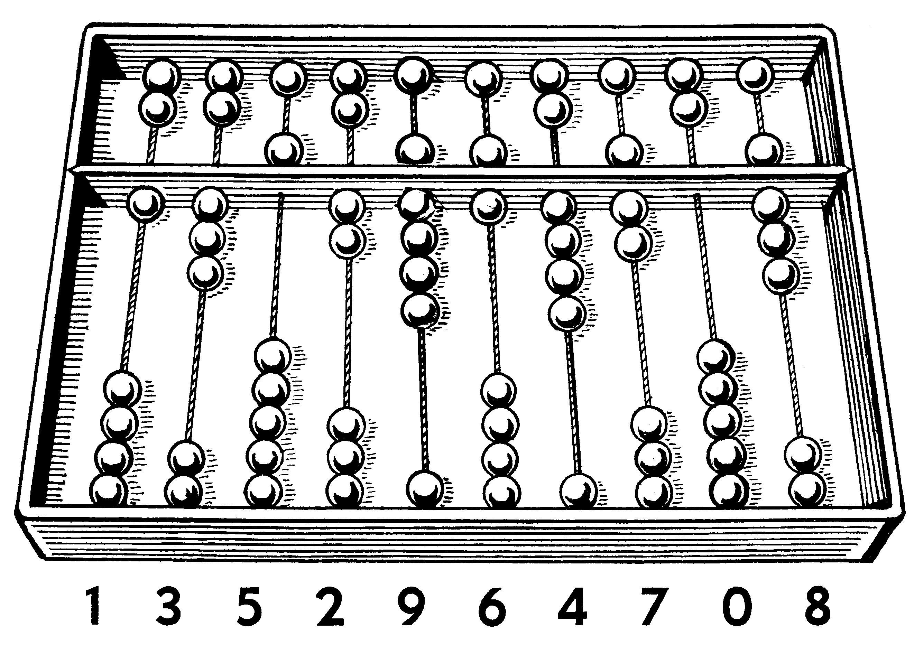

---

class: invert

---

# Einführung in die Informatik

## Was ist ein Computer?

---

---

## Einleitung

- Willkommen in der Welt der Informatik!

- Informatik ist wie Zauberei kennenlernen – sie erklärt, wie Computerinformationssysteme realen Problemen den Kampf ansagen.

---

# Geschichte der Computer

---

## Prähistorische Rechnen und Maschinen

1. Spring mit uns in die Zeitmaschine zurück, als Zahlen noch mystisch waren.
2. Staun über den Abakus – eine uralte Rechenmaschine, die mit Perlen und Drähten arbeitet.

---

## Erfindungen vor dem Digitalcomputer

1. Entdecke Charles Babbage, den Erfinder der "Analytical Engine".
2. Seine Maschine war ein Vorläufer des modernen Computers.
3. Stell dir vor: Eine Maschine, die Zahlen berechnen kann!

---

## Geburt des Digitalcomputers

1. Nach dem Krieg kamen die ersten digitalen Computer. ENIAC war einer der ersten.
2. Stell dir vor: Frühe Computer waren riesige Räume voller Technik!

---

---

## Entwicklung von Programmiersprachen

1. Mit besserer Hardware kam die Software.
2. Stell dir vor: Hardware ist der Körper, Software die Seele.
3. Von Assembly bis C – jede neue Sprache war ein großer Schritt vorwärts.

---

## Moderne Computer und technologische Fortschritte

1. Jetzt sind Computer überall: In Taschen, Autos, sogar Kühlschränken!
2. Unsere Welt ist vernetzt, Clouds speichern unsere Daten, und Algorithmen managen Städte.

---

# Bestandteile eines Computers

## Einführung in die Hardware

---

### Computer Hardware: Übersicht

1. Hardware sind die Teile, die du anfassen kannst: Tastatur, Monitor, Maus.
2. Jedes Teil hat seine Funktion, genau wie Organe in einem Körper.

---

### Central Processing Unit (CPU)

Deutsch: Zentrale Verarbeitungseinheit

1. Die CPU ist das Gehirn, das alles steuert und berechnet.
2. Es führt Millionen von Operationen pro Sekunde durch!
3. Denk an die CPU wie an einen Taschenrechner – sie macht die Berechnungen.

---

### Random-Access Memory (RAM)

Deutsch: Arbeitsspeicher

1. RAM ist der Arbeitsplatz des Computers, wo er aktuelle Infos speichert.
2. Je mehr RAM, desto mehr kannst du gleichzeitig machen.
3. Denk an RAM wie an einen Schreibtisch – je größer, desto mehr Platz für Arbeit.

---

### Speicherung von Daten: Festplatten, SSD und mehr

1. Daten werden auf Festplatten gespeichert, wie Bücher in einem Regal.
2. SSDs sind wie elektronische Schubladen – schneller und sicherer.
3. Je mehr Speicher, desto mehr kannst du speichern.
4. Je größer das Bücherregal, desto mehr Bücher kannst du aufbewahren.

---

---

## Einführung in die Software

---

### Was ist Software?

1. Software ist, was dem Computer sagt, was er tun soll – wie ein Dirigent einem Orchester.
2. Ohne Software kann Hardware nichts machen.
3. Software ist wie ein Kochrezept – es sagt dem Computer, was er tun soll.

---

### Betriebssysteme: Windows, Linux und macOS

1. Betriebssysteme sind wie Büromanager, die sicherstellen, dass alles reibungslos läuft.
2. Sie sind die Schnittstelle zwischen dir und der Hardware.
3. In der Consumer Welt sind Windows und MacOs die bekanntesten.
4. In der Industrie ist Linux weit verbreitet (vorallem auf Servern).
5. Betriebssysteme bestehen aus mehreren Komponenten, die zusammenarbeiten.
6. Wichtig ist hier vorallem der Kernel, der die Hardware steuert.

---

### Anwendungssoftware und Utilities

1. Anwendungssoftware sind Programme wie Textverarbeiter oder Spiele.
2. Sie sind wie Werkzeuge, die uns helfen, Aufgaben zu erledigen.

---

## Die verschiedenen Arten von Computern

---

### Für spezielle Zwecke entworfene "Embedded" Computer

---

#### Was sind "Embedded" Computer?

1. Embedded Computer sind in Geräte integriert und erledigen spezielle Aufgaben.
2. Sie sind wie fleißige Helfer, die im Hintergrund arbeiten.
3. Meistens sind sie eher Low-Power und haben spezielle Anforderungen.
4. Oft sind sie auf eine spezielle Aufgabe zugeschnitten.

---

#### Aufgaben und Anwendungen

1. Sie steuern Ampeln, medizinische Geräte und sogar Autos.
2. Embedded Systeme sind überall und machen unser Leben sicherer und effizienter.

---

#### Beispiele für "Embedded" Computer

1. Dein Smartphone, Smart-TV oder Auto – alles voll mit Embedded Systemen.
2. Sie sind die stillen Helden im Hintergrund.

---

### Desktopcomputer und Laptops: von Arbeitsmaschinen bis hin zu Gaming

---

#### Überblick und Schlüsselkonzepte

1. Desktops und Laptops sind die bekanntesten Computerarten.
2. Laptops sind für Unterwegs, Desktops bieten mehr Power und Flexibilität.

---

#### Desktopcomputer vs Laptops: Vor- und Nachteile

1. Die Wahl hängt von deinen Bedürfnissen ab – mobil oder leistungsstark?
2. Für Reisen sind Laptops top, für Powerjobs eher Desktops.

---

### Supercomputer: Leistung auf höchstem Niveau

---

#### Was ist ein Supercomputer?

1. Supercomputer sind die Giganten der Computerwelt, extrem leistungsfähig.
2. Sie lösen komplexe Probleme, wie Wettervorhersagen oder wissenschaftliche Forschung.

---

#### Nutzung von Supercomputern: Wissenschaft, Forschung und mehr

1. Sie helfen in der Forschung, von Biologie bis Astronomie.
2. Ihre Leistung ist enorm, weit über dem, was normale Computer können.

---

#### Beispiele und Realisierungen

1. Der Sunway TaihuLight in China ist ein Beispiel für solch eine Maschine.
2. Er kann Berechnungen durchführen, für die wir Menschen Jahre bräuchten.

---

### Server: Die unsichtbaren Helden des Internets

---

### Was ist ein Server?

1. Ein Server ist wie ein Superkellner in der digitalen Welt – immer bereit, Anfragen zu bearbeiten und Daten zu servieren.
2. Stell dir einen Server als einen Computer vor, der speziell dafür ausgelegt ist, anderen Computern Dienste und Ressourcen zur Verfügung zu stellen.

---

### Arten von Servern

1. Es gibt viele Serverarten, je nachdem, was sie tun: Webserver zeigen Webseiten an, Mailserver kümmern sich um E-Mails, und Fileserver speichern Daten.
2. Egal ob groß oder klein, Server sind die unsichtbaren Helden, die sicherstellen, dass alles online reibungslos läuft.

---

### Server im Alltagsleben

1. Jedes Mal, wenn du eine Webseite besuchst oder eine E-Mail verschickst, nutzt du einen Server.
2. Sie arbeiten Tag und Nacht, um sicherzustellen, dass du Zugriff auf deine Lieblingsseiten und -dienste hast.

---

### Server und Cloud-Computing

1. Cloud-Computing hat die Serverwelt revolutioniert. Jetzt sind Server nicht mehr nur physische Maschinen, sondern können auch virtuelle Dienste in der Cloud sein.
2. Das bedeutet mehr Flexibilität und Skalierbarkeit – du kannst mehr Leistung bekommen, wenn du sie brauchst, und weniger, wenn du sie nicht brauchst.

---

### Die Zukunft der Server

1. Mit dem Fortschritt der Technologie werden Server immer leistungsfähiger und energieeffizienter.
2. Sie spielen eine zentrale Rolle in der Entwicklung von KI, Big Data und dem Internet der Dinge (Internet of Things, IoT).

---

## On-Premise vs. Cloud

---

### Was bedeutet On-Premise?

1. On-Premise bedeutet, dass die Server physisch vor Ort in einem Unternehmen stehen. Stell dir das wie eine eigene Serverfarm im Keller deines Büros vor.
2. Bei On-Premise bist du komplett für den Kauf, die Einrichtung und Wartung der Server verantwortlich.

---

### Was bedeutet Cloud?

1. Bei Cloud-Servern mietest du Serverkapazitäten in einem entfernten Rechenzentrum. Stell dir das vor wie ein Lagerhaus voller Server, das du nach Bedarf nutzen kannst.
2. Du zahlst monatliche oder jährliche Gebühren, je nachdem, wie viel Ressourcen du nutzt.
