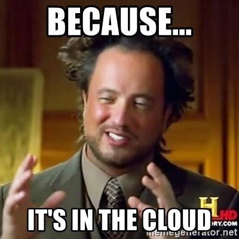
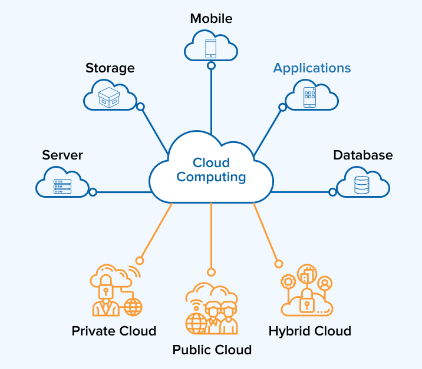
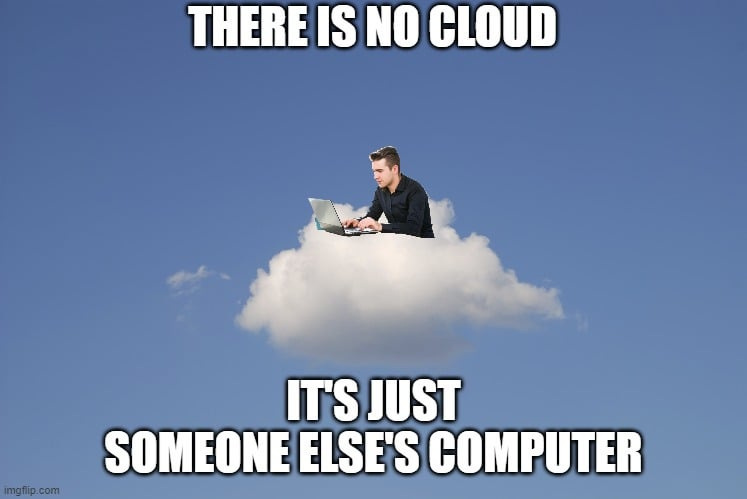
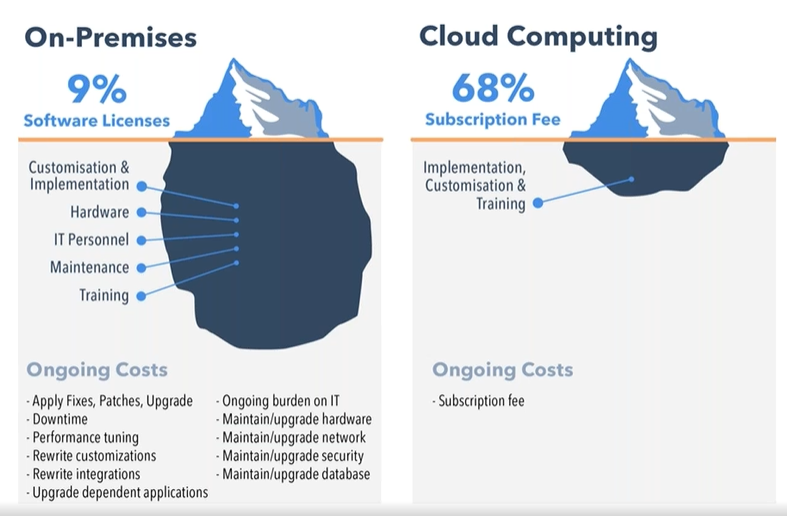

---

class: invert

---

# Einführung in Cloud Computing

---

---

## Grundlagen des Cloud Computing

### Definition von Cloud Computing

- Cloud Computing ist wie ein riesiger, unsichtbarer Computer im Himmel, den jeder nutzen kann.
- Es ermöglicht den Zugriff auf Rechenressourcen über das Internet.

---

### Vorteile des Cloud Computing

- **Flexibilität**: Wie eine Bibliothek, die dir Bücher ausleiht, statt dass du sie alle kaufen musst.
- **Skalierbarkeit**: Ähnlich wie bei einem modularen Haus, wo du bei Bedarf Zimmer hinzufügen kannst.

---

### Nachteile und Risiken des Cloud Computing

- **Datenschutzbedenken**: Wie wenn du deine persönlichen Gegenstände in einem öffentlichen Lager aufbewahrst.
- **Abhängigkeit vom Anbieter**: Als würdest du nur Werkzeuge mieten, nicht besitzen.

---

## Typen des Cloud Computing

---

### Infrastruktur as a Service (IaaS)

- Stell dir vor, du mietest ein Grundstück, auf dem du bauen kannst, was du willst.
- Miete dir auf Bedarf Rechenleistung, Speicher und Netzwerkressourcen.
- Du musst dich aber selbst noch um Updates und weitere Maintenance kümmern.
- Du musst dich nicht um die Infrastruktur aber die Software kümmern.

---

### Plattform as a Service (PaaS)

- Wie der Verleih eines komplett eingerichteten Büros, du bringst nur deinen Laptop.
- Du bekommst eine Plattform, auf der du Anwendungen entwickeln und betreiben kannst.
- Du musst nicht um die Infrastruktur und die Software kümmern, sondern nur um die Anwendung.

---

### Software as a Service (SaaS)

- Ähnlich wie Netflix: Du nutzt die Filme (Software), ohne sie besitzen zu müssen.
- Du bekommst eine fertige Anwendung, die du direkt nutzen kannst.

---

## Einführung in Public Clouds

---

### Was ist eine Public Cloud?

- Ein öffentlich zugänglicher Ort, wo Daten und Anwendungen gespeichert werden, ähnlich einer öffentlichen Bibliothek.
- Die Infrastruktur wird von einem Anbieter bereitgestellt und verwaltet.
- Die Ressourcen werden über das Internet bereitgestellt.
- Die Kosten sind variabel und abhängig von der Nutzung.
- Du kannst die Ressourcen nach Bedarf buchen und bezahlen.

---

### Wie funktioniert eine Public Cloud?

- Über das Internet verbindet man sich mit einem entfernten Rechenzentrum, ähnlich wie beim Streaming eines Films.
- Alle Ressourcen werden über das Internet bereitgestellt, wie ein virtueller Supermarkt.
- Du kannst die Resourcen über eine Weboberfläche oder eine API / programmatisch verwalten.

---

# Unterschiede von Cloud Computing zu On-Premise Lösungen

## Zusammenfassung der Unterschiede und Gemeinsamkeiten

---

### Kosten und Wirtschaftlichkeit

**Cloud**: 

- Bezahlen nach Nutzung, wie Strom aus der Steckdose.
- Keine Anfangsinvestition, wie das Mieten einer Wohnung.
- Laufende Kosten sind dafür höher.
- Geringere Kosten für Personal und Wartung.

**On-Premise**:

- Hohe Anfangsinvestition, wie ein Hauskauf.
- Laufende Kosten sind dafür niedriger.
- Höhere Kosten für Personal und Wartung.
- Hardware kann wieder verkauft werden.

---

---

### Skalierbarkeit und Flexibilität

**Cloud**:

- Einfaches Hoch- und Herunterskalieren, wie bei einem verstellbaren Stuhl.
- Innerhalb von Minuten sind zusätzliche Ressourcen verfügbar.
- Keine Kapazitätsgrenzen, wie bei einem unbegrenzten Parkplatz.
- Globale Verfügbarkeit

**On-Premise**:

- Fixe Kapazität, wie bei einem festen Gebäude.
- Nicht wirklich skalierbar auf kurze sicht.
- Kapazitätsgrenzen, wie bei einem Parkplatz mit begrenzter Anzahl an Plätzen.
- Lokale Verfügbarkeit

---

### Sicherheit und Compliance

- **Cloud**: Sicherheitsmanagement durch den Anbieter, wie in einem bewachten Wohnkomplex.
- **On-Premise**: Eigenes Sicherheitsmanagement, wie bei einem eigenen Haus.

---

# Einführung in die wichtigsten Public Clouds

---

## Amazon Web Services (AWS)

### Was ist AWS?

- AWS ist wie ein gigantisches Einkaufszentrum für IT-Dienste, das alles bietet, was du für deine Online-Projekte benötigst.
- Von einfachem Server bis zu einem Satiliten kann hier alles gemietet werden!

---

### Produkte und Lösungen von AWS

- Ein breites Spektrum von Produkten, von virtuellen Maschinen bis hin zu künstlicher Intelligenz.

---

### Anwendungsfälle und Kundenvorteile von AWS

- Von Startups bis zu großen Unternehmen, AWS hilft bei der Skalierung und Verwaltung von IT-Ressourcen.

---

## Microsoft Azure

### Was ist Azure?

- Azure ist wie ein Baukasten für Unternehmens-IT, der eine Vielzahl von Diensten und Lösungen bietet.

---

### Produkte und Lösungen von Azure

- Eine Palette von Diensten, die von Cloud-Computing bis zu Blockchain reicht.

---

### Anwendungsfälle und Kundenvorteile von Azure

- Unterstützt Unternehmen bei der Digitalisierung und bietet Lösungen für verschiedene Branchen.

---

## Google Cloud Platform (GCP)

### Was ist GCP?

- GCP ist wie ein Labor voller High-Tech-Werkzeuge, die Unternehmen nutzen können, um innovative Lösungen zu entwickeln.

---

### Produkte und Lösungen von GCP

- Bietet Tools für maschinelles Lernen, Datenanalyse und mehr.

---

### Anwendungsfälle und Kundenvorteile von GCP

- Ideal für Unternehmen, die in Big Data und künstliche Intelligenz investieren möchten.

---

# Geschichte von AWS

## Entwicklung und Meilensteine von AWS

---

### Von der Idee zur Realität: Die Anfänge von AWS

- AWS begann als kleine Idee, um die IT-Infrastruktur zu demokratisieren, ähnlich wie der Start eines kleinen Marktes.
- Die ersten Dienste waren einfach, aber effektiv.

  - Amazon S3 (Simple Storage Service)
  - Amazon EC2 (Elastic Compute Cloud)
  - Amazon SQS (Simple Queue Service)

---

### Wachstumsphase: Die Expansion von AWS

- AWS wuchs rasant, ähnlich wie ein Start-up, das zu einem multinationalen Unternehmen heranreift.

---

### Zukunftsaussichten: Die Vision von AWS

- AWS plant, weiterhin zu innovieren und die Art und Weise, wie Unternehmen Technologie nutzen, zu verändern.

