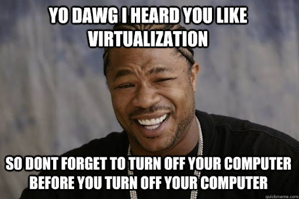
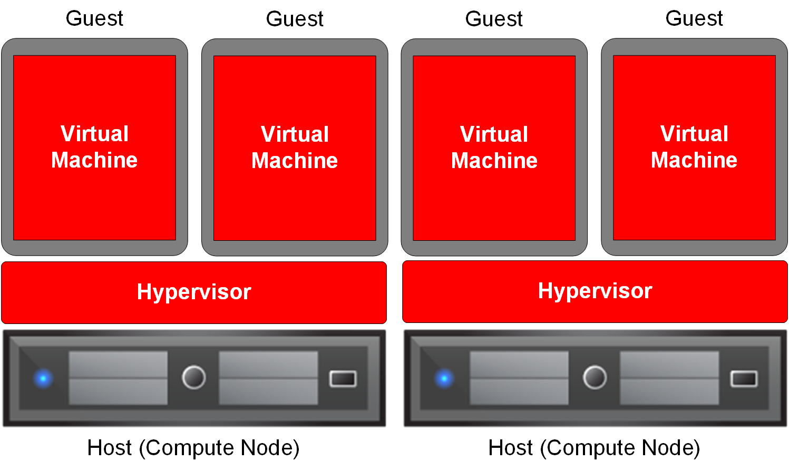
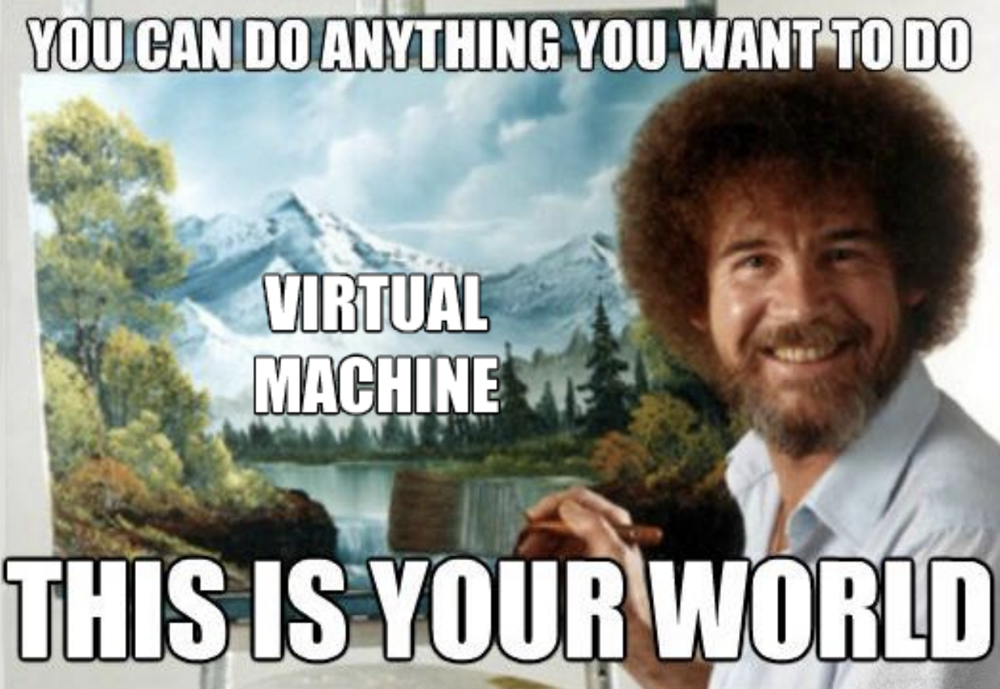

---

class: invert

---

# Einführung in Virtualisierung

---

---

## 1: Was ist Virtualisierung?

---

### 1.1 Denke an ein großes Haus aber nur für dich

- Am Anfang warscheinlich schön!
- Du kannst spontan viele Freunde einladen.
- Aber du wirst schnell merken, dass es auch Nachteile gibt.
- Große Räume, die du nicht nutzt.
- Hohe Kosten für Heizung und Strom.
- Muss alles gereinigt und gewartet werden.

---

### 1.2 Virtualisierung ist wie ein Mehrfamilienhaus

- Das große Haus wird in kleinere Wohnungen aufgeteilt.
- Jede Wohnung hat ihre eigene Küche, Bad und Schlafzimmer.
- Jede Wohnung ist unabhängig von den anderen.
- Jede Wohnung kann von einer anderen Person genutzt werden.
- Die Kosten werden aufgeteilt.
- Die Ressourcen werden effizienter genutzt.
- Die Wartung und Reinigung ist einfacher.

---

### 1.2 Definition Virtualisierung

- Prozess, bei dem man eine Ressource (z.B. Server, Anwendungen) in mehrere virtuelle Instanzen aufteilt.
- Jede Instanz ist unabhängig von den anderen.
- Jede Instanz kann von einem anderen Prozess genutzt werden.

---

---

## 2: Welches Problem löst die Virtualisierung?

---

### 2.1 Herausforderungen ohne Virtualisierung

- Vorstellung: Ein großer Raum (Server) für eine Person (Anwendung) – ineffizient und teuer.
- Probleme: Ressourcenverschwendung, mangelnde Flexibilität, Isolationsprobleme.

---

### 2.2 Vorteile der Virtualisierung

- Vorteile: Kosteneinsparung, höhere Effizienz, bessere Auslastung, Isolation.

---

## 3: Wichtige Anwendungsfälle der Virtualisierung

---

### 3.1 Virtualisierung im Data Center

- Erhöht Effizienz und Flexibilität in Datenzentren.
- Ermöglicht schnelle Bereitstellung von Ressourcen.
- Schnelles Skalieren von Anwendungen.
- Besser für Maintenance und Wartung.

---

### 3.2 Virtualisierung im Bereich Cloud Computing

- Ermöglicht Cloud-Dienste wie IaaS, PaaS, SaaS.

---

### 3.3 Weitere Anwendungsfälle

- Test- und Entwicklungsumgebungen: Experimentieren ohne Risiko.
- Notfallwiederherstellung: Schnelle Wiederherstellung bei Ausfällen.

---

## 4: Wie funktioniert Virtualisierung?

---

---

### 4.1 Hypervisor

---

#### 4.1.1 Was ist ein Hypervisor?

- Ein Hypervisor, auch Virtual Machine Monitor (VMM) genannt, ist eine Software, Firmware oder Hardware, die virtuelle Maschinen (VMs) erstellt und ausführt.
- **Metapher**: Denke an den Hypervisor als den Dirigenten eines Orchesters, wo jedes Instrument eine VM ist. Der Dirigent koordiniert, wer wann spielt, um die Harmonie zu wahren und sicherzustellen, dass die Ressourcen (Noten) effizient genutzt werden.
- Es gibt zwei Haupttypen von Hypervisoren: Typ-1 und Typ-2.

---

#### 4.1.2 Typ-1-Hypervisor (Bare Metal)

- Installiert direkt auf der Hardware ohne zugrunde liegendes Betriebssystem.
- **Metapher**: Ein Haus direkt auf dem Boden gebaut, ohne Fundament eines anderen Hauses. Es bietet direkten Zugriff auf die Ressourcen und verbesserte Leistung und Sicherheit.
- Beispiele: VMware ESXi, Microsoft Hyper-V, Xen.

---

---

#### 4.2.3 Typ-2-Hypervisor (Hosted)

- Installiert auf einem bestehenden Betriebssystem wie eine Anwendung.
- **Metapher**: Eine Wohnung in einem bestehenden Gebäude. Sie nutzt die vorhandenen Strukturen und Ressourcen des Gebäudes, was zu potenziellen Leistungseinbußen im Vergleich zum direkten Bau auf dem Boden führt.
- Beispiele: VMware Workstation, Oracle VirtualBox.
- Typ-2-Hypervisoren sind in der Regel einfacher zu installieren und zu verwenden, während Typ-1-Hypervisoren eine bessere Leistung und Sicherheit bieten.
- Wir werden uns in diesem Kurs auf Typ-2-Hypervisoren konzentrieren, um auf einfache Weise Linux auf unserem Windows-Computer zu virtualisieren.

---

---

#### 4.2.4 Funktionen des Hypervisors

- **Ressourcenzuweisung**: Teilt Hardware-Ressourcen wie CPU, Speicher und Netzwerk dynamisch den VMs zu.
- **Isolation**: Jede VM ist isoliert von den anderen, was Sicherheit und Stabilität gewährleistet. Wenn eine VM abstürzt, bleiben die anderen unberührt.
- **Verwaltung und Überwachung**: Bietet Tools zur Überwachung der Leistung von VMs und zur Verwaltung ihrer Konfigurationen.
- **Migrationsfähigkeit**: Ermöglicht die Live-Migration von VMs von einem physischen Server zu einem anderen ohne Downtime.

---

### 4.2 Wie erstelle ich eine virtuelle Maschine?

- Schritt-für-Schritt-Anleitung (vereinfacht):
  1. Wähle deinen Hypervisor
  2. Erstelle eine neue VM
  3. Installiere das Betriebssystem
  4. Konfiguriere die VM nach Bedarf

---

## 5: Was ist Virtual Box?

---

### 5.1 Was ist Virtual Box?

- VirtualBox: Eine Software, die es dir ermöglicht, virtuelle Maschinen zu erstellen und zu verwalten.
- Entwickelt von Oracle und ursprünglich von Innotek GmbH entwickelt.
- Unterstützt Windows, Linux, Mac OS X und Solaris.
- Kostenlos und Open Source.

---

### 5.2 Wie installiere ich Virtual Box?

- Schritt-für-Schritt-Anleitung:
  1. Gehe zur VirtualBox-Website und lade die Software herunter.
  2. Führe die Installationsdatei aus und folge den Anweisungen.
  3. Starte VirtualBox und beginne mit dem Erstellen deiner ersten virtuellen Maschine.

---

## 6: Zusammenfassung

- Virtualisierung ist der Prozess, bei dem man eine Ressource (z.B. Server, Anwendungen) in mehrere virtuelle Instanzen aufteilt.
- Virtualisierung löst Probleme wie Ressourcenverschwendung, mangelnde Flexibilität und Isolationsprobleme.
- Wichtige Anwendungsfälle der Virtualisierung sind Data Center, Cloud Computing, Test- und Entwicklungsumgebungen und Notfallwiederherstellung.
- Ein Hypervisor ist eine Software, Firmware oder Hardware, die virtuelle Maschinen (VMs) erstellt und ausführt.
- VirtualBox ist eine Software, die es dir ermöglicht, virtuelle Maschinen zu erstellen und zu verwalten.

---

## Fragen?

