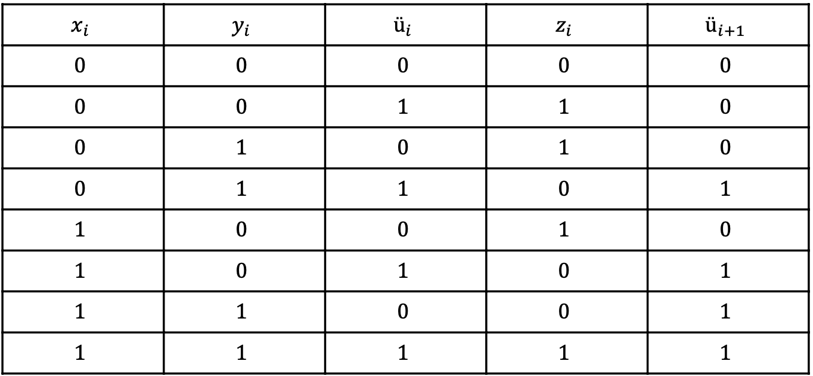
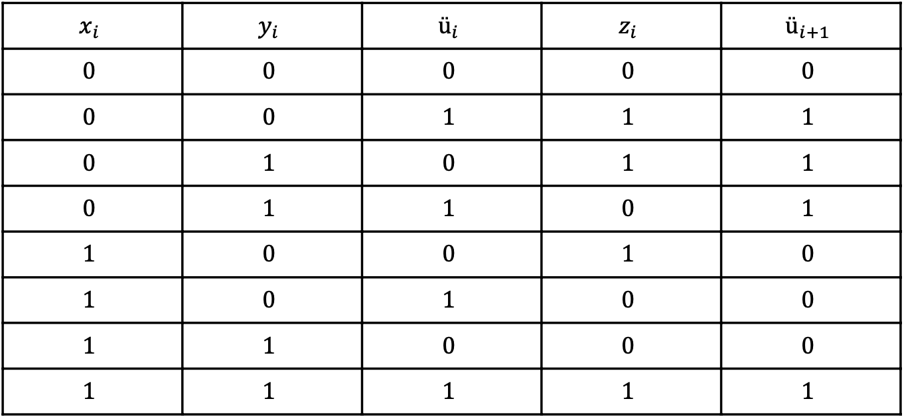

---

class: invert

---

# Zahlensysteme

---

## Einführung

- Computer sind wie vor "Rechenmaschinen", auch wenn das von außen nicht ohne weiters zu sehen ist
- Darstellung von Zahlen im Computer "computergerecht" nicht "menschengerecht"
- Zahlen sind eine der bzw. ggf. die wichtigsten Informationen, die von einem Rechner zu verarbeiten sind

- Wie werden Informationen im Rechner dargestellt?

---

- Darstellung einer ganzen Zahl zur Basis 10 (Dezimalsystem)
- Beispiel: 10,123,5144,7000456

- Eine Dezimalzahl d mit n Stellen lässt sich darstellen in der Form:
$$
d = d_{n-1} * 10^{n-1} + d_{n-2} * 10^{n-2} + ... + d_{1} * 10^{1} + d_{0} * 10^{0}
$$
wobei 
$$
 d_{i} ∈ {(0,1,2,...,9)}
$$
Beispiele:
$$
10   = 1 * 10^{1} + 0 * 10^{0}
$$
$$
123  = 1 * 10^{2} + 2 * 10^{1} + 3 * 10^{0}
$$
$$
5144 = ?
$$
---

Darstellung einer ganzen Zahl zu einer Basis 𝑏 (𝑏-adisches Stellenwertsystem)
Gegeben seien natürliche Zahlen 𝑧 zur Basis 𝑏 mit 𝑏 ≥ 2 (die „Basis“) und der Länge 𝑛 (die Anzahl der Stellen der Zahl)
Dann kann jede ganze Zahl 𝑧 mit 0 ≤ 𝑧 < 𝑏 eindeutig in der Form:
$$
𝑧 = 𝑧∗𝑏 + 𝑧 ∗𝑏 + ⋯+ 𝑧 ∗ 𝑏 + 𝑧 ∗ 𝑏
$$
mit 
$$ 
𝑧 ∈ 0,1, … , 𝑏 − 1 
$$ 
dargestellt werden.

Dabei heißt 𝑧 die 𝑖 -te Ziffer (zur Basis 𝑏) von 𝑧 und 𝑏 heißt die Wertigkeit der Ziffer 𝑧 .

---

### Praktisch relevante Basen:

b = 10 (Dezimaldarstellung) - im Alltag übliche Darstellung
mit den ziffern 0,...,9: z.B
$$
407_{10}
$$
b = 2 (Binär-/Dualdarstellung) - in Computern dominierende Repräsentation
mit den Ziffern 0 und 1: z.B.
$$
1010100011_{2}
$$
b = 16(Hexadezimaldarstellung) - leichter lesbare Alternative zur Binärdarstellung
mit den Ziffern 0,...,9,A(=10),B,C,D,E,F(=15): z.B. 
$$
151F_{16}
$$
4 Bit -Darstellung, z.B.: 
$$
1111_{2} = F_{16}
$$

---

b = 8 (Oktaldarstellung) - Alternative zu Binärdarstellung
mit den Ziffern 0,...,7: z.B. 
$$
12437_{8}
$$
3 Bit - Darstellung, z.B.:
$$
111_{2} = 7_{8}
$$

---

### Darstellung von Binärzahlen als bitsequenzen
- zunächst nur positive Zahlen

- 1 0 0 1 1 0 0 0 » Binärzahl der Länge 8 Bit(1 Byte), 256 Kombinationen

- 1 0 1 1 1 0 1 0 0 1 1 1 1 0 1 0 » Länge 16 Bit(2 Byte), 32.768

- 1 0 1 0 1 1 0 1 1 1 1 0 1 1 1 0 0 0 0 1 1 1 0 1 0 1 1 1 1 0 1 0 » 32 Bit(? Byte), 4.294.967.296

---

- Rechnen mit Binärzahlen (zunächst nur positive Zahlen)

Addition:
0 + 0 = 0
0 + 1 = 1
1 + 0 = 1
1 + 1 = 0 (Übertrag)

  100101
 +101001
 1001110

 ---

- Rechnen mit Binärzahlen
Übertragsbehandlung bei Addition

---

- Rechnen mit Binärzahlen (zunächst nur positive Zahlen)

Subtraktion:
0 - 0 = 0
0 - 1 = 1
1 - 0 = 0
1 - 1 = 1 (Übertrag)

  1001110
  -101001
  100101

---

- Rechnen mit Binärzahlen
Übertragsbehandlung bei Subtraktion

---

- Umwandlung Dezimal => Hexadezimaldarstellung (Basis 16):

Beispiel: Wandle 1000 in Hexadezimaldarstellung:
$$
1000_{10} : 16_{10} = 62_{10} mit Rest 8_{10}
$$
$$
8_{10} < 16 => 8_{10} = 8_{6}
$$
$$
62_{10} : 16_{10} = 3_{10} mit Rest 14_{10}
$$
$$
14_{10} < 16 => 14_{10} = E_{16}
$$
$$
3_{10} < 16 => 3_{10} = 3_{16}
$$
$$
=> 1000_{10} = 3E8_{16}
$$

---

- Umwandlung Dezimal => Binärdarstellung (Basis 2):

Beispiel Wandle 123 in Binärdarstellung:

123 / 2 = 61 mit Rest 1 ---- 1 < 2 => 1
61 / 2 = 30 mit Rest 1 ---- 1 < 2 => 1
30 / 2 = 15 mit Rest 0 ---- 0 < 2 => 0
15 / 2 = 7 mit Rest 1 ---- 1 < 2 => 1
7 / 2 = 3 mit Rest 1 ---- 1 < 2 => 1
3 / 2 = 1 mit Rest 1 ---- 1 < 2 => 1
1 / 2 = 0 mit Rest 1 ---- 1 < 2 => 1
=> 123 = 1111011

---

- Umwandlung einer Zahl zur Basis b (b>1) in die Dezimaldarstellung

Beispiel: Wandle z = AB2(16) in Dezimal um:

z = 10 * 16²+ 11 * 16¹+ 2 * 16⁰ = 10 * 256 + 11 * 16 + 2 * 1 = 2738(10)

Beispiel: Wandle z = 1111011(2) in Dezimal um:

z = 1*2⁶ + 1*2⁵ + 1*2⁴ + 1*2³ + 0*2² + 1*2¹ + 1*2⁰ = 123(10)

---

- Umwandlung Binär => Hexadezimal:

jeweils 4 Binärziffern zu einer Hexadezimalziffer zusammenfassen bzw. jede Hexadezimalziffer in 4 Binärziffern umwandeln:

Beispiel: 101010001111(2) =>
1111 = F
0001 = 1
0101 = 5
1 = 1
=> 151F(16)

* ggf. in der Binärdarstellung führende Nullen ergänzen

---

- Binärdarstellung negativer ganzer Zahlen:(bisher nur >= 0 Zahlen)

* Problem: Vorzeichen muss irgendwie dargestellt werden

Lösungsmöglichkeiten:

- Vorzeichenbit
- Einerkomplement
- Zweierkomplement

---

1. Vorzeichenbit

Explizite Speicherung des Vorzeichens

Vorzeichen muss mit einer zusätzlichen Binärziffer dargestellt werden,
z.B. "+" durch 0 und "-" durch 1 (oder umgekehrt)

1.Bit steht für das Vorzeichen, die anderen Bits für den Betrag der Zahl

Beispiel mit 8 Bit ( 0 = + , 1 = - ):
$$
26_{10} = 00011010_{2}
$$
$$
-26_{10} = 10011010_{2}
$$

---

Problem : Arithmetik

zwei Darstellungen für die Null:
 +0 = 000...0(Positive Null) und
 -0 = 100...0(negative Null)

---

Zusammenfassung:

- leicht zu verstehen
- Arithmetik:
-- Zwei Darstellungen für die Null:
    Arithmetik mit negativen Zahlen wird aufwendig(Fallunterscheidung +/-)
- Mit n Bit Darstellbare Zahlen:
$$
-2^{n-1} + 1,...,+2^{n-1} - 1 (deppelte 0)
$$
- nicht gebräuchlich