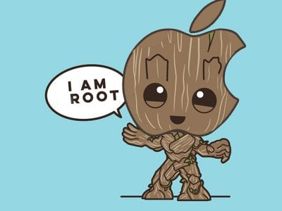
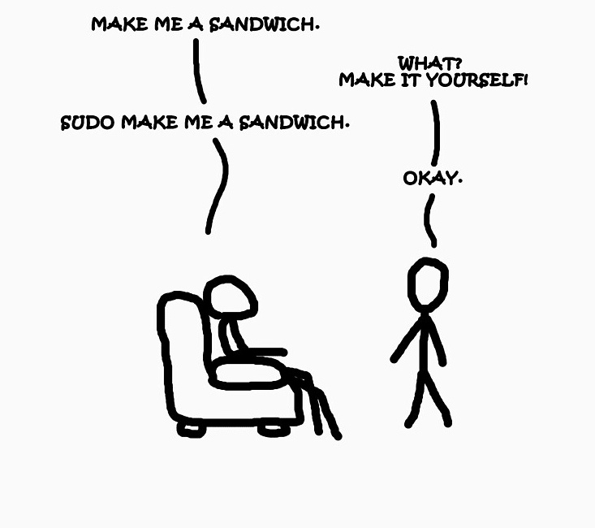

---

class: invert

---

# Einführung in Linux: Root und sudo

---

## Verstehen von Benutzern und Gruppen in Linux

---

### 1.1 Was ist der Root-Benutzer?

---

---

- **Definition des Root-Benutzers**

  - Höchste Zugriffsebene im Linux-System
  - Kann alle Dateien und Prozesse im System verwalten
  - Wird auch als Superuser bezeichnet
  - **Wie der König in einem Königreich**

---

- **Funktionen und Privilegien des Root-Benutzers**

  - Installation und Entfernung von Software
  - Änderung von Systemeinstellungen
  - Zugriff auf alle Dateien, unabhängig von den Zugriffsrechten
  - **Vollständige Kontrolle über das System**

---

- **Risiken und Verantwortung des Root-Benutzers**

  - Potenziell gefährliche Systemänderungen möglich
  - Höhere Gefahr von Sicherheitsverletzungen
  - Empfehlung: Nutzung minimieren, Vorsicht bei Befehlen
  - **Vorsichtiger Umgang notwendig**

---

### 1.2 Wozu benötigt man den Root-Benutzer?

---

- **Anwendungsfälle des Root-Benutzers**

  - Verwaltung von Benutzerkonten und -gruppen
  - Änderung von Netzwerkeinstellungen
  - Installation und Aktualisierung von Systemsoftware
  - Zugriff auf Logs und Systemdateien
  - Zugriff auf Hardware und Systemressourcen
  - Einrichtung von Systemdiensten
  - Direkte Bearbeitung von Systemdateien
  - Fehlerbehebung und Systemwartung

---

- **Root-Benutzer vs. normaler Benutzer**

  - Normaler Benutzer: Eingeschränkte Rechte, Sicherheit
  - Root-Benutzer: Volle Systemkontrolle, Risiko
  - **Mit großer Macht kommt große Verantwortung**

---

---

## 2. Sudo und why should you care?

---

---

### 2.1 Was ist Sudo?

- **Die Definition von Sudo**

  - Erlaubt Benutzern, Befehle mit den Rechten des Root-Benutzers auszuführen
  - Temporärer Zugriff auf erweiterte Rechte ohne dauerhaften Root-Zugang
  - **"Superuser do" - daher der Name Sudo**
  - **Wie wenn manche Leute sich für kurze Zeit die Königskrone aufsetzen dürfen**

---

- **Funktionen und Privilegien der Verwendung von Sudo**

  - Selektiver Zugriff für Benutzer auf Root-Rechte
  - **Protokollierung von Befehlen für Sicherheitsüberprüfungen** (`/var/log/auth.log`)

---

- **Unterschiede zwischen Root-Benutzer und Sudo**

  - Sudo bietet eine feingranulare Kontrolle und Protokollierung
  - Reduziert Risiken durch Begrenzung des Root-Zugriffs

---

### 2.2 Geschichte von Sudo

- **Ursprung und Hintergrund**

  - Entwicklung aus Sicherheitsbedürfnissen
  - Ermöglicht sichere Delegierung von administrativen Aufgaben

---

- **Wie hat sich Sudo entwickelt?**

  - Verbesserungen in Sicherheit und Konfigurierbarkeit
  - Erweiterung der Funktionalitäten über die Jahre

---

### 2.3 Wie funktioniert Sudo?

- **Der Prozess der Nutzung von Sudo**

  - Befehl mit `sudo` präfixieren für Root-Rechte
  - Authentifizierung des Benutzers (meist durch Passwort)
  - Nutzung der /etc/sudoers-Datei für Berechtigungen (**Regelwerk, wer was darf**)

---

- **Praktische Anleitung zur Verwendung von Sudo**

  - Grundlegende Befehle: `sudo <befehl>`, `sudo -i` für Root-Shell
  - Vorsichtige Nutzung zur Vermeidung von Systemschäden

---

### 2.4 /etc/sudoers

- **Was ist /etc/sudoers?**

  - Konfigurationsdatei für Sudo-Berechtigungen
  - Definiert, welche Benutzer/Befehle Sudo nutzen dürfen
  - **Zentrale Steuerung der Sudo-Funktionalität**
  - **Vorsicht beim Bearbeiten, um Systemfehler zu vermeiden**

---

- **Wie und wann /etc/sudoers zu nutzen ist**

  - Meistens reicht die Standardkonfiguration aus
  - Anpassung für spezifische Benutzerrechte und Sicherheitsrichtlinien
  - **Bearbeitung mit `visudo` zur Vermeidung von Fehlern**

---

- **Best Practices in /etc/sudoers**

  - Verwendung von Gruppen für Berechtigungen
  - Vermeidung von ALL-Zugriffen wo möglich
  - Regelmäßige Überprüfung und Aktualisierung der Konfiguration

---

## Fragen?

