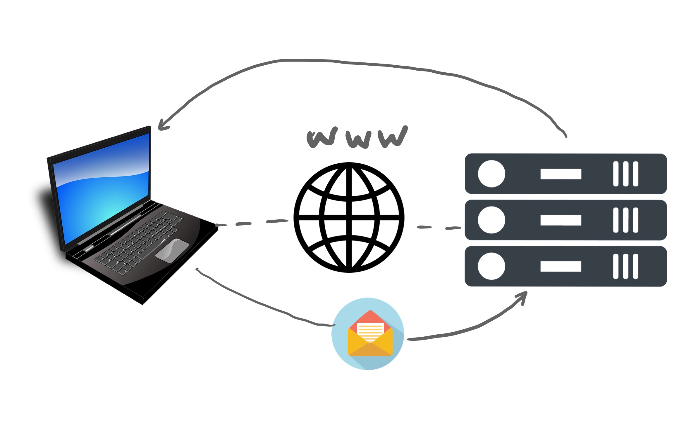
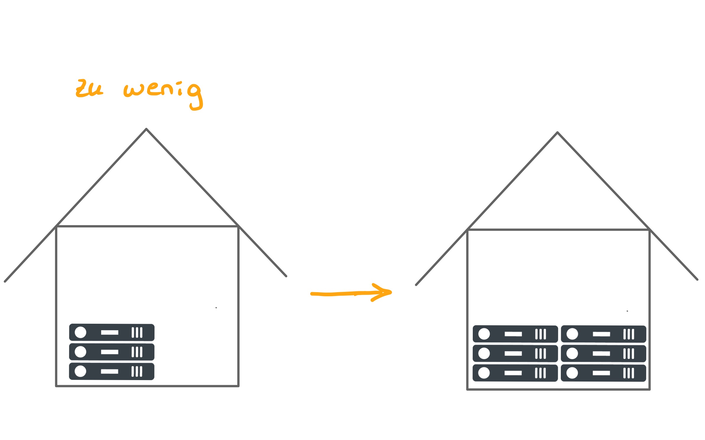
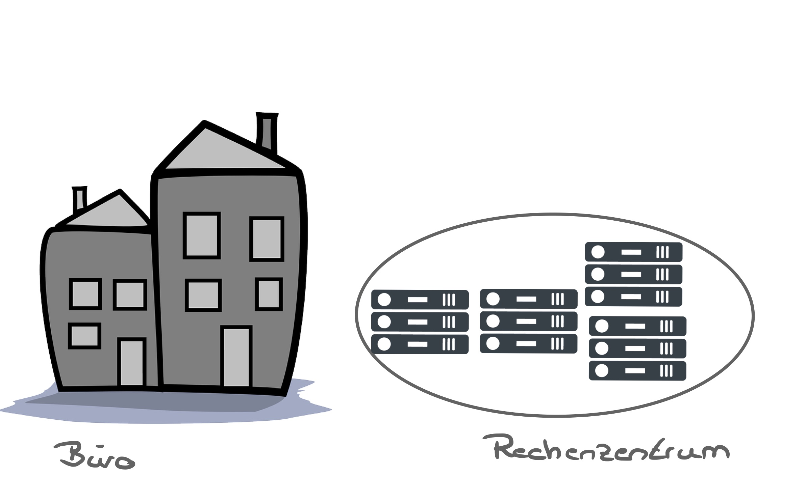
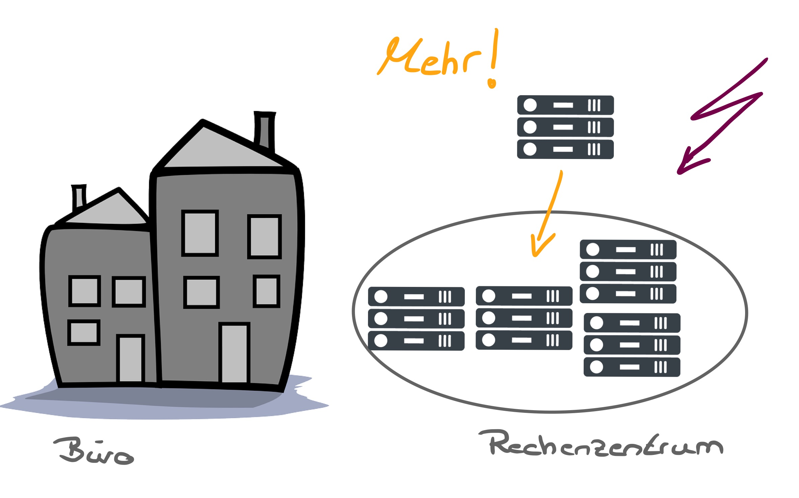
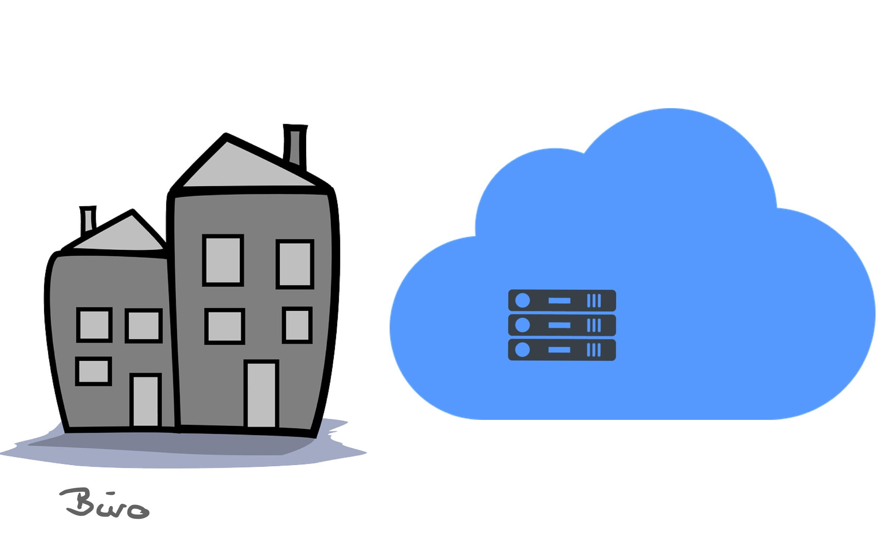
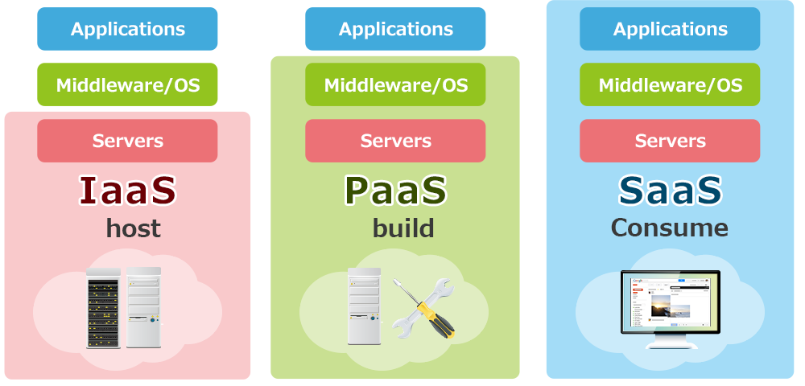
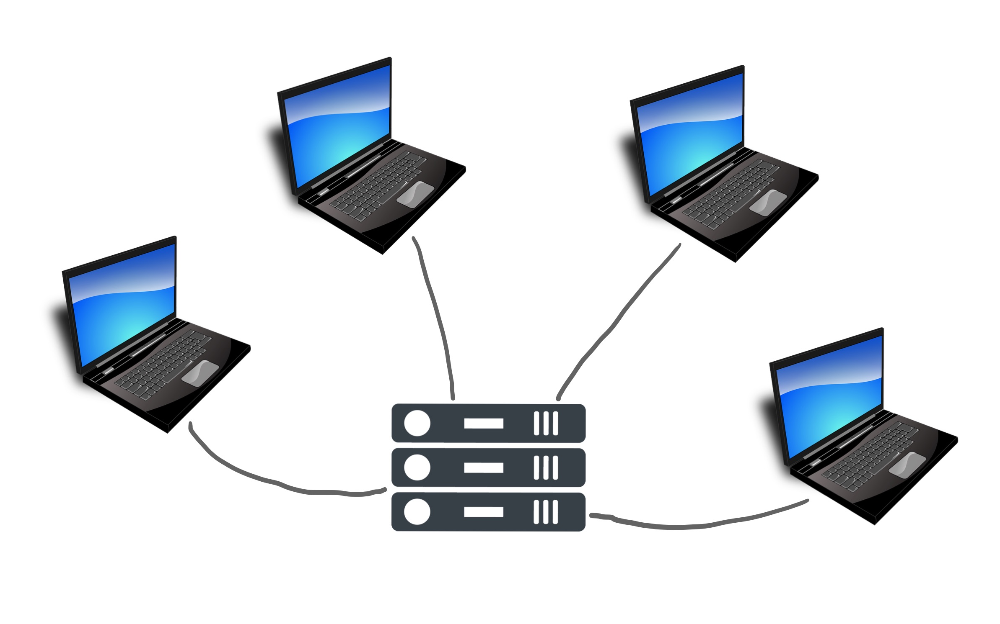
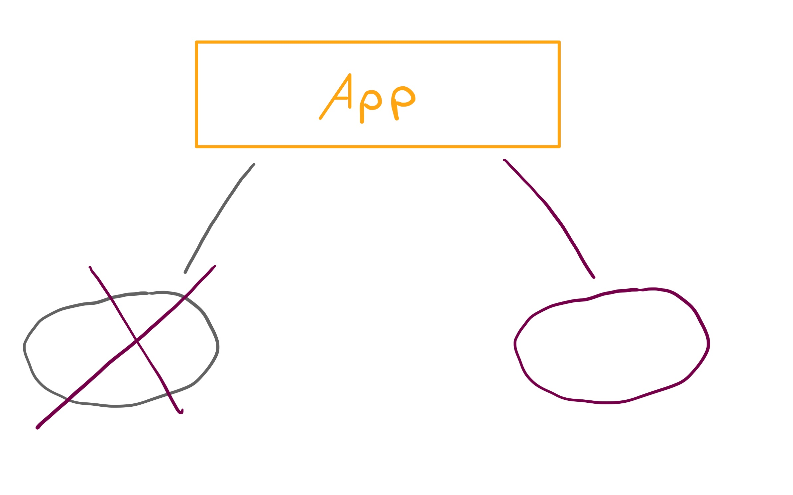
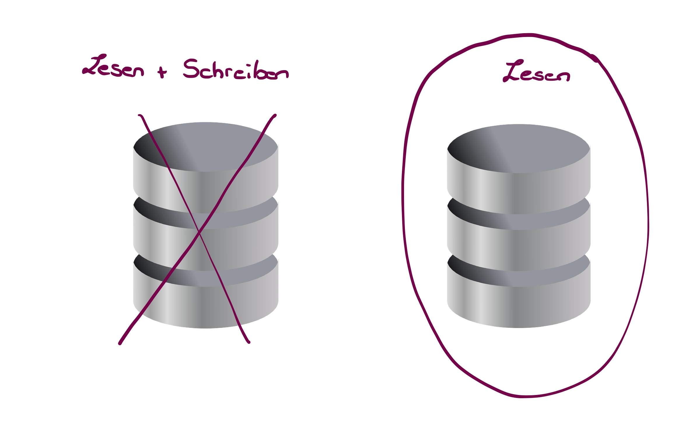

# Einführung Cloud Computing
---

# Fahrplan

1. Einführung
2. Bereitstellungsmodelle
3. Service Modelle
4. High Availability / Durability

---
# 1. Einführung

---
# Server

- CPU
- RAM

---

---

---

# Probleme mit diesem Ansatz

- Miete, Strom, Kühlung, Wartung, Austausch Hardware
- Überwachung Infrastruktur durch Personal
- Katastrophen ...

---
# weiteres Problem

- Skalierbarkeit

---

---

---

---

---
# Cloud Computing

- Bereitstellung bedarfsgerechter Rechenleistung, Datenbankspeicher, Anwendungen und anderer IT-Ressourcen

Stichwort **on-demand**

Was heißt das?

---

---

---

---

---
# Cloud Computing

**pay-as-you-go**

---

---

---
# Zurück zur Cloud

Was bietet sie noch?
Eine Oberfläche, mit der man auf Server, Speicher, Datenbanken und mehr zugreifen kann

---
# Verwaltung
AWS = **Amazon Web Services** besitzt + verwaltet die Hardware, die für Anwendungsdienste erforderlich ist

---

# Aufgabe

Welche Cloud-Dienste nutzt ihr selbst?
Was bezahlt ihr davon?
Was wird euch dabei angeboten zu bezahlen?

---

# 2. Bereitstellungsmodelle
- Private Cloud
- Public Cloud
- Hybrid Cloud
----

# Private Cloud

- unternehmensintern
- wird nur von einem Unternehmen genutzt
- komplette Kontrolle
- Erfüllung geschäftlicher Anforderungen

---
# Public Cloud

- AWS, Google Cloud, Azure
- Cloud-Ressourcen im Besitz Anbieters
- von Besitzer betrieben
- über das Internet bereitsgestellt
- wir können Ressourcen anfordern + nutzen

---
# Hybrid Cloud

- Mischung
- Ergänzung Rechenzentrum + public Cloud
- Ergänzung private Cloud + public Cloud
- einiges lokal halten + weitere Funktionen public Cloud nutzen

---

# Aufgabe

Zuordnung von Situationen zu den möglichen Bereitstellungsmodellen

---
# 3. Service-Modelle
- Infrastructure-as-a-Service (IaaS)
- Platform-as-a-Service (PaaS)
- Software-as-a-Service (SaaS)

---

# Infrastructure-as-a-Service (IaaS)

Bereitstellung von IT-Bausteinen:
- Virtuelle Maschinen
- Speicherplatz
- Netzwerkkomponenten (Router, Firewall ...)
- parallel nutzbar mit lokaler IT

*Beispiel:* Ein Unternehmen entscheidet sich, seine internen Server in die Cloud zu verlagern. Anstatt physische Server zu kaufen und zu verwalten, nutzen sie virtuelle Maschinen auf einer Cloud-Plattform. 

---

# Platform-as-a-Service (PaaS)

- Entwicklungsumgebungen
- Datenbanken
- keine Verwaltung der Infrastruktur
- Fokus Bereitstellung + Verwaltung Anwendungen

*Beispiel:* Ein Softwareentwicklerteam verwendet eine PaaS-Lösung wie Heroku, um eine neue Webanwendung zu entwickeln und bereitzustellen. Das Team kann sich auf die Entwicklung der Anwendung konzentrieren, während die PaaS-Plattform die zugrunde liegende Infrastruktur wie Server und Datenbanken verwalten.

---

# Software-as-a-Service (SaaS)

- E-Mail-Dienste
- Büroanwendungen
- fertige Produkte, die vom Anbieter ausgeführt werden

*Beispiel:* Ein Unternehmen abonniert einen SaaS-E-Mail-Dienst wie Gmail oder Outlook 365, um E-Mail-Kommunikation für seine Mitarbeiter bereitzustellen. Die Mitarbeiter können auf ihre E-Mails über einen Webbrowser oder eine mobile App zugreifen, ohne dass das Unternehmen eine eigene E-Mail-Infrastruktur betreiben oder verwalten muss.

---

---
# 4. High Availability / Durability

---
# High Availability = Hochverfügbarkeit

Was heißt das?

---

---

# Definition 

Hochverfügbarkeit bezeichnet die Fähigkeit eines Systems, kontinuierlich in Betrieb zu bleiben und Ausfallzeiten zu minimieren

---
# Aufgabe

Was könnten Gründe sein, dass ein System Ausfallzeiten hat?

---
**Eine Lösung**

Systemredundanz

Was heißt das?

Beispiel: Banking-App
- Kontostand einsehen
- Überweisungen tätigen
- Geldeingänge

---
# Was, wenn etwas scheitert?

---
# Was passiert mit den Daten?

---

# Fehlertoleranz

- große Bruder/Schwester von Hochverfügbarkeit
- Systemausfall = nutzende Menschen bemerken keine Unterschiede

---
# Gedankenspiel

- ohne Cloud 
= Hochverfügbarkeit teuer
= Fehlertoleranz außerordentlich teuer

Wieso?

---
- Hardware müsste bezahlt werden, ob wir sie brauchen oder nicht
- laufende Kosten (Betrieb, Miete...)

---

# Durability = Haltbarkeit

Haltbarkeit der Daten
- wieviele Dateien gehen in einem Jahr verloren?

99% 1 von 100 Objekten weg
99,999% 1 von 100.000 Objekten weg 

---
# Gründe für Datenverlust

- Hardwarefehler (z.B. Festplattenausfall)
- Menschliche Fehler (z.B. versehentliches Löschen von Dateien)
- Softwarefehler (z.B. fehlerhafte Updates oder Systemabstürze)
- Datendiebstahl oder -beschädigung durch Cyberangriffe
- Naturkatastrophen oder externe Einflüsse (z.B. Feuer, Überschwemmungen)

---
# Was kann man dagegen tun?

- Redundante Speicherung auf verschiedenen Medien oder Standorten
- Implementierung von Mechanismen zur Datenintegritätsprüfung
- regelmäßige Backups für Wiederherstellbarkeit
- Kontinuierliche Überwachung der Dateninfrastruktur 

