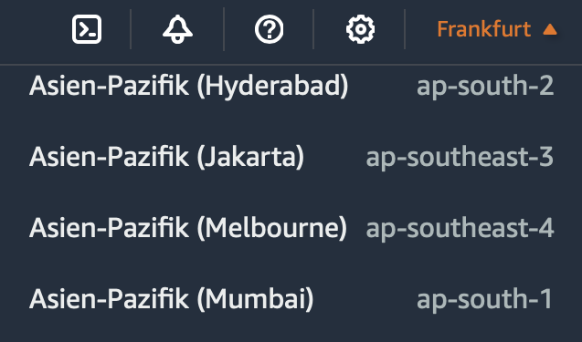
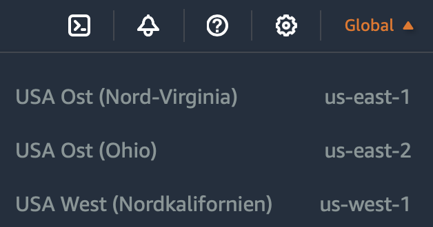
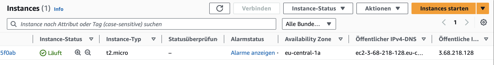
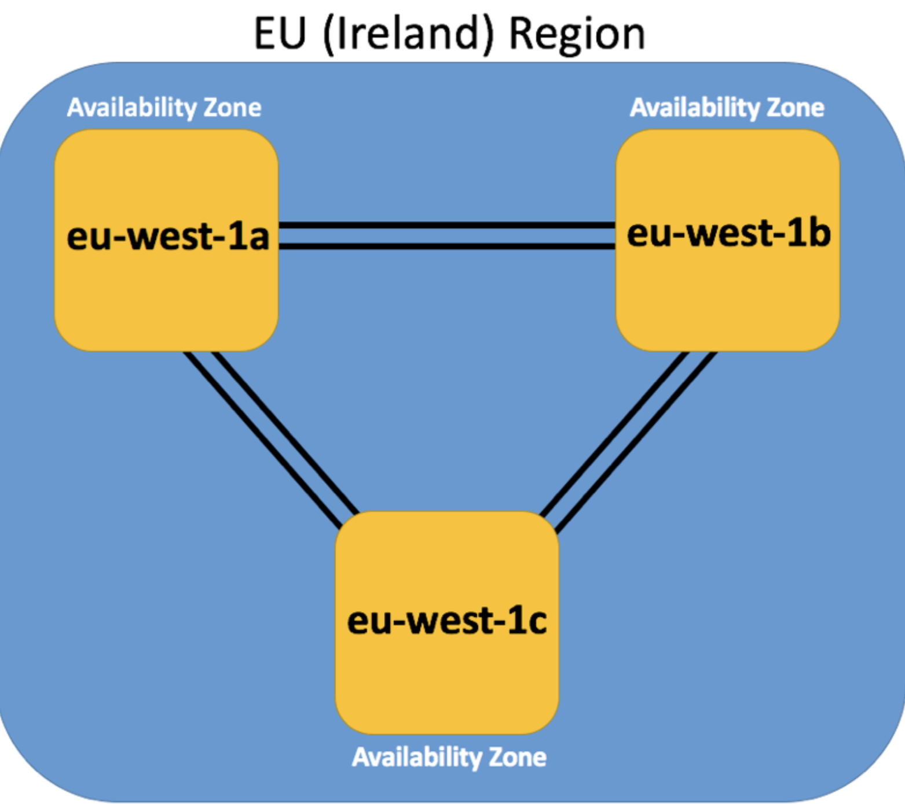

# Erste Schritte mit AWS

---

# Fahrplan

1. AWS Account Basics
2. Region und Availability Zones
3. Virtual Private Cloud (VPC)
4. Amazon EC2 (Elastic Compute Cloud)

---

# 1. AWS Account Basics

- Erlaubt Zugriff auf AWS-Dienste und Ressourcen
- Benutzername, Passwort und Zahlungsinformationen erforderlich
- Zugriff auf AWS Management Console
- Bereitstellung, Verwaltung und Überwachung von Ressourcen

---

# AWS Management Konsole

1. Kontoinformationen
2. Regionsauswahl
3. Serviceauswahl
4. Suchfeld
5. AWS CloudShell

---

# 2. Region und Availability Zone (Verfügbarkeitszone)

---

# Region
- Geografisch isoliertes Gebiet
- Mindestens zwei Verfügbarkeitszonen
- Eigene Rechenzentren und Netzwerke
- Beispiele: "us-east-1" (Nord-Virginia), "eu-west-1" (Irland)

---

---

---

# Availability Zone
- Physisch isoliertes Rechenzentrum
- Unabhängig von anderen Zonen
- Bietet Redundanz und Ausfallsicherheit
- 1 Region = 2 oder mehr Availability Zones

---

---

---

---

# 3. Virtual Private Cloud (VPC)

- Eigenes privates Netzwerk in der Cloud
- Sicherheit
- Regionale Verfügbarkeit

---

---

---
# 4. Amazon EC2 (Elastic Compute Cloud)

---

# EC2 - Flexibilität und Skalierbarkeit
- Schnelle Erstellung und Anpassung virtueller Computerinstanzen
- Skalierung entsprechend den Anforderungen der Anwendung

---

# EC2 - Pay-as-you-go-Abrechnung
- Zahlung nur für tatsächlich genutzte Ressourcen
- Starten, Beenden oder Ändern von Instanzen nach Bedarf

---

# EC2 - Hochverfügbarkeit und Zuverlässigkeit

- Verbesserte Ausfallsicherheit und Kontinuität der Anwendungen
- Stichwort 1 Availability Zone = 1 oder mehr Rechenzentren

