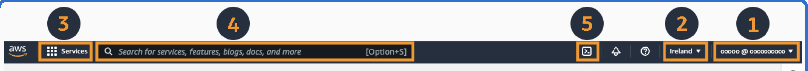

### Region und Availability Zone (Verfügbarkeitszone)

**Region** 

Eine Region in AWS ist ein geografisch isoliertes Gebiet, das aus mindestens zwei Verfügbarkeitszonen besteht. Jede Region hat ihre eigenen Rechenzentren und Netzwerke. Beispiele für AWS-Regionen sind "us-east-1" (Nord-Virginia) und "eu-west-1" (Irland).

**Availability Zone (Verfügbarkeitszone)**

In der Regel besteht eine AWS-Region aus mindestens zwei Verfügbarkeitszonen (AZs). Jede Verfügbarkeitszone ist ein physisch isoliertes Rechenzentrum, das unabhängig von anderen Zonen innerhalb derselben Region betrieben wird und funktionieren kann. Die genaue Anzahl der Datacenter pro Verfügbarkeitszone kann je nach Region und Infrastruktur variieren, aber AWS stellt sicher, dass jede Verfügbarkeitszone über ausreichende Kapazitäten und Redundanzen verfügt, um eine hohe Verfügbarkeit und Zuverlässigkeit zu gewährleisten.

Die genaue Anzahl der Datacenter pro AZ wird normalerweise nicht öffentlich bekannt gegeben, da AWS kontinuierlich seine Infrastruktur erweitert und aktualisiert. Es ist jedoch bekannt, dass jede AZ über mehrere physische Rechenzentren verfügt, um Redundanz und Ausfallsicherheit zu gewährleisten.

### AWS Account Basics (Grundlagen des AWS-Kontos)

- Ein AWS-Konto ermöglicht es Benutzern, auf die Dienste und Ressourcen von AWS zuzugreifen. Beim Erstellen eines Kontos werden grundlegende Informationen wie Benutzername, Passwort und Zahlungsinformationen angegeben. Mit einem AWS-Konto können Benutzer auf die AWS Management Console zugreifen, Ressourcen bereitstellen und verwalten sowie Abrechnungs- und Supportinformationen einsehen.

1. Kontoinformationen
2. Regionsauswahl
3. Serviceauswahl
4. Suchfeld
5. AWS CloudShell

### Virtual Private Cloud (VPC)

Eine Virtual Private Cloud (VPC) in AWS ist wie dein eigenes privates Netzwerk in der Cloud. Warum das Erstellen einer VPC wichtig ist:

1. **Sicherheit**: Eine VPC ermöglicht es, Ressourcen in einem privaten Bereich zu isolieren, sodass sie vor unbefugtem Zugriff geschützt sind.

2. **Verbindung mit einem lokalen Netzwerk**: Ein VPC lässt sich sicher mit deinem lokalen Netzwerk verbinden, entweder über eine VPN-Verbindung oder eine Direct Connect-Verbindung, um eine nahtlose Integration zwischen Cloud und lokaler Infrastruktur zu erreichen.

3. **Regionale Verfügbarkeit**: Jedes VPC ist an eine bestimmte AWS-Region gebunden, was bedeutet, dass die Ressourcen in dieser Region bereitgestellt werden. Dies minimiert die Latenz und erfüllt Compliance-Anforderungen (geltende Bestimmungen beispielsweise eines Landes).

Zusätzlich dazu bietet eine VPC auch Verbindungen zum öffentlichen Internet und anderen AWS-Diensten, sodass die Ressourcen sicher mit der Außenwelt kommunizieren können.

### Amazon EC2 (Elastic Compute Cloud)

Amazon EC2 ist ein Dienst von AWS, der es Benutzern ermöglicht, virtuelle Computer, sogenannte "Instances", in der Cloud zu erstellen und auszuführen.

1. **Flexibilität und Skalierbarkeit**: Mit Amazon EC2 lassen sich virtuelle Computerinstanzen in wenigen Minuten erstellen und starten. Diese Instanzen lassen sich nach Bedarf anpassen. Das heißt sie können je nach Bedarf skaliert werden, um sich den veränderlichen Anforderungen deiner Anwendung anzupassen.

2. **Pay-as-you-go-Abrechnung**: Amazon EC2 verwendet ein Pay-as-you-go-Abrechnungsmodell, das bedeutet, dass du nur für die Ressourcen zahlst, die du tatsächlich nutzt. Du kannst Instanzen starten, beenden oder ändern, wann immer du möchtest, und du zahlst nur für die tatsächlich genutzte Rechenzeit.

3. **Hochverfügbarkeit und Zuverlässigkeit**: EC2 bietet eine hohe Verfügbarkeit und Zuverlässigkeit durch die automatische Verteilung von Instanzen über mehrere Verfügbarkeitszonen innerhalb derselben Region. Dadurch wird die Ausfallsicherheit verbessert und die Kontinuität deiner Anwendungen sichergestellt.

