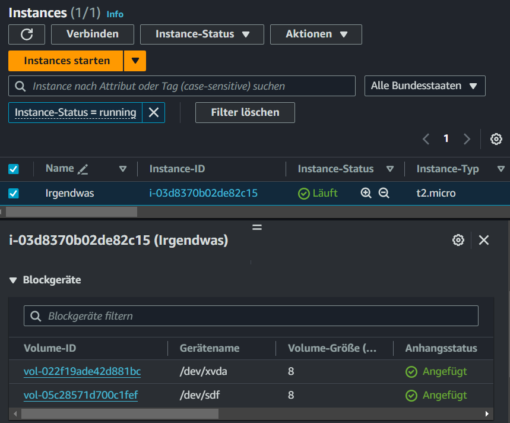

## EBS-Volumes erstellen

1. **Öffne die Amazon EC2-Konsole**: Gehe zur AWS Management Console und navigiere zum EC2-Dashboard.

2. **Navigiere zu Volumes (Volumes)**: Wähle im linken Navigationsbereich "Volumes" aus.

3. **Volume erstellen**: Klicke auf "Volume erstellen".

4. **Konfiguriere das Volume**:
   - **Volume-Typ**: Wähle den gewünschten Volumetyp, z. B. "gp3" für General Purpose SSD.
   - **Größe (GiB)**: Gib die gewünschte Größe des Volumes in GiB ein, z.B. 8 GiB.
   - **Ziel-Availability-Zone**: Wähle die Availability Zone (Verfügbarkeitszone) aus, in der das Volume erstellt werden soll, z. B. "eu-central-1a".
   - **Weitere Einstellungen (optional)**: Konfiguriere zusätzliche Einstellungen wie Tags oder Verschlüsselung nach Bedarf.

5. **Volume erstellen**: Klicke auf "Volume erstellen", um das EBS-Volume zu erstellen.

Dokumentiere dein erstelltes EBS Volume mit einem Screenshot.

## EBS-Snapshots erstellen

1. **Öffne die Amazon EC2-Konsole**: Gehe zur AWS Management Console und navigiere zum EC2-Dashboard.

2. **Navigiere zu Snapshots (Snapshots)**: Wähle im linken Navigationsbereich "Snapshots" aus.

3. **Snapshot erstellen**: Klicke auf "Snapshot erstellen".

4. **Wähle das Volume aus**: Wähle das EBS-Volume aus, von dem du einen Snapshot erstellen möchtest.

5. **Snapshot konfigurieren**:
   - **Snapshot-Beschreibung (optional)**: Gib eine optionale Beschreibung für den Snapshot ein.
   - **Tags hinzufügen (optional)**: Füge Tags hinzu, um den Snapshot zu organisieren oder zu kennzeichnen.

6. **Snapshot erstellen**: Klicke auf "Snapshot erstellen", um den EBS-Snapshot zu erstellen.

7. **Snapshot Name**: Klicke in der Snapshot Übersicht auf die Spalte Name, bis du ein Stiftzeichen siehst. Nun öffnet sich ein kleines Fenster. Gebe deinem Snapshot hier einen aussagekräftigen Namen.

Dokumentiere deinen Snapshot mit einem Screenshot.

## EBS-Volumes aus einem Snapshot erstellen

1. **Öffne die Amazon EC2-Konsole**: Gehe zur AWS Management Console und navigiere zum EC2-Dashboard.

2.**Navigiere zu Snapshots**: Wähle deinen eben erstellten Snapshot an und kopiere die Snapshot-ID.

3. **Navigiere zu Volumes (Volumes)**: Wähle im linken Navigationsbereich "Volumes" aus.

3. **Volume erstellen**: Klicke auf "Volume erstellen".

4. **Snapshots verwenden**: Wähle unter "Snapshots verwenden" den gewünschten Snapshot aus, aus dem das Volume erstellt werden soll. An dieser Stelle fügst du die zuvor kopierte Snapshot-ID ein.

5. **Konfiguriere das Volume**:
   - **Ziel-Availability-Zone**: Wähle die Availability Zone (Verfügbarkeitszone) aus, in der das Volume erstellt werden soll, z. B. "eu-central-1a". Im Idealfall sollte dies eine andere AZ sein, als das Ausgangs-Volume aus der ersten Aufgabe hier.
   

6. **Volume erstellen**: Klicke auf "Volume erstellen", um das EBS-Volume aus dem ausgewählten Snapshot zu erstellen.

## das aus dem Snaphot erstellte EBS Volume an eine Instanz anhängen

1. **Öffne die Amazon EC2-Konsole**: Gehe zur AWS Management Console und navigiere zum EC2-Dashboard.

2. **EC2 Instanz erstellen**: Erstelle eine EC2 Instanz in der gleichen Availability Zone, wie dein EBS Volume aus der vorherigen Aufgabe (z.B. eu-central-1b).

3. fertig hier erst einmal

## Volume auswählen und an die EC2-Instanz anhängen

5. **Navigiere zu Volumes (Volumes)**: Wähle im linken Navigationsbereich "Volumes" aus.

6. **Volume auswählen**: Wähle das EBS-Volume aus, das du an die EC2-Instanz anhängen möchtest.

7. **Volume an Instanz anhängen**: Klicke auf "Aktionen" und wähle "Volume an Instanz anhängen".

8. **Instanz auswählen**: Wähle die EC2-Instanz aus, an die das Volume angehängt werden soll.

9. **Gerätebezeichnung festlegen**: Wähle einen freien Gerätepfad für das Volume aus.

10. **Anhängen bestätigen**: Klicke auf "Anhängen", um das Volume an die ausgewählte EC2-Instanz anzuhängen.

Nachdem diese Schritte abgeschlossen sind, ist das EBS-Volume aus dem Snapshot erfolgreich an die EC2-Instanz angehängt und einsatzbereit.

Dokumentiere, dass deine EC2-Instanz zwei Geräte aufgelistet hat unter dem Punkt Speicher. Wähle dazu deine EC2 Instanz an und suche im unteren Menü den Punkt ,,Speicher". Mache von dieser Ansicht einen Screenshot.

## Aufräumen

1. Terminiere die EC2-Instanz
2. Lösche den Snaptshot
3. Lösche die nicht mehr benötigten EBS-Volumes