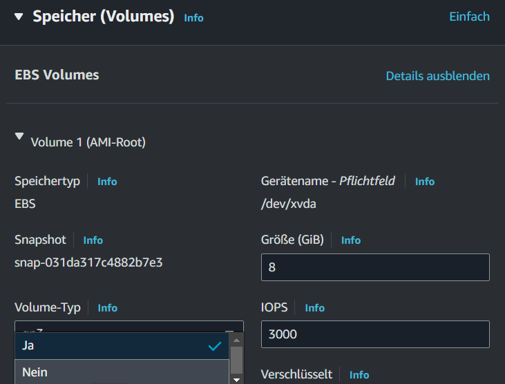
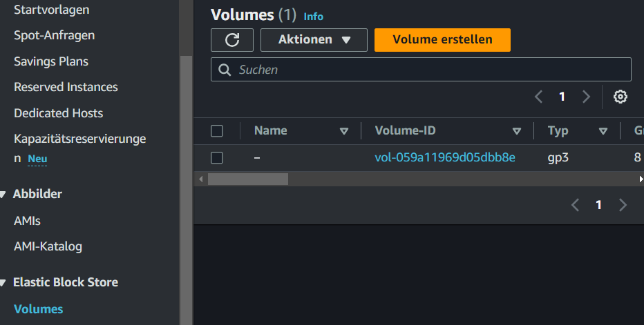
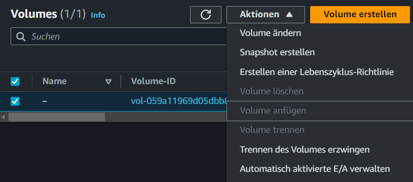
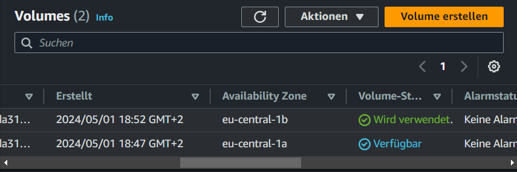
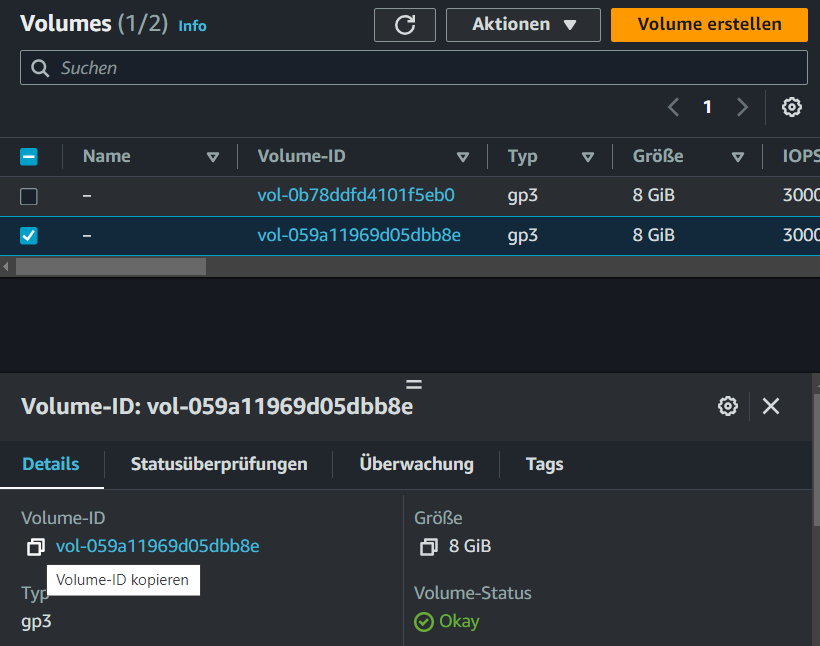
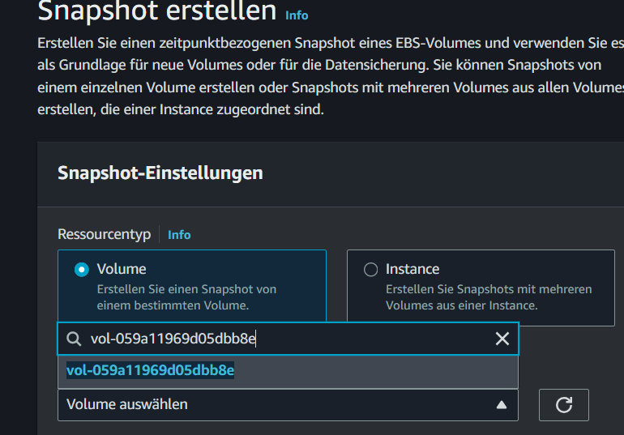
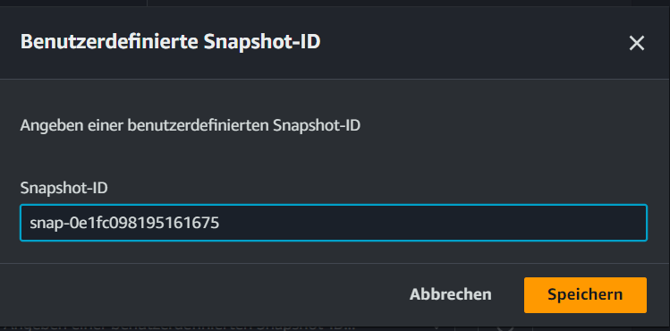
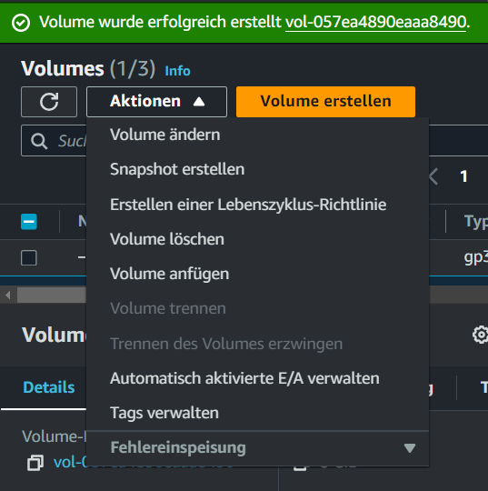
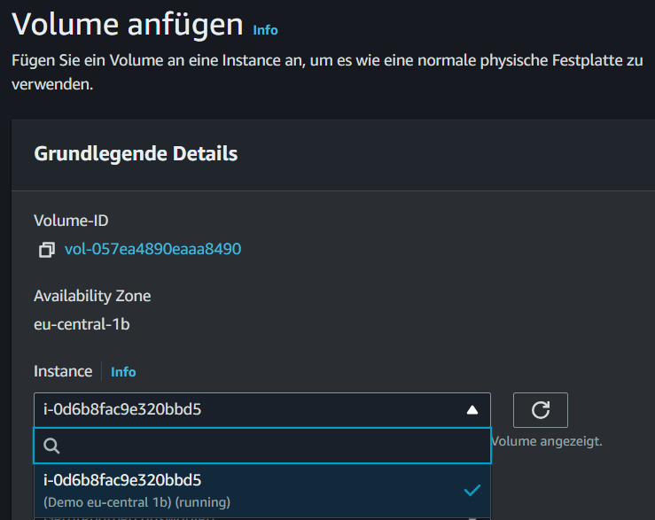

# Praxis: EBS

1. **Erstellen einer EC2-Instanz mit beibehaltenem EBS-Volume:**
   - Gehe zur AWS Management Console und navigiere zum EC2-Dashboard.
   - Klicke auf "Instanz starten", um den Startvorgang zu beginnen.
   - Wähle dein gewünschtes AMI aus und konfiguriere die Instanz nach Bedarf.
   - Stelle sicher, dass du die Option aktivierst, das EBS-Volume beim Beenden der Instanz nicht zu löschen. Dies geschieht im Menüpunkt ,,Speicher konfigurieren“ unter ,,Erweitert“.
   - Starte die Instanz und warte, bis ihr Status auf ,,running“ steht. Diese Option sollte auf ,,Nein" stehen.
   
   - Beende die Instanz, nachdem sie gestartet wurde, um sicherzustellen, dass das EBS-Volume beibehalten wird.

2. **Überprüfen des EBS-Volumes:**
   - Gehe zum EC2-Dashboard und wähle "Volumes" im linken Menü aus.
   - Stelle sicher, dass das EBS-Volume, das mit deiner Instanz verbunden war, weiterhin angezeigt wird und nicht gelöscht wurde.
   

3. **Erstellen einer neuen Instanz in einer anderen Verfügbarkeitszone (AZ) in der Region "eu-central1":**
   - Kehre zum EC2-Dashboard zurück und klicke auf "Instanz starten".
   - Wähle eine andere Verfügbarkeitszone (z. B. eu-central-1b) für die neue Instanz aus.
   

4. **Volume an die Instance anhängen**  
   - Gehe zum EC2-Dashboard und wähle "Volumes" im linken Menü aus.
   - Versuche, das vorhandene EBS-Volume dieser neuen Instanz hinzuzufügen.
   - Dazu klickst du auf Aktionen 
   
   - Du wirst feststellen, dass das Volume nicht verfügbar ist, da es an die ursprüngliche AZ gebunden ist.

5. **Erstellen eines Snapshots und Zuweisen an die richtige AZ:**
   - Kehre zum Menüpunkt ,,Volumes" zurück
   - Es sollten 2 EBS Volumes vorhanden sein
   - Eines der laufenden Instanz und eines der vorherigen
   - Schaue deshalb nach, welche AZ welches EBS Volume hat
   
   - kopiere die die ID des Volumes, das nicht in Nutzung ist
   
   - Gehe zum Bereich "Snapshots" im EC2-Dashboard.
   - Klicke auf ,,Snapshot erstellen"
   - Wähle das EBS-Volume aus, für das du einen Snapshot erstellen möchtest, indem du es unter ,,Volume-ID" einfügst
   
   - Erstelle einen Snapshot und kopiere die Snapshot-ID

5. **Hinzufügen des EBS-Volumes zur neuen Instanz:**
   - Nachdem der Snapshot erstellt wurde, gehe zum Bereich "Volumes" im EC2-Dashboard
   - Erstelle ein neues Volume aus dem Snapshot und weise es der gewünschten AZ zu (z. B. eu-central-1b)
   - Dazu klickst du auf ,,Volume erstellen"
   - wähle unter ,,Availability Zones" nun ,,eu-central-1b" aus
   - wähle unter Snapshot-ID ,,Angeben einer benutzerdefinierten Snapshot-ID an"
   - du solltest folgende Ansicht haben
   
   - klicke auf ,,Volume erstellen"
   - Untersuche erneut, welches Volume die richtige AZ hat, um der neuen Instanz angehängt zu werden
   - wenn du das nun aus dem Snapshot erstellte EBS Volume auswählst und auf Aktionen klickst, sollte die Aktion ,,Volume anfügen" verfügbar sein
   
   - Füge das neu erstellte Volume der neuen Instanz hinzu, indem du es der Instanz zuweist.
   - Klicke dazu auf ,,Volume anfügen"
   
   Dadurch wird das Volume mit der Instanz verbunden und kann von dieser genutzt werden.
   - du musst nun noch einen Gerätenamenn auswählen
   - richte dich dabei gerne nach den Hinweisen, die dir gegeben werden
   - bestätige noch mit dem Klick auf ,,Volume anfügen"

6. **Kontrolle:**
   - Kehre zu deinen Instanzen zurück und wähle die laufende Instanz aus, unter dem Punkt ,,Speicher" siehst du nun, dass deine EC2-Instanz zwei EBS-Volumes angehängt hat.
   

7. **Aufräumen:**
   - fahre die EC2 Instanz herunter und terminiere sie
   - lösche die erstellten Volumes
   - lösche den erstellten Snapshot 

Auf diese Weise kannst du sicherstellen, dass du ein EBS-Volume einer neuen Instanz in einer anderen AZ in der Region "eu-central1" zuweisen kannst, selbst wenn das ursprüngliche Volume an eine spezifische AZ gebunden ist.