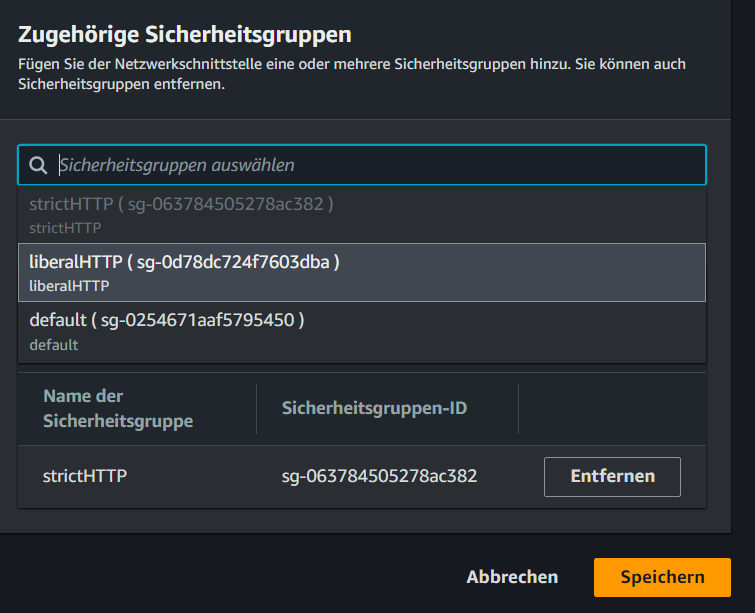

## Praxis: Sicherheitsgruppe

1. **Erstellen der EC2-Instanz mit User Data**

   - Melde dich bei der AWS Management Console an und navigiere zum EC2-Dashboard.
   - Klicke auf "Instanz starten", um den Start-Assistenten zu öffnen.
   - Wähle eine Amazon Machine Image (AMI) aus, z. B. "Amazon Linux 2 AMI".

2. **Erstellen der Sicherheitsgruppe**

   - Navigiere zum Bereich "Sicherheitsgruppen" im EC2-Dashboard.
   - Erstelle eine Sicherheitsgruppe: "strictHTTP".
   - Konfiguriere "strictHTTP" so, dass eingehender HTTP-Verkehr blockiert ist.

   - Konfiguriere die Instanzdetails nach Bedarf und füge die oben angegebene User Data im Schritt "Details der Instanz konfigurieren" unter "Erweiterte Details" im Feld "User data" hinzu.
	-  nutze folgende user data
   
```bash
#!/bin/bash
yum update -y
yum install -y httpd
systemctl start httpd
systemctl enable httpd
echo "<html><body><h1>Hello World!</h1></body></html>" > /var/www/html/index.html
```

   - Starte die Instanz.

3. **Überprüfen der Erreichbarkeit der Instanz:**

   - Kopiere die öffentliche IP-Adresse der Instanz aus dem EC2-Dashboard.
   - Öffne einen Webbrowser und gib die IP-Adresse der Instanz ein (z. B. http://IP-Adresse).
   - Die Instanz sollte nicht erreichbar sein

4. **Erstellen einer weiteren Sicherheitsgruppe**

   - gehe zum EC2-Dashboard und wähle Sicherheitsgruppen an
   - klicke auf Sicherheitsgruppe erstellen
   - Erstelle eine weitere Sicherheitsgruppe: "liberalHTTP".
   
   - Konfiguriere "liberalHTTP" so, dass HTTP-Verkehr erlaubt ist.
   - wähle dazu unter ,,Regeln für eingehenden Datenverkehr" ,,Regel hinzufügen" an
   
   - suche nach ,,HTTP"
   
   - wähle unter Quelltyp ,,Anywhere" aus
   - bestätige mit dem Klick auf ,,Sicherheitsgruppe erstellen"


3. **Zuweisen der Sicherheitsgruppe zur EC2-Instanz**

   - Weise der EC2-Instanz die Sicherheitsgruppe "liberalHTTP" ebenfalls zu. 
   - Wähle dazu deine Instanz an und klicke auf ,,Aktionen", wähle dort den Punkt ,,Sicherheit" aus und klicke auf ,,Sicherheitsgruppe ändern"
   
   - wähle nun die neue Sicherheitsgruppe aus
   
   - klicke auf ,,Sicherheitsgruppe hinzufügen"


   - Überprüfe anschließend, ob die Instanz über HTTP erreichbar ist (z. B. http://IP-Adresse).und dir die "Hello World!"-Seite angezeigt wird, da die Sicherheitsgruppe "liberalHTTP" eingehenden HTTP-Verkehr erlaubt.


4. **Aufräumen**

- Terminiere deine EC2 Instanz
- lösche ggf. die erstellten Sicherheitsgruppen

Mit diesen Schritten hast du eine EC2-Instanz erstellt, die zwei verschiedene Sicherheitsgruppen verwendet und je nach Konfiguration unterschiedliche Netzwerkverbindungen erlaubt oder blockiert. Da bei mehreren Sicherheitsgruppen die liberalere Regel angewendet wird, ist unsere EC2-Instanz per HTTP erreichbar.