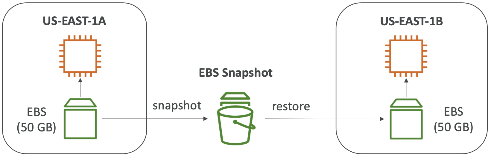

# EC2 Advanced
---

# Fahrplan
1. Recap EC2
2. Sicherheitsgruppen
3. User Data/ Benutzerdaten
4. EBS
5. AMI

---

# 1. Recap EC2

---
## Instanz Typen

- **Allgemeine Zwecke (General Purpose)**:
  - Eine Webseite für einen kleinen Online-Shop
  - Eine Blogging-Plattform
  - Ein einfaches CRM(Management)-System für kleine Unternehmen

- **Optimiert für Datenverarbeitung (Compute Optimized)**:
  - Eine App, die komplexe mathematische Berechnungen durchführt, wie z.B. eine Wettervorhersage-App

---

- **Arbeitsspeicheroptimiert (Memory Optimized)**:
  - Ein System zur Überwachung und Analyse von Netzwerkverkehr in Echtzeit
  - Eine Anwendung zur Analyse von Sensor-Daten in IoT-Geräten

- **Speicheroptimiert (Storage Optimized)**:
  - Eine Medien-Streaming-Plattform, die große Dateien effizient speichern und abrufen kann
  - Ein Archivierungssystem für große Datenmengen, wie z.B. historische Unternehmensdokumente
  - Eine Plattform zur Speicherung und Verarbeitung von großen Mengen an Bildern oder Videos

---
# Referenz
[https://aws.amazon.com/de/ec2/instance-types/](https://aws.amazon.com/de/ec2/instance-types/)

wichtig ist es die Anwendungsfälle auseinander halten zu könen

---

**On-Demand-Instanzen (On-Demand Instances)**
- Kurze Workloads, vorhersehbare Preisgestaltung, Bezahlung pro Sekunde

**Reservierte Instanzen (1 & 3 Jahre) (Reserved Instances)**
  - Langfristige Workloads
  - keine Vorabzahlung, teils Vorabzahlung, komplette Vorabzahlung
  - bis zu 72% Preisnachlass

**Spot-Instanzen (Spot Instances)**: 
- Kurze Workloads, kostengünstig, aber die Instanzen können verloren gehen (weniger zuverlässig)
- bis zu 90% Preisnachlass

---

**Savings Plans (1 & 3 Jahre) (Savings Plans)**
- Verpflichtung zu einem bestimmten Nutzungsbedarf, geeignet für langfristige Workloads
- bspw. Region/ Instanz Familie
- bis zu 72% Preisnachlass

**Dedicated Hosts (Dedicated Hosts)**
- Buchen eines gesamten physischen Servers

**Kapazitätsreservierungen (Capacity Reservations)**
- Reservieren von Kapazität in einer bestimmten Verfügbarkeitszone für jede gewünschte Dauer

---

# 2. Sicherheitsgruppen

---

# Sichterheitsgruppen allgemein

- Sicherheitsgruppen steuern Datenverkehr 
- Filterung nach Protokollen und Ports möglich
- Regeländerungen wirken automatisch
- Mehrere Sicherheitsgruppen können kombiniert werden = 1 Instanz mit mehreren Regeln
- Regeln gelten für alle zugeordneten Instanzen
- Toleranteste Regel gilt bei Konflikten 

---

# Sicherheitsgruppen

- **erlauben standardmäßig ausgehenden Datenverkehr**
- **Regeln immer zulassend; Verweigerung nicht möglich**
- **Zustandsbehaftet: Antworten auf Anfragen werden zugelassen**
---

# Standardsicherheitsgruppe
- Jedes AWS-Konto hat automatisch Standardsicherheitsgruppe für Standard-VPC
- Starten einer Instanz ohne Sicherheitsgruppenauswahl = automatisch Standardsicherheitsgruppe
- Regeln in Standardsicherheitsgruppen können geändert werden, aber die Gruppe kann nicht gelöscht werden

---
# Sicherheitsgruppenregeln

- **Webserverregeln:** HTTP-Zugriff auf Port 80 und HTTPS-Zugriff auf Port 443 von allen IP-Adressen.
- **Datenbankserverregeln:** Regeln für spezifische Datenbankports wie z.B. Port 3306 für MySQL oder Port 5432 für PostgreSQL.
- **Regeln für die Verbindung von Ihrem Computer aus:**: SSH-Zugriff auf Port 22 (für Linux-Instanzen)/ Port 3389 (für Windows-Instanzen)
- **Regeln für die Verbindung von einer Instance mit derselben Sicherheitsgruppe aus:** Kommunikation zwischen Instanzen durch geeignete eingehende Regeln.
- **Ping/ICMP-Regeln:** ICMP-Regeln für das Pingen von Instanzen.
- **DNS-Server-Regeln:** Gestatten Datenverkehr über Port 53 für DNS-Anfragen.

---
# das müsst ihr euch nicht alles merken

Ihr müsst nur wissen, wo ihr es nachlesen könnt!

[https://docs.aws.amazon.com/de_de/AWSEC2/latest/UserGuide/security-group-rules-reference.html](https://docs.aws.amazon.com/de_de/AWSEC2/latest/UserGuide/security-group-rules-reference.html)

---
# 3. User Data/ Benutzerdaten

---
# User Data/ Benutzerdaten
- wid beim Start einer Amazon EC2-Instance Benutzerdaten übergeben und nur dann

- kann verwendet werden, um automatisierte Konfigurationsaufgaben durchzuführen und Skripts auszuführen.

- **Beispiele für Aufgaben**: Aktualisierung von Softwarepaketen, Installation von Webservern und Datenbankpaketen, Konfiguration von Diensten und Benutzerberechtigungen.

---

# 4. EBS

EBS = Elastic Block Storage

zur Erinnerung: Wiederholung Linux
**Blockgeräte (Block Devices)**

Sind solche, bei denen Daten in Blöcken gelesen und geschrieben werden, die individuell
adressiert werden können, z.B. Festplatten (und deren Partitionen, wie `/dev/sda1`), USB-Sticks,
CDs oder DVDs.

---
# EBS Volumes
- ermöglicht Datenpersistenz (persistenz = bestehenbleiben) nach Terminieren einer Instanz
- 1 EBS = 1 Instanz
- an die Availability Zone gebunden
- Kapazität wird in GB und IOPS(Input/Output Operations Per Second) angegeben 

- **Analogie: Netzwerk USB Stick**

---

# Warum Netzwerk USB Stick?

- EBS = Netzwerk Laufwerk
- nutzt das Cloud Netzwerk, um mit der Instanz zu kommunizieren
- EBS Speicher kann von einer zur anderen Instanz schnell übertragen werden

---

# Verfügbarkeitszonen Bindung

- EBS aus eu-central-1a kann nicht an eine Instanz in eu-central-1b angehängt werden

**ziemlich unpraktisch**

---

# Snapshot Erstellung

---

---

# 5. AMI

- AMI = Amazon Machine Image
- Abbild einer EC2 Instanz
= eigene Software, Einstellungen, Betriebssystem...
- Region gebunden, können kopiert werden über Regionen hinweg
- EC2 Instanzen können aus AMIs heraus erstellt werden

---

# Arten von AMIs

- von AWS gestellte AMIs
- eigene AMIs
- auf dem Marktplatz (AWS Marketplace) verfügbare AMIs
- wurden von anderen Personen erstellt

---

# Instance Store/ Instanzspeicher

- Temporärer Speicher
- direkt mit der physischen Hardware der EC2-Instanz verbunden
- Nicht persistent, geht verloren bei Beenden/Ausfall
- hohe I/O-Leistung, da mit Instanz verbunden, nicht über das Netzwerk
- für temporäre Daten/ Anwendungen, die hohe Leistung erfordern
- Auswahl Instance-Typs = überprüfen, ob dieser über Instance Store verfügt (Größe, Leistung)

---

# Zusammenfassung

- **EC2-Instanz**: AMI (Betriebssystem) + Instanzgröße (CPU + RAM) + Speicher + Sicherheitsgruppen + EC2-Benutzerdaten
- **Sicherheitsgruppen**: Firewall, die mit der EC2-Instanz verbunden ist
- **EC2-Benutzerdaten**: Skript, das beim ersten Start einer Instanz ausgeführt wird
- **SSH**: Starten eines Terminals auf unseren EC2-Instanzen (Port 22)
- **Kaufoptionen**: On-Demand, Spot, Reserviert, Dedizierter Host, Kapazitätsreservierungen
- **EBS**: Persistenter Blockspeicher, bietet Snapshots für Backups.
- **Instance Store**: Temporärer, hochleistungsfähiger Speicher, nicht persistent.

