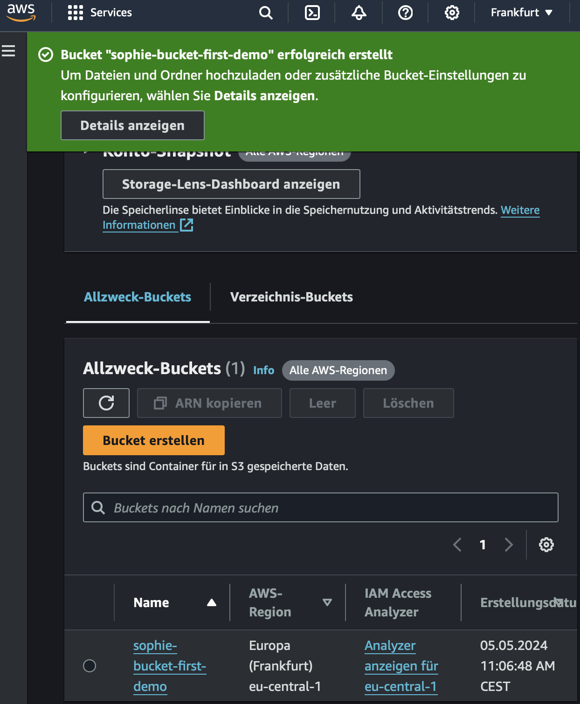
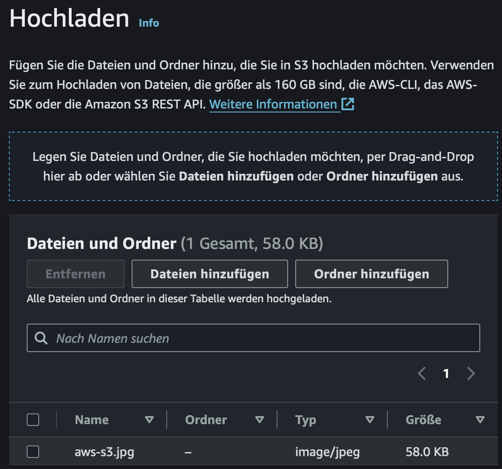
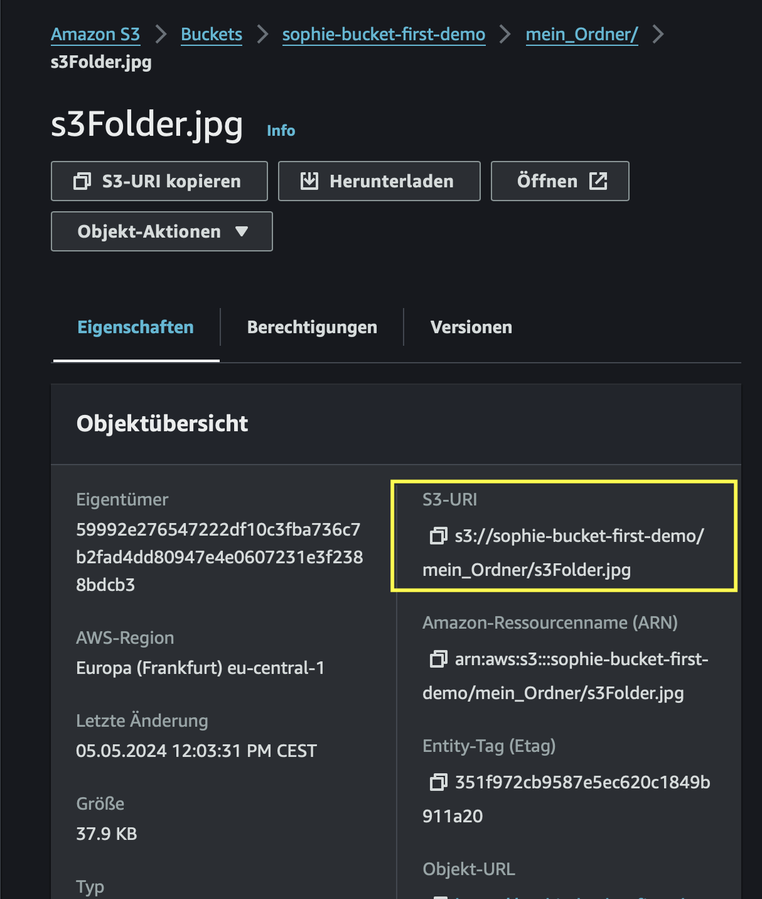
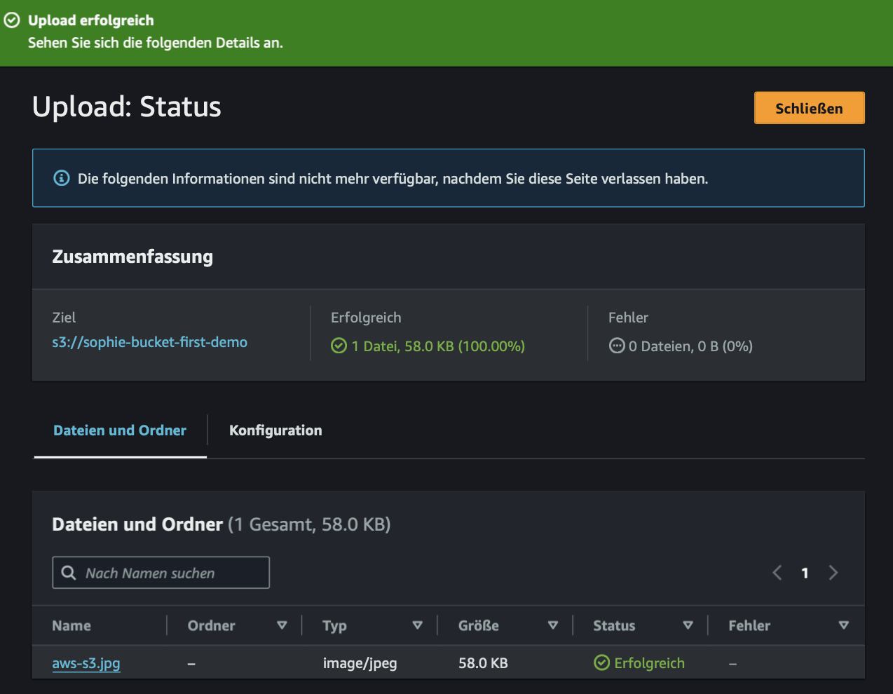
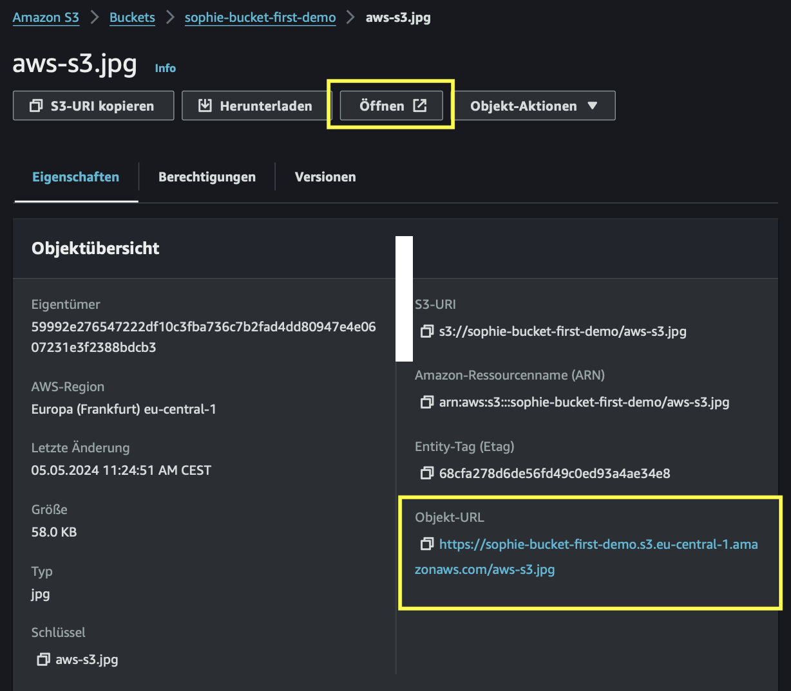

# Praxisaufgabe 1

**Einen Bucket erstellen und ein erstes Objekt hineinlegen**

## Schritt 1: Bucket erstellen

1. **Anmelden bei AWS:**
   - Gehe zur AWS-Website und melde dich mit deinem AWS-Konto an.

2. **Öffnen der S3-Konsole:**
   - Klicke oben rechts auf `Services` und suche nach `S3`. Klicke darauf, um die S3-Konsole zu öffnen.

3. **Neuen Bucket erstellen:**
   - In der S3-Konsole siehst du die Option `Bucket erstellen`. Klicke darauf, um einen neuen Bucket zu erstellen.

4. **Bucket-Konfiguration:**
   - Jetzt musst du deinem Bucket einen eindeutigen Namen geben. Wähle `my-bucket` als Name

5. **Bucket-Optionen festlegen:**
   - Unter `Objekteigentümerschaft` lässt du die Einstellungen wie sie sind
   - Unter `Einstellungen "Öffentlichen Zugriff beschränken` für diesen Bucket" ebenso nichts verändern
   - den Punkt `Bucket-Versionierung` lassen wir ebenfalls unter `Deaktivieren`
   - Tags vergeben wir jetzt nicht
   - unter `Standardverschlüsselung` lassen wir die Optionen wie sie sind

6. **Überprüfen und erstellen:**
  - Wenn alles richtig aussieht, klicke auf `Bucket erstellen`, um den Erstellungsprozess abzuschließen.

7. **Fehler beheben:**
  - Du solltest einen Fehlermeldung bekommen `Bucket mit demselben Namen ist bereits vorhanden`
  - Der Name muss global eindeutig sein in AWS
  - vergebe daher einen eindeutigeren Namen wie bspw `name-bucket-first-demo`(bei mir: `sophie-bucket-first-demo`)

8. **Fertig:**
   - Herzlichen Glückwunsch! Dein S3-Bucket wurde erfolgreich erstellt. Du erhältst eine Bestätigungsnachricht, die besagt, dass der Bucket erfolgreich erstellt wurde. 

Das war's! Du hast erfolgreich einen S3-Bucket erstellt und bist bereit, ihn für deine Anwendungen zu nutzen. 

## Schritt 2: Ein Bild hochladen

1. **Bucket auswählen:** Klicke in der Bucket Übersicht auf deinen eben erstellten Bucket.

2. **Bucket Ansicht:** Du solltest sehen, dass dein Bucket leer ist. Deswegen wird dir `Keine Objekte
Sie haben keine Objekte in diesem Bucket.`angezeigt.

3. **ein erstes Bild hochladen:** Klick auf den Button `Hochladen`, um dein erstes Objekt hochzuladen.
Du kommst in die Ansicht `Hochladen`. Im Classroom befindet sich die Datei `aws-s3.jpg`, lade sie herunter, damit du sie auf deinem Laptop verfügbar hast. Diese möchten wir nun in den Bucket legen. Klicke unter dem Punkt `Dateien und Ordner` auf den Button `Dateien hinzufügen`. Nun kannst du aus deinen Dateien das Bild `awd-s3.jpg`aus. 

Du solltest folgende Ansicht haben:

Klicke nun auf `Hochladen`.

Super, du hast dein erstes Objekt in deinen Bucket hochgeladen!

## Schritt 3: Einen Ordner erstellen

1. **Einen Ordner erstellen:** Gehe in den Bucket hinein, falls du dort nicht mehr bist. Klicke auf den Button `Ordner erstellen`. Du bist nun im Menü `Ordner erstellen`. Gib dem Ordner einen Namen, wie beispielsweise `mein_Ordner`. Lasse die restlichen Optionen wie sie sind und klicke auf `Ordner erstellen`.

Du hast nun einen Ordner erstellt, der dir im Bucket angezeigt wird.

2. **Ein Bild in den Ordner hochladen:** Klicke auf den Ordner, indem du auf den Namen klickst. Da der Ordner noch leer ist, solltest du `In diesem Ordner befinden sich keine Objekte` angezeigt bekommen. Im Classroom befindet sich das Bild `s3Folder.jpg`. Lade es herunter, sodass es auf deinem Laptop abgespeichert wird. Klicke auf `Hochladen` und danach im Menü `Hochladen` auf `Dateien hinzufügen` und wähle das Bild `s3Folder.jpg` aus. Klicke auf den orangenen Button `Hochladen`.

Wenn du nun im Ordner `mein_Ordner`bist und auf das Bild `s3Folder.jpg`klickst, wird die die `S3-URL`angezeigt.

Hier siehst du sehr gut, dass `s3://sophie-bucket-first-demo/mein_Ordner/s3Folder.jpg` den Schlüssel `mein_Ordner/s3Folder.jpg`hat. Und der Schlüssel aus dem Präfix `mein_Ordner/`und dem Objekt Name `s3Folder.jpg`besteht.

3. **Das Bild aus dem Ordner löschen:** Löschen das Bild `s3Folder.jpg`, indem du es über das Hakenfeld neben dem Namen anwählst und auf den Button `Löschen`klickst. Es öffnet sich das Menü `Objekte löschen`. Dort scrollst du nach unten, bis `Objekte endgültig löschen?`, dort tippst du `Endgültig löschen`ein und kannst dann auf den orangenen Button `Objekte löschen`klicken. Schließe das Menü `Objekte löschen: Status`mit dem Klick auf den orangenen Button `Schließen`.

4. **Den Ordner `mein_Ordner`löschen:** Gehe zurück in deinen Bucket und wähle nun den Ordner `mein_Ordner`an, indem du den Haken links neben den Namen setzt. Auch hier klickst du dann auf den Button `Löschen` und tippst um nächsten Menü `Objekte löschen`unten `Endgültig löschen`ein und bestätigst dies mit dem Klick auf `Objekte löschen`.

## Schritt 4: Auf das erste Bild zugreifen

4. **Objekt auswählen:** Wähle `aws-s3.jpg`an,, indem du auf den Namen klickst, der blau angezeigt wird.

Für uns interressant ist der Button `Öffnen`und die `Objekt-URL`. Im Bild unten sind beide gelb markiert.

5. **Das Objekt öffnen:** Klicke auf den Button `Öffnen`. Es öffnet sich ein neues Tab, indem dir das eben hinzugefügte Objekt angezeigt wird. 

Navigiere zurück in das zuvorige Tab mit der Objektansicht.

6. **Objekt-URL:** Wähle die Objekt-URL aus, indem du auf die Objekt-URL klickst. Es öffnet sich ein neues Browser-Tab, indem `AccessDeniedAccess `steht.

Wir merken also, dass unser Objekt über den Button `Öffnen`erreichbar ist, über die `Objekt-URL` aber nicht.

