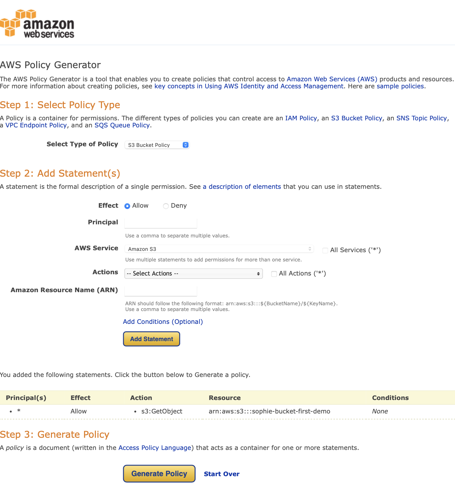

# Praxisaufgabe 2

**Einen S3-Bucket so konfigurieren, dass er öffentlich zugänglich ist**

1. **`Öffentlichen Zugriff beschränken (Bucket-Einstellungen)`bearbeiten:**
  - Gehe zur S3-Konsole und wähle deinen Bucket aus, für den du die öffentlichen Zugriffe ermöglichen möchtest.
  - Wähle ihn aus, indem du ihn über das Hakenfeld links neben den Namen anwählst.
  - Klicke auf die Registerkarte `Berechtigungen` und dann unter `Öffentlichen Zugriff beschränken` auf den Button `Bearbeiten`.
  - Entferne den Haken `Öffentlichen Zugriff beschränken`und klicke auf den orangenen Button `Änderungen speichern`
  - es öffnet sich ein Fenster, in dem du `bestätigen`eintippst und dann auf `Bestätigen`klickst

   

2. **Bucket Policy erstellen:**
  
   - Du kehrst nun zur Registerkarte `Berechtigungen` zurück, gehe zu `Bucket-Richtlinie` und klicke auf den Button `Bearbeiten`.

   - Hier gibt es zwei hiflreiche Links. Einmal den Link zu den Richtlinienbeispielen, den du öffnen kannst, indem du auf den Button `Richtlinienbeispiele`klickst. Dann gibt es noch den Link zum Richtliniengenerator, den du mit einem Klick auf `Richtliniengenerator`erreichst.

3. **Bucket Policy konfigurieren:**
   - - Klicke nun auf den Button `Richtliniengenerator`.

   - Es öffnet sich ein neues Browser Tab, dass dich dorthin führt.

   - Folgende Einstellungen nehmen wir vor:
      - unter `Select Type of Policy`wählen wir `S3 Bucket Policy`aus
      - unter `Effect`wählen wir `Allow`aus
      - unter `Principal`tippen wir `*`
      - bei `AWS Service`sollte `Amazon S3`stehen und dies belassen wir
      - unter `Actions`suchen wir `GetObject`und wählen es an
      - im Feld `Amazon Resource Name (ARN)`müssen wir den `Bucket-ARN`einfügen
      - diesen finden wir, indem wir in das vorherige Browser-Tab wechseln und die `Bucket-ARN`von dort kopieren
      - im Bild ist es gelb markiert 
      
      - kopiere dies nun und füge es im `Policy Generator`Browser Tab unter dem Feld `Amazon Resource Name (ARN)` ein.
      - nun ist der Button `Add Statement`klickbar 
      - unten wurde nun eine Policy hinzugefügt und du kannst den Button `Generate Policy`klicken
   - zur Kontrolle einmal ein Bild, wie es aussehen sollte, inklusive der vorherigen Einstellungen
      
   - wenn du auf den Button `Generate Policy`geklickst hast, wird die nun eine Policy angezeigt, diese kannst du nun kopieren
   

   - wechsle in das vorherige Browser-Tab zurück
   - du solltest dich im Menü `Bucket-Richtlinie bearbeiten`befinden
   - Füge in das Freifeld unter dem Punkt `Richtlinie`die eben kopierte Richtlinie ein 
   - wir müssen noch eine Sache ergänzen
   - bei `"Resource": "arn:aws:s3:::sophie-bucket-first-demo"`ergänzen wir `/*`, sodass alle Ressourcen im Bucket erreichbar sein sollen
   - `"Resource": "arn:aws:s3:::sophie-bucket-first-demo/*"`
   - klicke auf den orangenen Button `Änderungen speichern``

4. **Testen:**
   - Kehre zu deinem Bucket zurück
   - wähle das darin befindliche Bild `aws-s3.jpg` an, indem du auf den Namen klickst.
   - klicke nun auf die `Objekt-URL`
   - unser Bild ist nun über die `Objekt-URL`öffentlich erreichbar

Es ist wichtig zu beachten, dass das Öffentlichmachen eines Buckets potenzielle Sicherheitsrisiken birgt. Stelle sicher, dass du die Konsequenzen verstehst und die notwendigen Sicherheitsvorkehrungen triffst, um deine Daten zu schützen.