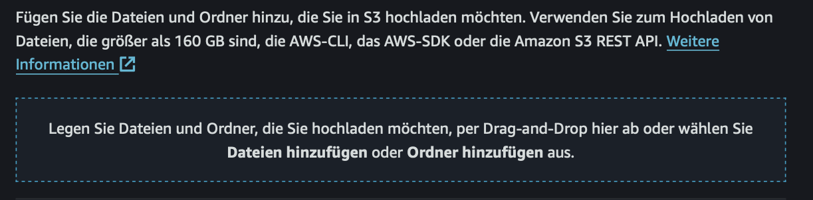
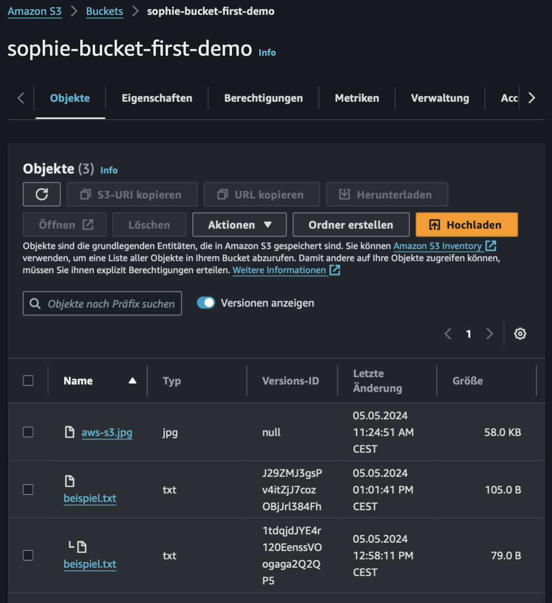
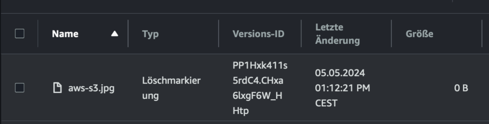

# Praxisaufgabe 3

**Aktivieren der Versionierung für einen Amazon S3-Bucket**

1. **Anmeldung bei der AWS Management Console:**
   - Öffne deinen Webbrowser und melde dich bei der AWS Management Console an.

2. **Navigation zur S3-Konsole:**
   - Klicke auf `Services` oben auf der Seite und wähle dann `S3` aus.

3. **Auswahl des Buckets:**
   - Wähle unseren heutigen Bucket aus, für den du die Versionierung aktivieren möchtest, indem du auf den Namen des Buckets in der Liste der verfügbaren Buckets klickst.

4. **Öffnen der Bucket-Eigenschaften:**
   - Klicke auf die Registerkarte `Eigenschaften` oben im Bereich des ausgewählten Buckets.

5. **Aktivierung der Versionierung:**
   - Scrolle bis du den Abschnitt `Bucket-Versionierung` erreichst, und klicke auf `bearbeiten`.

6. **Versionierung aktivieren:**
   - Du befindest dich nun im Menü `Bucket-Versioning bearbeiten`
   - Wähle `aktivieren` aus, indem du den Radiobutton anwählst
   - klicke auf den orangenen Button `Änderungen speichern`, um die Versionierung für den ausgewählten Bucket zu aktivieren.

7. **Lade eine weitere Datei in den Bucket:**
  - Im Classroom befindet sich die Datei `beispiel.txt`
  - lade sie auf deinen Laptop herunter, sodass du sie gleich zu deinem Bucket hinzufügen kannst
  - klicke dazu auf den orangenen Button `Hochladen`
  - du kannst die Datei hinzufügen, indem du sie in das Feld per Drap&Drop schiebst, das im Bild siehst.
  
  - klicke auf den orangenen Button `Hochladen`
  - du befindest dich im Menü `Upload: Status`. Klicke hier auf den orangenen Button `Schließen`
  - Du kehrst nun zu deinem Bucket zurück

8. **Abändern der Datei `beispiel.txt`:**
  - ändere die Datei `beispiel.txt`, die sich auf deinem Laptop befindet ab, indem du ein wenig Text hinzufügst
  - Klicke in deinem Bucket abermals auf den orangenen `Hochladen`
  - klicke auf den orangenen Button `Hochladen`
  - du befindest dich im Menü `Upload: Status`. Klicke hier auf den orangenen Button `Schließen`
  - Du kehrst nun zu deinem Bucket zurück

9. **Versionen anzeigen lassen:**
  - Wir sehen im Bucket kein weiteres Dokument, denn die `beispiel.txt`wurde versioniert
  - dies können wir uns anzeigen lassen, indem wir den Klickschalter `Versionen anzeigen`umlegen
  
  - wir sehen nun, dass wir zwei Versionen der `beispiel.txt`sehen können

10. **Das Bild löschen:**
  - lege den Klickschalter `Versionen anzeigen`um, sodass er inaktiv ist
  - wähle das Objekt `aws-s3.jpg`an, indem du den Haken im linken Feld neben dem Namen setzt
  - klicke nun auf `Löschen`
  - Tippe `Löschen`im nächsten Feld ein und klicke auf den orangenen Button `Objekte löschen`
  - kehre zu deinem Bucket zurück, indem du im nächsten Menü auf den orangenen Button `Schließen`klickst
  - es sieht so aus, als ob das Bild gelöscht wurde
  - - lege den Klickschalter `Versionen anzeigen`erneut um, sodass er aktiv ist
  - nun sehen wir, dass eine Löschmarkierung zu unserem Bild hinzugefügt wurde
  

  - wähle diese an, indem du den Haken links neben den Namen setzt
  - klicke auf den Button `löschen`
  - Tippe ` Endgültig löschen`im nächsten Feld ein und klicke auf den orangenen Button `Objekte löschen`
  - nun ist unser Bild wieder im Bucket vorhanden

Nach diesen Schritten ist die Versionierung für deinen S3-Bucket aktiviert. Jetzt werden alle Änderungen an Objekten im Bucket versioniert, was bedeutet, dass ältere Versionen eines Objekts beibehalten werden, wenn das Objekt geändert oder gelöscht wird. Du kannst auf diese älteren Versionen zugreifen, wiederherstellen oder löschen, falls erforderlich. Ebenso kannst du die Funktion der Löschmarkierungen dazu nutzen, um versehentlich gelöschte Objekte wiederherzustellen, indem du die Löschmarkierung löschst. 