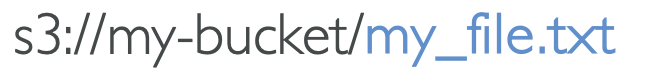
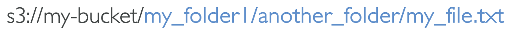
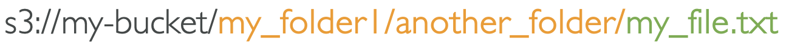
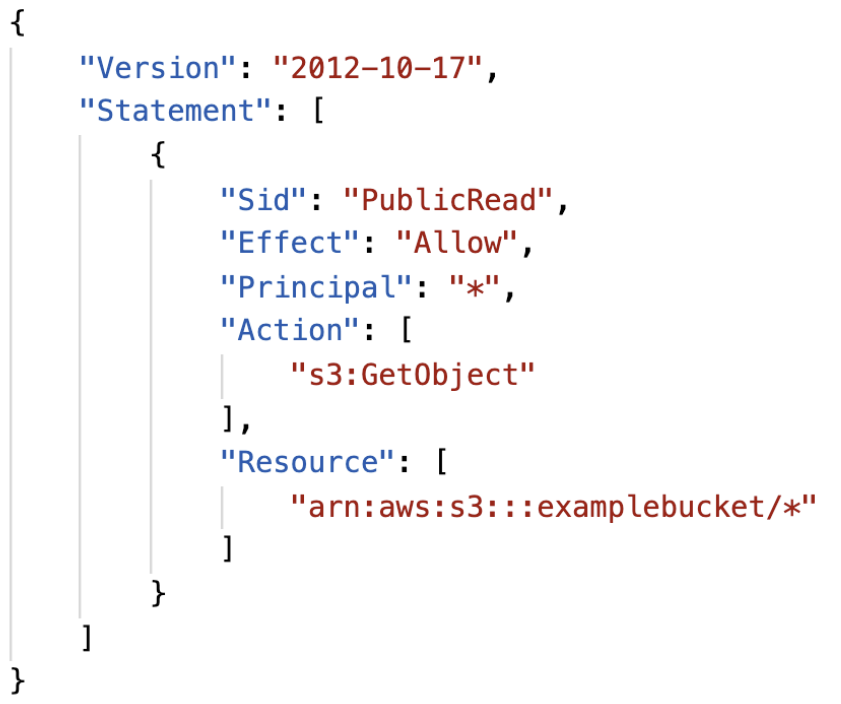
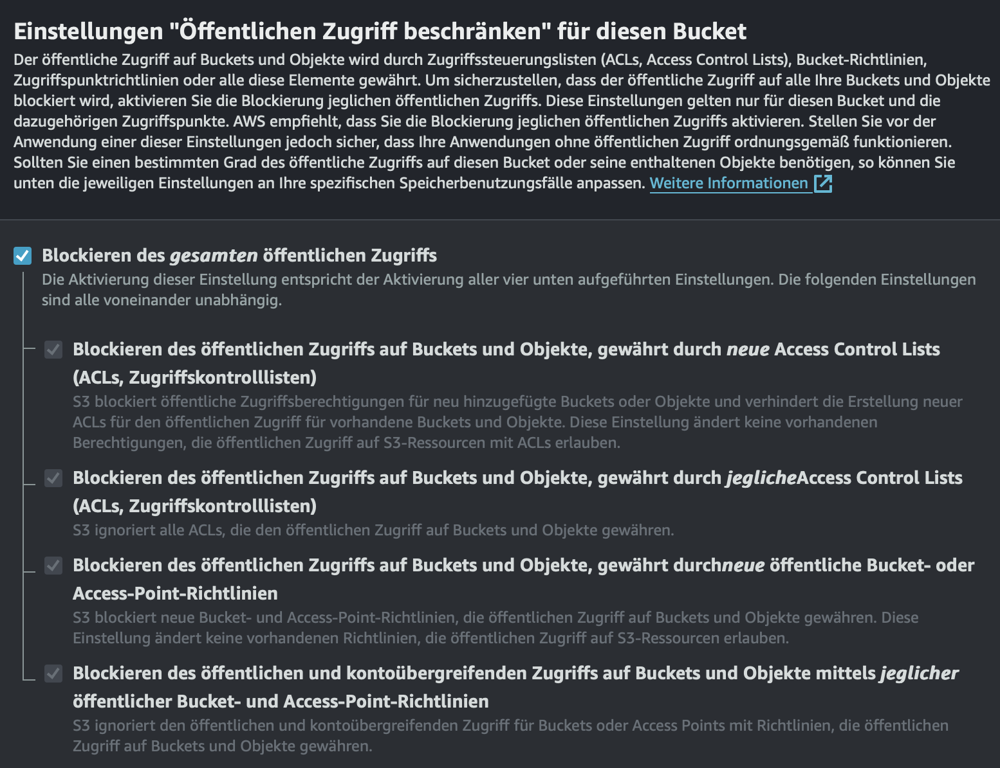
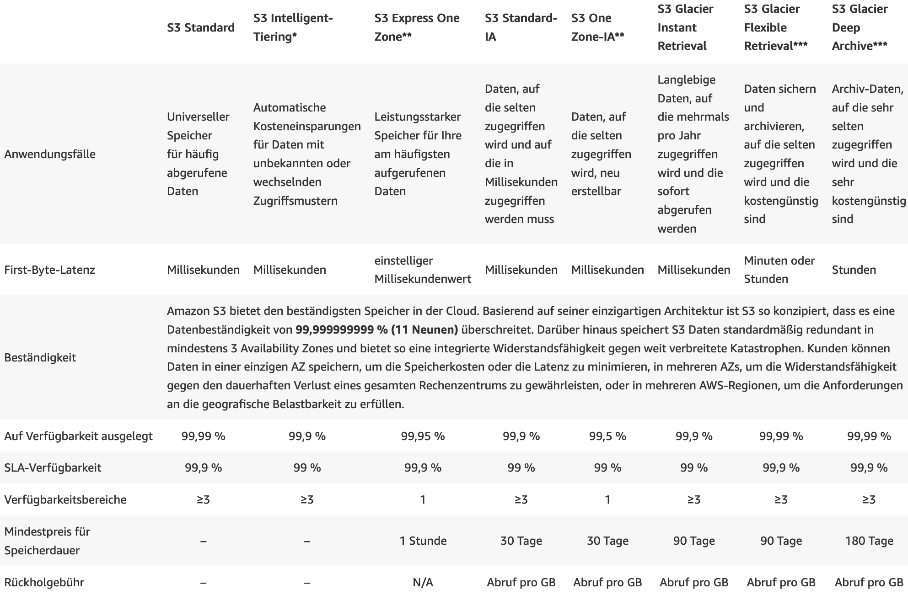

# AWS S3

---

# Fahrplan

1. S3 - Vorstellung
2. Anwendungsfälle
3. S3 - Objektspeicher
4. Definition Object - Key
5. pre-signed URL vs Objekt-URL
6. S3 - Sicherheit
7. Bucket Versionierung
8. Rückbezug EBS
9. Datenhaltbarkeit und Verfügbarkeit
10. Speicherklassen
11. Preis
12. Lebenszyklusregeln

---

# 1. S3 = Simple Storage Service

- Speicherdienst
- Objektspeicher
- Speicher => Bucket

---

# 2. Anwendungsfälle

1. Backup & Speicher
2. Wiederherstellung bei Katastrophen
3. Archivierung
4. Hybrid Cloud Speicher
5. Hosten Anwendungen
6. Medien Hosting (Videos, Bilder)
7. Data Lakes für Big Data Analysen
8. Bereitstellung von Software (Updates)
9. Hosting statischer Webseiten

---

# 3. S3 - Objektspeicher

- Dateien => Objekten
- werden in Bucket gespeichert
- Name Buckets muss global **einzigartig** sein
- Buckets werden auf Region Ebene erstellt
- Namenskonventionen
    - Verboten: Großbuchstaben, _ (underscore), IP-Adressen

---

# 4. Definition Objekt - Key

**Objekt** = Inhalt in einem S3 Bucket
**Key** = Pfad

---

# Key

---

# Key = Präfix + Objektname

---

# Was heißt das nun?

- wir haben KEINE Verzeichnishierarchie
- alles ist ein Schlüssel/Key
- Key = sehr langer Name mit Slashes (/)

---

# Objekte genauer betrachtet

- Objekt = was im Eimer liegt
**besteht aus:**
+ Value/Wert = Wert des Objektes (bis zu 5 TB)
+ Schlüssel
+ Tags zum kategorisieren (mehrere pro Objekt möglich)
+ Versions ID

---

Objekt = Wert + Schlüssel + Tags + Versionsdaten

---
# 5. pre-signed URL vs Objekt-URL

- **Pre-signed URL**: Temporäre URL mit begrenzter Gültigkeitsdauer für spezifischen Zugriff auf ein Objekt
- **Objekt-URL**: Statische URL für dauerhaften Zugriff auf ein Objekt im S3-Bucket

---

# 6. S3 - Sicherheit

- Bucket Policy/ Richtlinie
  - Bucket weite Regeln
- Access Control List = Zugriffskontrollliste
- Verschlüsselung über encryption keys
  - Verschlüsselung der Objekte

---

# Bucket Policy/ Richtlinie

---

JSON Format
- Ressource = für welche Bereiche gilt die Richtlinie
- Effect = Allow/Deny
- Actions = Reihe von API Zugriffen
- Principal = für welchen Account/User gilt die Richtlinie
  - hier: * = Alle
- dieser Bucket hat öffentliche Lesezugriffe auf alle Objekte darin

---
# 6. S3 - Sicherheit

- weitere Sicherheit = AWS Magic
- Bucket Einstellungen
- zweites Sicherheitsnetz zur Bucket Richtlinie

---
# 7. Bucket Versionierung

- Datei kann versioniert werden
- bietet Schutz vor unbeabsichigter Löschung
- rollback zu vorherigen Versionen

---

# 8. Rückbezug EBS

- **Bucket vs. EBS**:
  - S3 organisiert Daten in Buckets
  - EBS (Elastic Block Store) fungiert als Speichervolumen für EC2-Instanzen 
  - S3 speichert Daten als Objekte in Buckets -
  - EBS-Volumes dienen als Blockspeicher für EC2-Instanzen

- **Object:key vs. Dateisystem**:
  - In S3 identifiziert ein eindeutiger Schlüssel (Key) jedes Objekt in einem Bucket
  - in einem Dateisystem identifizieren Dateinamen die Dateien und Ordner

---

# 9. Datenhaltbarkeit und Verfügbarkeit

- **Haltbarkeit:**
  - S3 = 99.999999999% = 11 9's 
  - Haltbarkeit von Objekten über mehrere AZs hinweg 
  - 10.000.000 Objekte speichern = Verlust 1 Objekt in 10.000 Jahren
  - gilt für alle Speicherklassen 
- **Verfügbarkeit:** 
  - Misst, wie ein Dienst verfügbar ist 
  - Variiert je nach Speicherklasse 
  - Beispiel: S3-Standard hat 99,99% Verfügbarkeit = nicht verfügbar 53 Minuten pro Jahr
---

# 10. Speicherklassen

- Amazon S3 Standard 
- Amazon S3 Standard-Infrequent Access (IA) 
- Amazon S3 One Zone-Infrequent Access
- Amazon S3 Glacier Instant Retrieval
- Amazon S3 Glacier Flexible Retrieval
- Amazon S3 Glacier Deep Archive
- Amazon S3 Intelligent Tiering

---

---

# S3 Standard

- Hohe Verfügbarkeit (99,99%)
- Für Daten, auf die häufig zugegriffen wird (öfter als einmal pro 30 Tage)
- Daten werden automatisch über mindestens drei geografisch getrennte Availability Zones innerhalb einer AWS-Region repliziert

---

# S3 Standard-IA (Infrequent Access)

- Für Daten, auf die weniger häufig zugegriffen wird (seltener, als einmal pro 30 Tage)
- Daten müssen aber schnell verfügbar sein bei Zugriff 
- Niedrigere Speicherkosten im Vergleich zu S3 Standard, jedoch mit einer Abrufgebühr.
- Verfügbarkeit (99,99%)

---

# S3 One Zone-IA

- Geringere Kosten als S3 Standard-IA
- Daten werden nur in einer AZ gespeichert
- Daten, die nicht häufig benötigt werden 
- Etwas höheres Risiko, da nicht geografisch verteilt sind
- Verfügbarkeit Verfügbarkeit (99,99%)

---

# Amazon S3 Glacier Storage Classes 

- Kostengünstiger Objektspeicher für die Archivierung / Sicherung 
- Preis: Preis für die Speicherung + Kosten für den Objektabruf 

---

# Amazon S3 Glacier Instant Retrieval 

- Millisekunden-Abruf
- ideal für Daten, auf die einmal im Quartal zugegriffen wird 
- Mindestspeicherdauer 90 Tage

---

# Amazon S3 Glacier Flexible Retrieval 

- Beschleunigt (1 bis 5 Minuten), Standard (3 bis 5 Stunden), Bulk (5 bis 12 Stunden) kostenlos 
- Mindestspeicherdauer 90 Tage 

---

# Amazon S3 Glacier Deep Archive 
- für Langzeitspeicher 
- Standard (12 Stunden), Bulk (48 Stunden)
- Mindestspeicherdauer von 180 Tage

---

# S3 Intelligent-Tiering 

- Kleine monatliche Überwachungs- und Auto-Tiering-Gebühr 
- Bewegt Objekte automatisch zwischen Standard, Infrequent Access, Glacier und Galcier Deep Archive basierend auf der Nutzung 
- keine Abrufgebühren 
- keine Notwendigkeit, Datenzugriffsmuster zu lernen oder zu vorhersagen
- Gleiche Haltbarkeit und Verfügbarkeit wie S3 Standard

---

# Preis

https://aws.amazon.com/de/s3/pricing/

---
# Lebenszyklusrichtlinien

- Automatische Verwaltung von Objekten im Lebenszyklus
- Definition von Aktionen basierend auf Alter, Präfix oder Tags
- Übergang in verschiedene Speicherklassen oder Löschung
- Beispiel: Verschiebung in Glacier nach 30 Tagen, Löschung nach einem Jahr
- Optimierung von Speicherkosten durch Umzug weniger genutzter Daten
- Automatisierung reduziert manuellen Aufwand und optimiert Ressourceneinsatz
