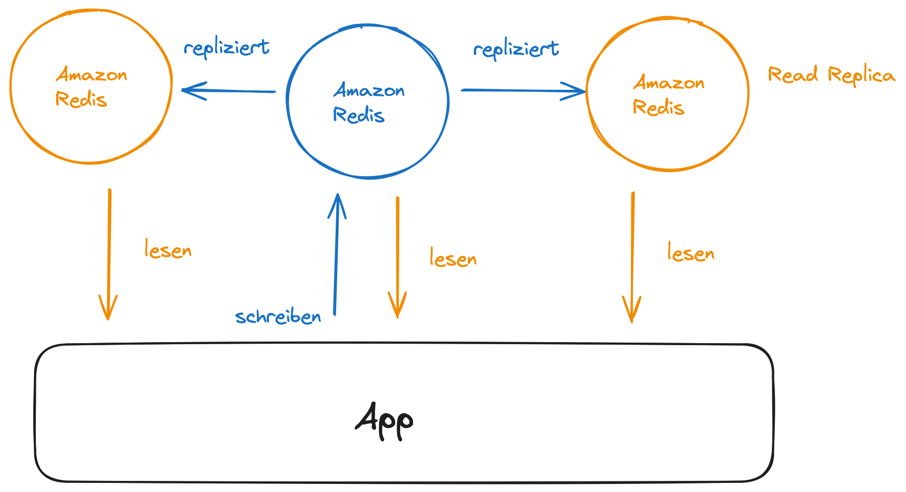
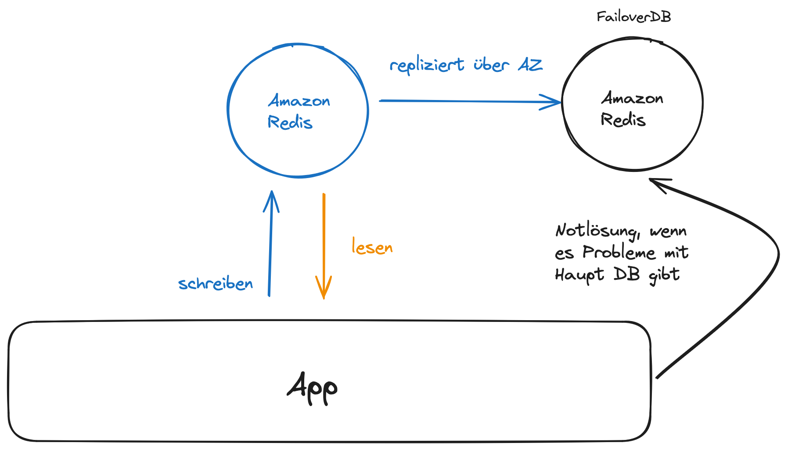
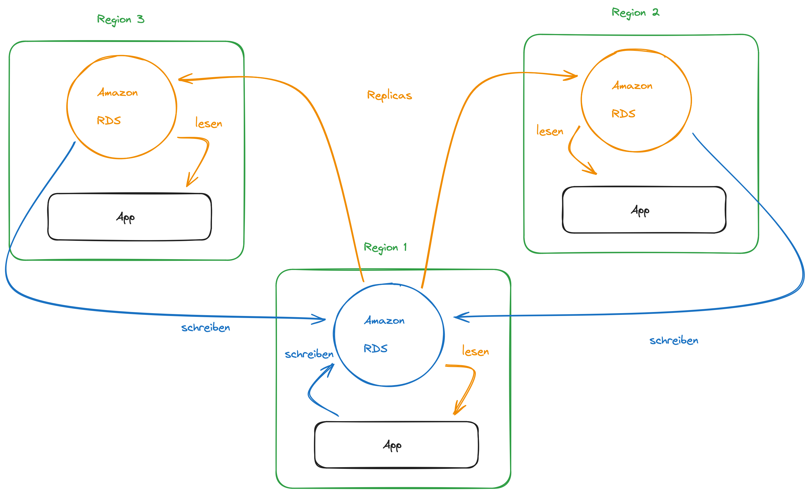

# AWS Datenbanken

---

# Gliederung

1. Recap Datenbanken
2. Warum AWS DB?
3. Gruppenarbeit
4. Ergebnispräsentation
5. Vergleichstabelle
6. RDS Bereitstellsmodelle
7. DynamoDB Accelerator (DAX)

---

# SQL-Datenbanken
- Strukturierte Datenbankumgebung
- SQL-Abfragesprache
- Beispiele: MySQL, PostgreSQL, SQL Server

---

# NoSQL-Datenbanken
- Flexible, nicht-relationale Struktur
- Speicherung und Verarbeitung unstrukturierter Daten
- Beispiel: MongoDB

---

# Graphdatenbanken
- Modellierung von Beziehungen zwischen Datenpunkten
- Anwendungen: soziale Netzwerke, Empfehlungssysteme

---

# In-Memory-Datenbanken
- Speicherung von Daten im Arbeitsspeicher
- Schnelle Datenverarbeitung
- Anwendungen: Echtzeitanalysen, Caching

---

# 2. Warum AWS DB?
- schnelle Bereitstellung
- hohe Verfügbarkeit
- Skalierung (horizontal & vertikal)
- automatisierte Sicherung & Wiederherstellung
- Updates
- Überwachung

---

# 3. Gruppenarbeit 

---

# 4. Ergebnispräsentation

---

# 5. Vergleichstabelle

---

| Dienst         | Datenbanktyp       | Skalierbarkeit  | Leistung        | Anwendungsfälle                     |
|----------------|--------------------|-----------------|-----------------|------------------------------------|
| RDS            | Relational         | Hoch            | Gut             | Traditionelle Anwendungen          |
| Aurora         | Relational         | Sehr hoch       | Ausgezeichnet   | Skalierbare und leistungsstarke Anwendungen |
| DynamoDB       | NoSQL              | Sehr hoch       | Sehr gut        | Big Data, Echtzeitanwendungen      |
| MemoryDB       | In-Memory          | Sehr hoch       | Ausgezeichnet   | Echtzeitanwendungen, Caching       |
| Neptune        | Graph              | Hoch            | Sehr gut        | Wissensgraphen |

---

# 6. RDS Bereitstellungsmodelle

---

# Read-Replicas/ Lese-Repliken
- Skalieren der Lese-Workloads der DB 
- Kann bis zu 15 Lese-Replikate erstellen 
- Daten werden nur in die Haupt-DB geschrieben

---

---
# Multi-AZ

- Failover im Falle eines AZ-Ausfalls (hohe Verfügbarkeit) 
- Daten werden nur in die Hauptdatenbank gelesen/geschrieben 
- Kann nur 1 andere AZ als Failover haben

---

---
# Multi-Region (Lese-Repliken) 
- Notfallwiederherstellung im Falle eines Regionsproblems 
- Lokale Leistung für globale Lesungen 
- Replikationskosten

---

---

# 7. DynamoDB Accelerator (DAX)

- Vollständig verwalteter In-Memory-Cache für DynamoDB 
- 10-fache Leistungsverbesserung 
- einstellige Millisekundenlatenz bis Mikrosekundenlatenz beim Zugriff auf Tabellen
- Sicher, hoch skalierbar und hochverfügbar 

