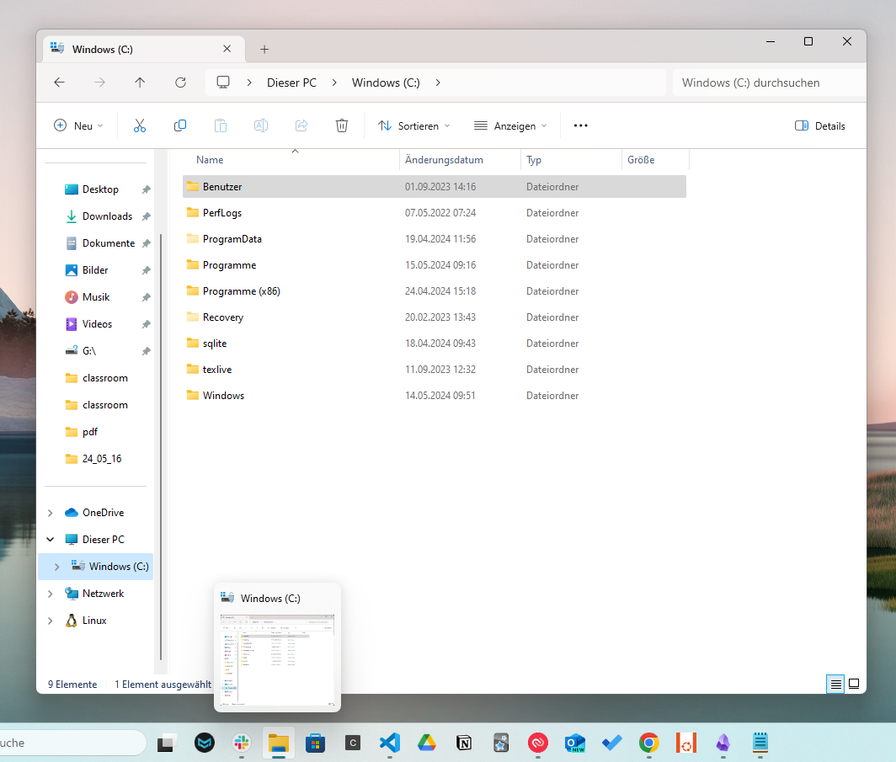
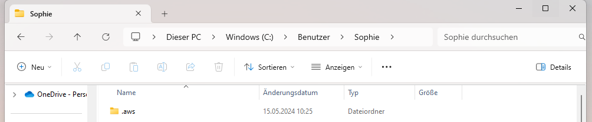

# Aufgabe 1

Lösche deine config Datei für deinen SSO Zugang und richte ihn selbst noch einmal ein. 
Du findest die config Datei wie folgt:

- öffne den Dateiexplorer und klicke auf `Windows(C:)`

- nun gehst du in den Ordner `Benutzer`
- klicke auf deinen Benutzer
- hier findest du das Verzeichnis `.aws`

- gehe dort hinein
- du solltest nu die `config`-Datei sehen 

- lösche diese Datei
- wenn du nun beispielsweise `aws s3 ls --profile sandbox-profile` im Terminal eingibst, solltest du folgende Fehlermeldung erhalten `The config profile (sandbox-profile) could not be found`. Dein konfiguriertes Profil ist also nicht mehr auffindbar. Mache davon einen Screenshot für die Abgabe
- Super, jetzt kannst du es selbst noch einmal einrichten!
- Dokumentiere das erfolgreiche Einrichten, indem du den Befehl `aws s3 ls --profile sandbox-profile` ausführst und er erfolgreich ausgeführt werden kann.

