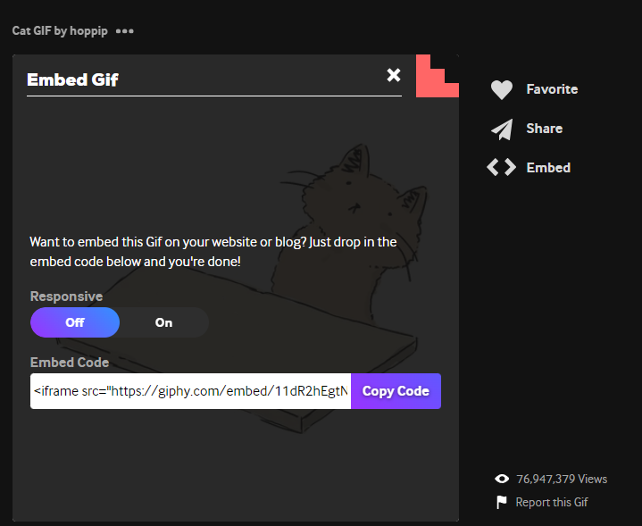

# Aufgabe 2

Gehe noch einmal die Schritte aus der Praxisaufgabe 2 durch, diesmal suchst du dir selbst jedoch einen Titel aus, der angezeigt werden soll und ein lustiges Bild.

Ich gebe dir erst einmal eine Anleitung, wie du den Titel und das Bild abändern kannst.

um den Titel zu ändern, kannst den Abschnitt zwischen `<h1>` und `</h1>` ändern.
Aus `<h1>Yeah, its a Unicorn!</h1>` kann ganz langweilig `<h1>Hausaufgabe</h1>` werden. Du darfst aber gerne deiner Phantasie freien Lauf lassen ;-)


Gehe auf https://giphy.com/ und wähle im  Suchfeld nach einem Begriff, beispielsweise `cats`. Klicke auf ein Gif, das dir gefällt und klicke danach auf `Embed`. Dir wird nun ein Code angezeigt, den du über `Copy Code` kopierst. 
.

Lösche folgenden Absatz aus dem Gesamtcode

```html
<div style="padding-top: 81.633%; position: relative;">
        <iframe src="https://gifer.com/embed/QhO" width="50%" height="50%" style="position: absolute; top: 0; left: 0;" frameborder="0" allowfullscreen></iframe>
    </div>
```

Es sollte nun so aussehen


```html
<!DOCTYPE html>
<html lang="en">
<head>
    <meta charset="UTF-8">
    <meta name="viewport" content="width=device-width, initial-scale=1.0">
    <title>Unicorn</title>
</head>
<body>
    <h1>Hier hast du hoffentlich schon Änderungen vorgenommen</h1>
    


</body>
</html>
```

Füge diesen Code unter dem `</h1>` ein und über `</body>` ein. 

Super, gemacht! Nun geht es ans Erstellen eines Buckets, der deine eigene Überschrift und dein ausgewähltes Gif anzeigt.

#### 1. Erstellen eines neuen Buckets mit einem eindeutigen Namen

```sh
aws s3 mb "s3://dein-ausgewählterName" --profile deinProfilname
```

Kontrolliere, dass der s3 Bucket erstellt wurde
```sh
aws s3 ls --profile deinProfilname
```

#### 2. Aktivieren des öffentlichen Zugriffs auf den Bucket

```sh
aws s3api put-public-access-block --bucket dein-ausgewählterName --public-access-block-configuration "BlockPublicAcls=false,IgnorePublicAcls=false,BlockPublicPolicy=false,RestrictPublicBuckets=false" --profile deinProfilname
```
#### 3. Aktualisieren der Bucket-Richtlinie für öffentlichen Lesezugriff
```sh
aws s3api put-bucket-policy --bucket dein-ausgewählterName --policy "{ \"Version\": \"2012-10-17\", \"Statement\": [ { \"Sid\": \"PublicReadGetObject\", \"Effect\": \"Allow\", \"Principal\": \"*\", \"Action\": \"s3:GetObject\", \"Resource\": \"arn:aws:s3:::dein-ausgewählterName/*\" } ] }" --profile deinProfilname

```

#### 4. Hochladen deiner geänderten index.html Datei

wähle den Ordner mit der index.html Datei darin mit einem rechtsklick an und wähle `Als Pfad kopieren` aus. Ersetze im unteren Befehl `verzeichnis-pfad` mit dem eben kopierten Pfad.

```sh
aws s3 sync verzeichnis-pfad "s3://dein-ausgewählterName/" --profile deinProfilname
```

`aws s3 sync`aktualisiert den Inhalt des Buckets mit dem Inhalt des lokalen Verzeichnisses.

Wenn du nur eine einzelne Datei kopieren möchtest, kannst du verwenden`aws s3 cp`

```sh
aws s3 cp verzeichnis-pfad s3://dein-ausgewählterName/" --profile deinProfilname
```

ebenso kannst du eine Datei aus deinem Bucket heruaskopieren

```sh
aws s3 cp "s3://your-bucket-name/filename" verzeichnispfad --profile deinProfilname
```

### Bereinigen


Um einen Bucket zu löschen, musst du zunächst alle Objekte im Bucket löschen und dann den Bucket selbst löschen. 
Alle Objekte im Bucket löschen

```sh
aws s3 rm s3://dein-ausgewählterName --recursive --profile deinProfilname
```

Den Bucket selbst löschen
```sh
aws s3api delete-bucket --bucket dein-ausgewählterName --profile deinProfilname
```

