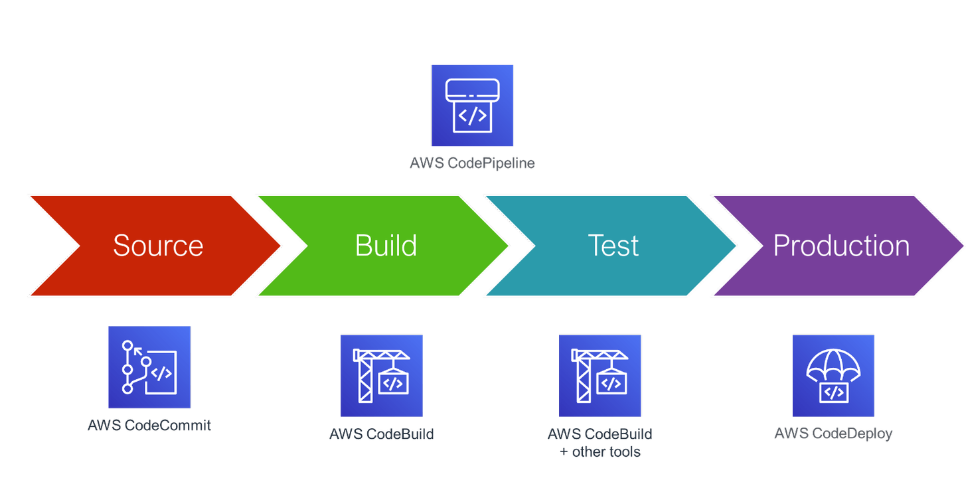
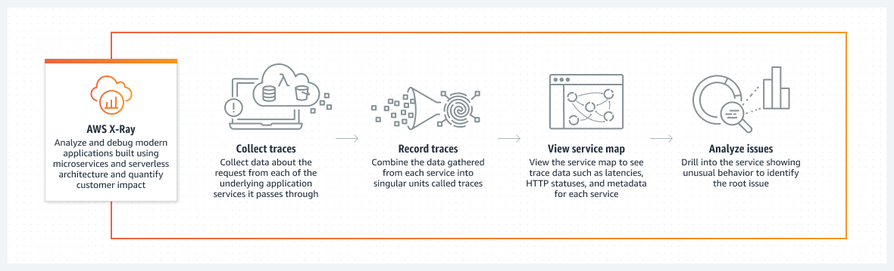

# Entwickler- und Frontend-Tools

---

# Agenda
1. Entwickler-Tools
2. Frontend-Tools

---
- AWS CloudShell
- AWS CLI
- AWS Cloud9
- AWS CodeCommit
- AWS CodeBuild
- AWS CodeDeploy
- AWS CodePipeline
- AWS CodeArtifact
- AWS CodeStar
- AWS X-Ray
- AWS AppConfig
---

# 1. Entwickler-Tools

AWS bietet eine Suite von Tools zur Unterstützung von Entwicklern beim Erstellen, Bereitstellen und Verwalten von Anwendungen.

---

# Entwickler-Tools: Details

---

# AWS CloudShell
- **Zweck:** Browser-basierte Shell
- **Hauptmerkmale:** Vorgefertigte Authentifizierung, vorinstallierte AWS CLI
- **Analogie:** Wie ein Büroarbeitsplatz, der immer bereit ist, ohne dass man seinen Laptop anschließen muss.

---

# AWS CLI
- **Zweck:** Befehlszeilenschnittstelle für AWS-Dienste
- **Hauptmerkmale:** Aufgaben automatisieren, Dienste verwalten, Scripting
- **Analogie:** Wie ein Schweizer Taschenmesser für AWS, immer bereit, jede Aufgabe zu erledigen.

---

# AWS Cloud9
- **Zweck:** Cloud-basiertes IDE, um Code zu schreiben, laufen zu lassen und zu ,,debuggen"
- **Hauptmerkmale:** Echtzeit-Zusammenarbeit, direkter Zugriff auf AWS-Dienste
- **Analogie:** Wie ein gemeinschaftliches Whiteboard, auf dem alle Entwickler gleichzeitig schreiben und zeichnen können.

---

# AWS CodeCommit
- **Zweck:** Versionsverwaltung, Zusammenarbeit am Code
- **Hauptmerkmale:** Sicher, Git-basiert, Prinzip **Versionierung**, ähnlich zu GitHub etc.
- **Analogie:** Wie ein Tresor, in dem alle Codeänderungen sicher und organisiert aufbewahrt werden

---

# AWS CodeBuild
- **Zweck:** Code kompilieren, testen und Pakete (packages) erstellen
- **Hauptmerkmale:** Vollständig verwalteter, skalierbarer Build-Service, unterstützt mehrere Sprachen
- **Analogie:** Wie eine Fabrik, die Rohstoffe (Quellcode) nimmt und fertige Produkte (Builds) herstellt

---

# AWS CodeDeploy
- **Zweck:** Automatisierung von Code-Bereitstellungen
- **Hauptmerkmale:** Unterstützt EC2, Lambda, On-Premises-Server, **Hybrid** Service
- **Analogie:** Wie ein Lieferservice, der Software-Pakete schnell und zuverlässig an die richtigen Orte liefert

---

# AWS CodePipeline
- **Zweck:** Organisiert die Schritte Code --> Bereitstellung
- **Hauptmerkmale:** Automatisierung von Release-Pipelines
- **Ablauf:**
- **Analogie:** Wie ein Fließband in einer Fabrik, das sicherstellt, dass Produkte effizient und fehlerfrei gefertigt werden

---

---

# AWS CodeArtifact

- Softwarepakete, die erstellt werden, hängen oft voneinander ab
- besonders im **Build**-Prozess
- ,,Architektur" von Softwarepaketen
- Code-Abhängigkeiten = Code-Dependencies
- Abhängigkeiten können gespeichert + abgerufen werden = Artefektverwaltung

---

# AWS CodeArtifact

- **Zweck:** Artefakt-Repository für Softwarepakete
- **Hauptmerkmale:** Unterstützt Maven, npm, Python und mehr
- **Analogie:** Wie eine Bibliothek, die alle Bücher (Artefakte) enthält, die Entwickler benötigen.

---

# AWS CodeStar
- **Zweck:** Erstellen, Verwalten und Koordinieren von Softwareentwicklungsprojekten in AWS
- **Hauptmerkmale:** Schnelles Einrichten von Entwicklungsprojekten, Projektvorlagen für verschiedene Programmiersprachen
- **Analogie:** Wie ein All-in-One-Bauplan für ein Haus, der alle notwendigen Werkzeuge und Materialien enthält, um schnell und effizient loszulegen.

---

# AWS AppConfig
- **Zweck:** Verwaltung von Anwendungskonfigurationen
- **Hauptmerkmale:** Feature-Flags, Versionsverwaltung, Validierung
- **Analogie:** Wie ein Schaltkasten, der sicherstellt, dass die richtigen Schalter zur richtigen Zeit aktiviert werden.

---

# AWS X-Ray
- **Zweck:** Analyse und Debugging von **verteilten Anwendungen**
- **Hauptmerkmale:** Tracing, Performance-Analyse, Fehlererkennung
- **Analogie:** Wie ein Navigationssystem für Anwendungen, das den Weg verfolgt und Engpässe oder Fehler identifiziert.

---

---

# 2. Frontend-Tools

AWS bietet spezialisierte Tools zur Unterstützung der Web- und mobilen Entwicklung

---

# Wichtige Frontend-Tools

- AWS AppSync
- AWS Amplify
- AWS Device Farm

---

# Frontend-Tools: Details
---
# AWS AppSync
- **Zweck:** *GraphQL*-API-Service, Backend für mobile-/Web-Anwendungen, Echtzeit
- **Hauptmerkmale:** Realtime-Updates, Offline-Synchronisierung, Sicherheitsfeatures
- **Analogie:** Wie ein Telefonnetz, das dafür sorgt, dass alle Gespräche (Daten) immer zur richtigen Zeit am richtigen Ort ankommen.

---

# AWS Amplify

Amplify = Verstärken
- **Zweck:** Entwicklung und Bereitstellung von Web- und mobilen Anwendungen
- **Hauptmerkmale:** Einfaches Hosting, Authentifizierung, Datenbank-Integration, Monitoring, Analytics...
- **Analogie:** Wie ein *Baukasten*, der alle Teile enthält, um eine komplette Web- oder Mobile-App zu erstellen.

---

# AWS Device Farm
- **Zweck:** Testen von mobilen und Web-Anwendungen, Testen verschiedener Konfigurationen (GPS, Sprache, Bluetooth...)
- **Hauptmerkmale:** Testen auf echten Geräten, parallele Tests, Unterstützung für verschiedene Plattformen, Ausgabe von Reports, Logs, Screenshots an uns
- **Analogie:** Wie ein Autotestgelände, auf dem Autos (Apps) unter realen Bedingungen getestet werden.

---

# Zusammenfassung
---

# Entwickler-Tools
- Unterstützen den gesamten Entwicklungszyklus
- Automatisierung und Verwaltung

# Frontend-Tools
- Fokus auf Web- und mobile Anwendungen
- Integration und Testen auf verschiedenen Geräten
- Analogie: Wie eine vollständige Werkstatt für die Entwicklung und das Testen von Anwendungen.

