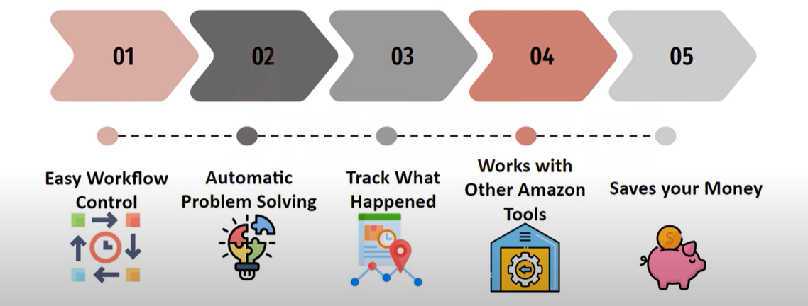

# Serverless Services und Anwendungsintegration

---

# Fahrplan

1. AWS Lambda
2. Amazon SNS
3. Amazon SQS
4. Amazon EventBridge
5. AWS Fargate
6. AWS Step Functions

---

# 1. AWS Lambda

## Was ist AWS Lambda?

- **Analogie:** Denke an AWS Lambda wie an eine Glühbirne mit Bewegungsmelder.
- Serverless Compute Service
- Führe Code aus, ohne Server zu verwalten
- Ereignisgesteuert
- Skalierung automatisch

---
## Anwendungsfälle

- Datenverarbeitung
- Reaktion auf Datenänderungen
- APIs und Webservices

---
## Vorteile

- Kosteneffizient
- Einfach zu integrieren
- Hohe Verfügbarkeit

---

# 2. Amazon SNS (Simple Notification Service)

## Was ist Amazon SNS?

- **Analogie:** Stell dir SNS wie ein Lautsprechersystem vor, das Ankündigungen an viele Empfänger gleichzeitig sendet.
- Fully managed messaging service
- Senden von Benachrichtigungen an eine Vielzahl von Empfängern
- Unterstützt verschiedene Kommunikationsprotokolle

---
## Anwendungsfälle

- System-zu-System Messaging
- Mobile Push-Benachrichtigungen
- E-Mail-Benachrichtigungen

---

# 3. Amazon SQS (Simple Queue Service)

## Was ist Amazon SQS?

- **Analogie:** Denke an SQS wie an ein Postfachsystem, wo jeder seine Nachrichten in der richtigen Reihenfolge erhält.
- Fully managed message queuing service
- Ermöglicht das Entkoppeln und Skalieren von Microservices, verteilten Systemen und serverlosen Anwendungen

---
## Anwendungsfälle

- Job Queues
- Pufferung
- Synchronisation zwischen Services

---

# 4. Amazon EventBridge

## Was ist Amazon EventBridge?

- **Analogie:** Stell dir EventBridge wie ein Bahnsystem vor, das Züge (Ereignisse) von einem Punkt zum anderen leitet.
- Serverless event bus service
- Verbindet Anwendungen mit Daten von eigenen Anwendungen, SaaS und AWS-Services
- Echtzeit-Datenstromverarbeitung

---
## Anwendungsfälle

- Ereignisgesteuerte Architekturen
- Integration von Drittanbieter-Services
- Echtzeit-Benachrichtigungen

---

| Funktion                | Amazon SNS                               | Amazon SQS                                | Amazon EventBridge                         |
|-------------------------|------------------------------------------|-------------------------------------------|--------------------------------------------|
| **Analogie**            | Lautsprechersystem                       | Postfachsystem                           | Bahnsystem                                 |
| **Anwendungsfälle**     | System-zu-System Messaging             | Job Queues                             | Ereignisgesteuerte Architekturen        |
|                         | Mobile Push-Benachrichtigungen         |  Pufferung                              |  Integration von Drittanbieter-Services  |
|                         | E-Mail-Benachrichtigungen              | Synchronisation zwischen Services      | Echtzeit-Benachrichtigungen              |

---

# 5. AWS Fargate

## Was ist AWS Fargate?

- **Analogie:** Denk an Fargate wie an ein Catering-Service für Container: Du sagst, was du brauchst, und es wird bereitgestellt, ohne dass du die Küche siehst.
- Serverless Compute Engine für Container
- Ermöglicht das Ausführen von Containern ohne Serververwaltung
- Unterstützt Amazon ECS und EKS

---

# 6. AWS Step Functions

## Was sind AWS Step Functions?

- **Analogie:** Stell dir Step Functions wie ein Fließband in einer Fabrik vor, wo jeder Schritt automatisch abläuft und das Produkt am Ende fertiggestellt wird.
- Serverless Orchestration Service
- Ermöglicht das Erstellen und Betreiben von Workflows
- Unterstützt Zustandsautomaten

[Link zu Step Functions](https://aws.amazon.com/de/blogs/aws/new-compute-database-messaging-analytics-and-machine-learning-integration-for-aws-step-functions/)

---

---

---

---
## Anwendungsfälle

- Datenverarbeitungspipelines
- Automatisierung von Geschäftsprozessen

---
## Vorteile

- Einfache Erstellung von Workflows
- Fehlermanagement
- Integration mit anderen AWS-Services

---

# Zusammenfassung

- **AWS Lambda**: Serverless Compute, automatisierte Skalierung. (Glühbirne mit Bewegungsmelder)
- **Amazon SNS**: Pub/Sub-Messaging, vielseitige Benachrichtigungen. (Lautsprechersystem)
- **Amazon SQS**: Nachrichtenwarteschlange, Skalierbarkeit und Entkopplung. (Postfachsystem)
- **Amazon EventBridge**: Eventbus, Integration von Anwendungen und Daten. (Bahnsystem)
- **AWS Fargate**: Serverless Container Management, keine Serververwaltung. (Catering-Service)
- **AWS Step Functions**: Workflow-Orchestrierung, Zustandsautomaten. (Fließband)

---

# Fragen?

