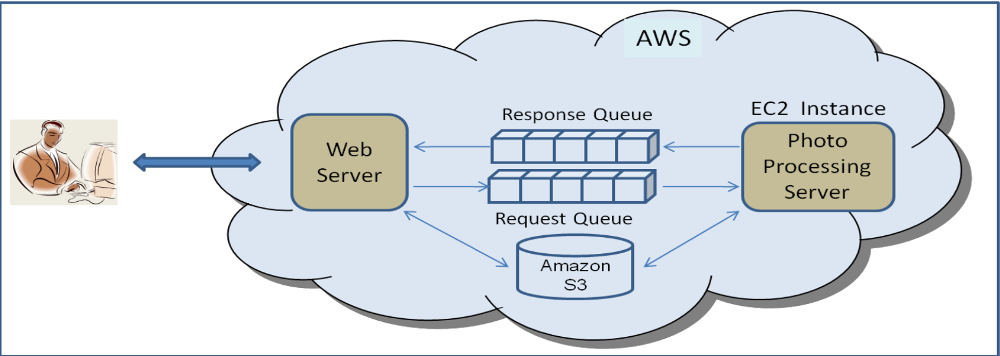

# Aufbau skalierbarer und zuverlässiger Anwendungen mit Amazon EC2 und SQS

### Überblick

- **Amazon EC2** bietet anpassbare Rechenkapazität in der Cloud.
    - **Kapazitätsanpassung**: Erhöhen oder verringern der Kapazität innerhalb von Minuten.
    - **Kostenmodell**: Zahle nur für das, was du nutzt.

- **Amazon SQS** ermöglicht asynchrone, nachrichtenbasierte Kommunikation zwischen verteilten Komponenten einer Anwendung.

### Herausforderungen und Lösungen:

- **Architektur von Anfang an richtig gestalten**: Um Skalierbarkeit und Zuverlässigkeit zu gewährleisten, vermeiden von Engpässe und Single Points of Failure.
- **Einsatz von Amazon SQS**: Ermöglicht es, verteilte Anwendungen leicht zu skalieren, indem es eine zuverlässige Nachrichtenwarteschlange bereitstellt.

### Beispielanwendung: Online-Fotobearbeitungsdienst

1. **Nutzer lädt Fotos hoch** und spezifiziert die gewünschten Bearbeitungen.
2. **Amazon SQS Warteschlange**: Nachrichten über die Bearbeitungsaufträge werden in die Warteschlange gestellt.
3. **Fotos in Amazon S3**: Die hochgeladenen Fotos werden in Amazon S3 gespeichert.
4. **Fotobearbeitungsserver**: Liest Nachrichten aus der Warteschlange, führt die Bearbeitungen durch und sendet Statusmeldungen zurück an die Warteschlange.

### Vorteile der Architektur mit Amazon SQS:

1. **Isolierung von Fehlern**: Wenn ein Fotobearbeitungsserver abstürzt, bleiben die Nachrichten in der Warteschlange und können von einem anderen Server verarbeitet werden.

2. **Einfache Skalierung**: Neue Serverinstanzen können hinzugefügt werden, um die Last zu bewältigen.
3. **Automatisches Skalieren**: Die Anzahl der Verarbeitungsserver kann dynamisch angepasst werden, um der Nachfrage gerecht zu werden.

### Zusammenfassung:

- in diesem Beispiel ergänzt **Amazon SQS** **Amazon EC2**, indem es eine Grundlage für den Aufbau skalierbarer und zuverlässiger Anwendungen bietet.
- Die **Nachrichtenwarteschlange** von SQS ermöglicht asynchrone Kommunikation und verbessert die Flexibilität und Fehlertoleranz der gesamten Architektur.

