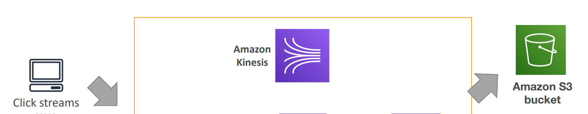
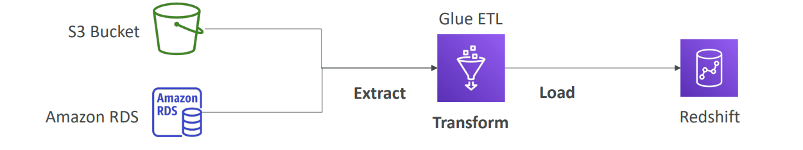
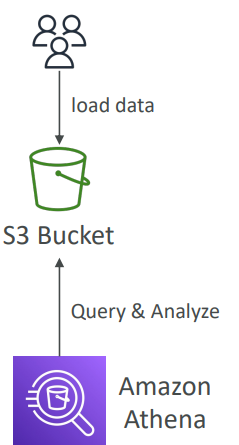
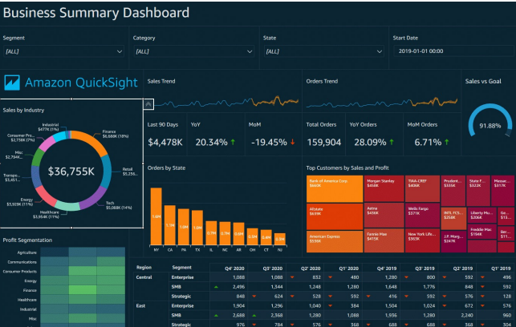
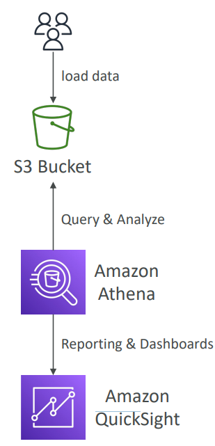

# Datenanalyse mit AWS

---

# Fahrplan

1. Wozu Daten verarbeiten?
2. Daten organisieren
3. Daten verarbeiten
4. AWS Services für Data Analytics
5. Gruppenarbeit 

---

# 1. Wozu Daten verarbeiten?

- aus Daten sollen Informationen & Erkenntnisse gesammelt werden
- aus Unternehmenssicht
    - Effizienz und Betriebsabläufe zu verbessern
    - Kundenverhalten und Markttrends zu verstehen
    - Risiken zu minimieren und Betrug zu erkennen
    - Produktentwicklungen und Innovationen voranzutreiben
    - Personalisierte Kundenerfahrungen zu schaffen

---
# Prozess

- Daten werden gesammelt, verarbeitet + analysiert
- Transformation von Rohdaten in nützliche Informationen

1. **Datensammlung und -speicherung**: Sammeln von Daten aus verschiedenen Quellen und Datenspeicherung
2. **Datenbereinigung und -vorbereitung**: Verwenden von Tools, um Daten zu bereinigen, zu formatieren und für die Analyse vorzubereiten.
3. **Datenanalyse**: Datenabfragen durchführen, um Einsichten zu gewinnen.
4. **Visualisierung und Berichterstattung**: Erstellung von Dashboards und Berichten, um die Analyseergebnisse darzustellen und zu teilen.

---

# 2. Daten organisieren

---

# Data Warehouse

- strukturiertes, organisiertes Lagerhaus für Daten
- Zweck: sammeln Daten von verschiedenen Quellen
- auf diesen Daten Analysen auszuführen, Berichte erstellen
- Anwendung: Geschäftseintscheidungen & -analysen

---

# Data Lake

- Sammlung Rohdaten
- strukturiert & unstrukturiert
- große Menge Daten aus versch. Quellen
- keine Gedanken Datenformat, Struktur
- erst sammeln, dann Verwendung festlegen

---

# 3. Daten verarbeiten

---

# Wie können Daten verändert werden?

- Anpassung in einheitliches Format über alle Datensätze
    - Bsp: Datum in DD-MM-YYYY
- doppelte, fehlerhafte Daten entfernen
- Zusammenfassung von Merkmalen
- Hinzufügen Merkmalen
- Aussortieren von Daten

---

# Stream Processing

- Verarbeitung von Daten in Echtzeit
- Daten ,,fließen" dabei in einem ,,Strom"
- Daten werden kontinuierlich generiert, übertragen, verarbeitet & analysiert
- nötig, um Einblicke aus den neuesten Informationen zu gewinnen
- Beispiele
    - Finanzmarktdaten
    - IoT-Sensordaten
    - Log-Daten
    - Video/Audio-Streams

---

# Batch-Processing

- Daten werden in kleinere ,,Batches" aufgeteilt und dann verarbeitet
- Verarbeitet Daten in großen, vordefinierten Intervallen
- Anwendungen: Datenbereinigung, Transformation, maschinelles Lernen

---

# 4. AWS Services für Data Analytics

---

# Data Warehouse: Amazon Redshift
- Strukturierte Analyse: Speichert und analysiert strukturierte Daten aus verschiedenen Quellen.
- Optimiert für Analytik: Schnelle Abfrageleistung für umfangreiche Datenmengen.
- Skalierbarkeit: Ermöglicht das Hoch- und Herunterskalieren je nach Bedarf.
**Data Warehouse**

---

# Stream Processing mit AWS
- Echtzeitverarbeitung: **Amazon Kinesis** und **Apache Kafka** ermöglichen die Verarbeitung von Daten in Echtzeit
- Skalierbarkeit: Kann mit wachsenden Datenmengen umgehen 
- Verarbeitungsleistung dynamisch anpassbar
- Anwendungen: Echtzeit-Analysen, Betrugserkennung, Überwachung von Systemen und mehr
**Echtzeit big data streaming = Kinesis**

---

---

# Amazon Managed Streaming für Apache Kafka (Amazon MSK)

- Vollständig verwaltet, Ausführung und Skalierung von Apache Kafka-Clustern
- Echtzeit-Datenverarbeitung
- Publizieren, Abonnieren, Speichern und Verarbeiten von Datenströmen in Echtzeit

---

# Amazon OpenSearch Service

- Skalierung und Management für OpenSearch-Cluster
- Unterstützung von Log-Analytics, Echtzeitanwendungen und Suchfunktionen
- Daten durchsuchen, analysieren und visualisieren

---

# Amazon EMR

• EMR steht für „Elastic MapReduce“
• hilft bei der Erstellung von Hadoop-Clustern (Big Data) zur Analyse und Verarbeitung
riesige Menge an Daten
• Die Cluster können aus Hunderten von EC2-Instanzen bestehen
• Anwendungsfälle: Datenverarbeitung, maschinelles Lernen, Webindizierung, groß
Daten…

---

# Vergleich der Clusterarten

| Merkmal                    | Hadoop-Cluster                           | OpenSearch-Cluster                      | Apache Kafka-Cluster                     |
|----------------------------|------------------------------------------|-----------------------------------------|------------------------------------------|
| Zweck                 | **Batch**-Verarbeitung + Speicherung       | **Echtzeit**-Suche und -Analyse             | Echtzeit-**Datenströme**                     |
| **AWS-Service**            | Amazon EMR                               | Amazon OpenSearch Service               | Amazon MSK (Managed Streaming for Kafka) |

---

# AWS Glue 
• Verwalteter Dienst zum Extrahieren, Transformieren und Laden (ETL) 
• Nützlich zum Vorbereiten und Transformieren von Daten für Analysen 
• Vollständig serverloser Dienst

---

---

# Analytics / Query

- Amazon Athena: Ermöglicht das Ausführen von SQL-Abfragen auf Daten in Amazon S3, ohne vorherige Datenbankverwaltung.

**Analysieren Sie Daten in S3 mit serverlosem SQL, verwenden Sie Athena**

---

---

# Visualisierung
- Amazon QuickSight
- Visualisiert und analysiert Daten in Echtzeit
- Intuitive Benutzeroberfläche für die Erstellung von Dashboards

---

---

---

1. **Datensammlung und -speicherung**: Sammeln von Daten aus verschiedenen Quellen und speichern an einem zentralen Ort, z.B. Amazon S3.
2. **Datenbereinigung und -vorbereitung**: Verwendund von Tools wie AWS Glue, um Daten zu bereinigen, zu formatieren und für die Analyse vorzubereiten.
3. **Datenanalyse**: Nutzung von Dienste wie Amazon Athena oder Amazon Redshift, um Datenabfragen durchzuführen und Einsichten zu gewinnen.
4. **Visualisierung und Berichterstattung**: Erstellen von Dashboards und Berichten mithilfe von Amazon QuickSight, um die Analyseergebnisse darzustellen und zu teilen.

---
## AWS Data Exchange

- Einfacher Zugang zu Daten aus verschiedenen Branchen von Drittanbietern
- Integration von Drittanbieter-Daten in AWS-Anwendungen
- Verbesserung von Analysen und Machine Learning

---

# 5. Gruppenarbeit 

