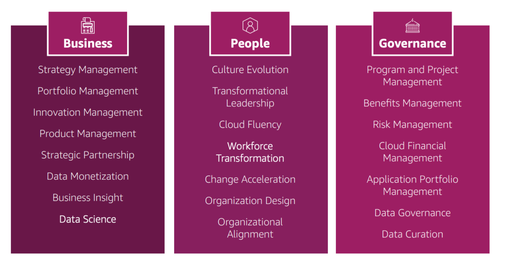
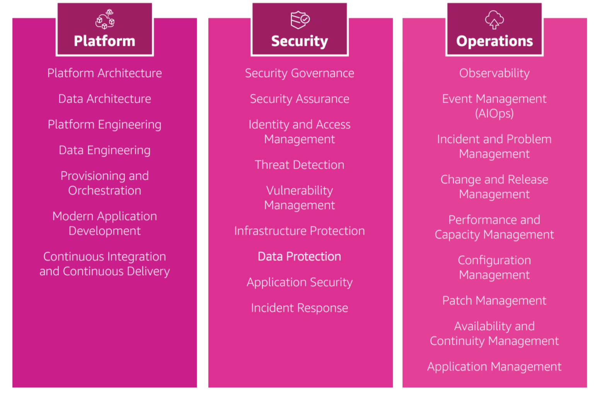

# Aufgabe: Zusammenfassung des AWS Cloud Adoption Framework (CAF)

Das AWS Cloud Adoption Framework (CAF) ist ein eBook und ein Whitepaper, das Unternehmen bei der digitalen Transformation durch die innovative Nutzung von AWS unterstützt. Es wurde von AWS-Experten entwickelt und fasst bewährte Praktiken zusammen, um einen umfassenden Plan für die Cloud-Nutzung zu erstellen und umzusetzen.

Der CAF besteht aus zwei Hauptkomponenten: organisatorische Fähigkeiten und technische Fähigkeiten, die in sechs Perspektiven zusammengefasst sind: 

1. **Business**
2. **People**
3. **Governance**
4. **Platform**
5. **Security**
6. **Operations**

Jede Perspektive umfasst spezifische Fähigkeiten, die erforderlich sind, um Geschäftsergebnisse zu verbessern und die Transformation voranzutreiben. Außerdem werden Transformationsbereiche wie Technologie, Prozesse, Organisation und Produkte identifiziert, die helfen, Geschäftsergebnisse zu verbessern und neue Wertangebote zu schaffen.

Der CAF durchläuft vier Transformationsphasen:
1. **Vision**
2. **Ausrichtung**
3. **Einführung**
4. **Skalierung**

Diese Phasen stellen sicher, dass die Cloud die Geschäftsergebnisse beschleunigt und die digitale Transformation vorantreibt. 

In der Prüfung werden Fragen zu den CAF-Perspektiven, den Transformationsbereichen und ihren Phasen gestellt. Es wird erwartet, dass die Kandidaten die Zusammenhänge zwischen diesen Konzepten verstehen und anwenden können.

https://aws.amazon.com/de/cloud-adoption-framework/?nc1=h_ls

1. **Lesen und Verstehen des CAF eBooks:**
   - Lese das AWS Cloud Adoption Framework (CAF) eBook gründlich durch.
   - Achte besonders auf die Definitionen und Beschreibungen der sechs Perspektiven: Business, People, Governance, Platform, Security und Operations.
   - Verstehe die Transformationsbereiche: Technologie, Prozesse, Organisation und Produkte.
   - Mache dich mit den vier Transformationsphasen: Vision, Ausrichtung, Einführung und Skalierung vertraut.

2. **Zusammenfassen der Perspektiven:**
   - Erstelle eine detaillierte Zusammenfassung jeder der sechs Perspektiven. Beschreibe die wichtigsten Fähigkeiten und deren Bedeutung für die digitale Transformation.

3. **Analyse der Transformationsbereiche:**
   - Analysiere die Transformationsbereiche und erläutere, wie sie zur Verbesserung von Geschäftsergebnissen und zur Schaffung neuer Wertangebote beitragen.

4. **Darstellung der Transformationsphasen:**
   - Beschreibe jede der vier Transformationsphasen und erkläre deren Rolle im Prozess der digitalen Transformation.

5. **Anwendungsbeispiele entwickeln:**
   - Entwickle Beispiele für reale Anwendungsszenarien, in denen das CAF genutzt wird, um die digitale Transformation eines Unternehmens zu unterstützen. Beschreibe, wie die Perspektiven und Transformationsphasen in diesen Szenarien angewendet werden.

6. **Vorbereitung auf die Prüfung:**
   - Erstelle eine Liste von möglichen Prüfungsfragen, die die wichtigsten Konzepte des CAF abdecken.
   - Übe die Beantwortung dieser Fragen, um sicherzustellen, dass du die Zusammenhänge zwischen den Perspektiven, Transformationsbereichen und -phasen verstehst und anwenden kannst.

## Kurze Anleitung zum Zusammenfassen

1. **Schritt-für-Schritt-Vorgehen:**
   - **Lesen:** Lies das eBook Abschnitt für Abschnitt..
   - **Notieren:** Notiere dir in eigenen Worten die Hauptaussagen jeder Perspektive, jedes Transformationsbereichs und jeder Phase.
   - **Zusammenfassen:** Schreibe eine kurze Zusammenfassung der markierten und notierten Punkte.
   - **Überprüfen:** Vergleiche deine Zusammenfassung mit dem Originaltext, um sicherzustellen, dass du die wesentlichen Informationen erfasst hast.

2. **Beispielstruktur einer Zusammenfassung:**
   - **Einleitung:** Kurzbeschreibung des CAF und seiner Ziele.
   - **Perspektiven:** Jeweils ein Abschnitt für Business, People, Governance, Platform, Security und Operations.
   - **Transformationsbereiche:** Beschreibe die vier Transformationsbereiche.
   - **Transformationsphasen:** Erkläre die vier Phasen der Transformation.
   - **Fazit:** Zusammenfassung der wichtigsten Erkenntnisse und deren Bedeutung.

Mit dieser Anleitung kannst du systematisch die wichtigsten Informationen aus dem AWS Cloud Adoption Framework (CAF) eBook extrahieren und in einer strukturierten Form zusammenfassen.