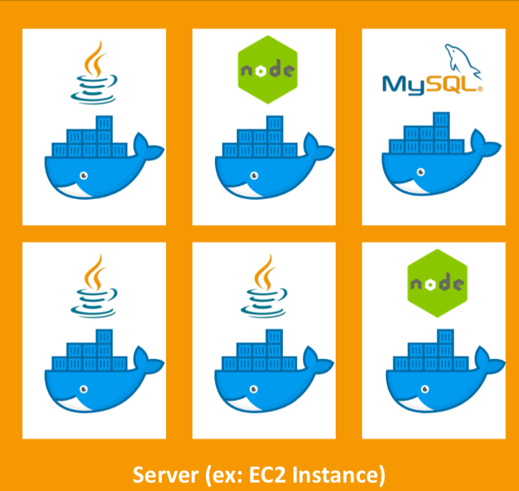
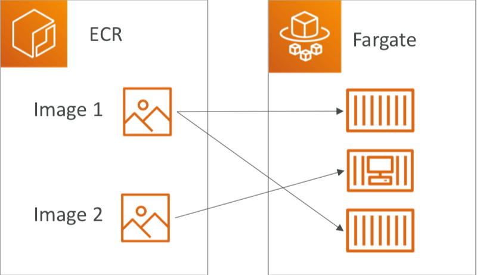
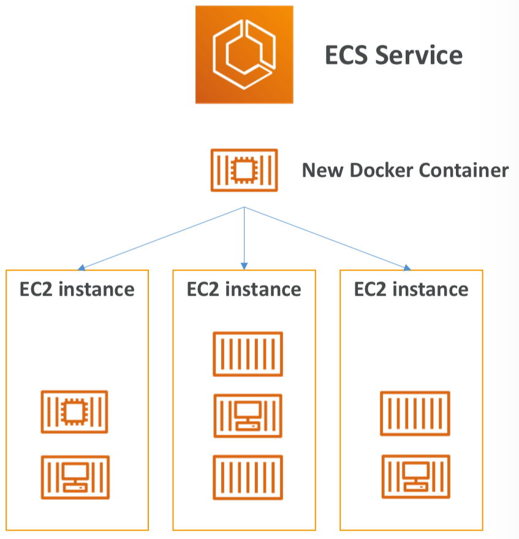
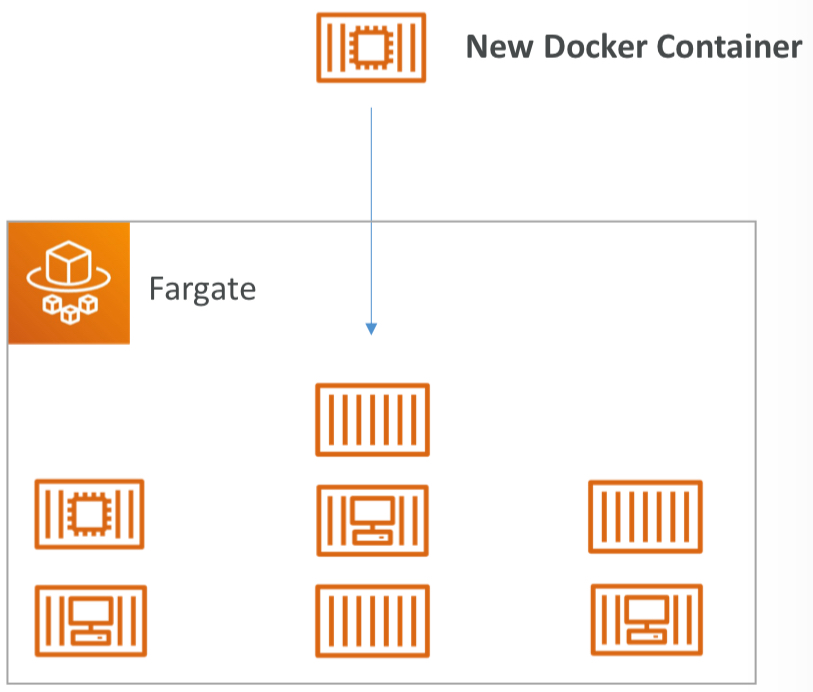
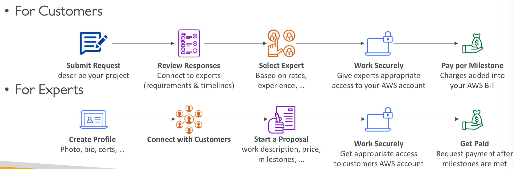
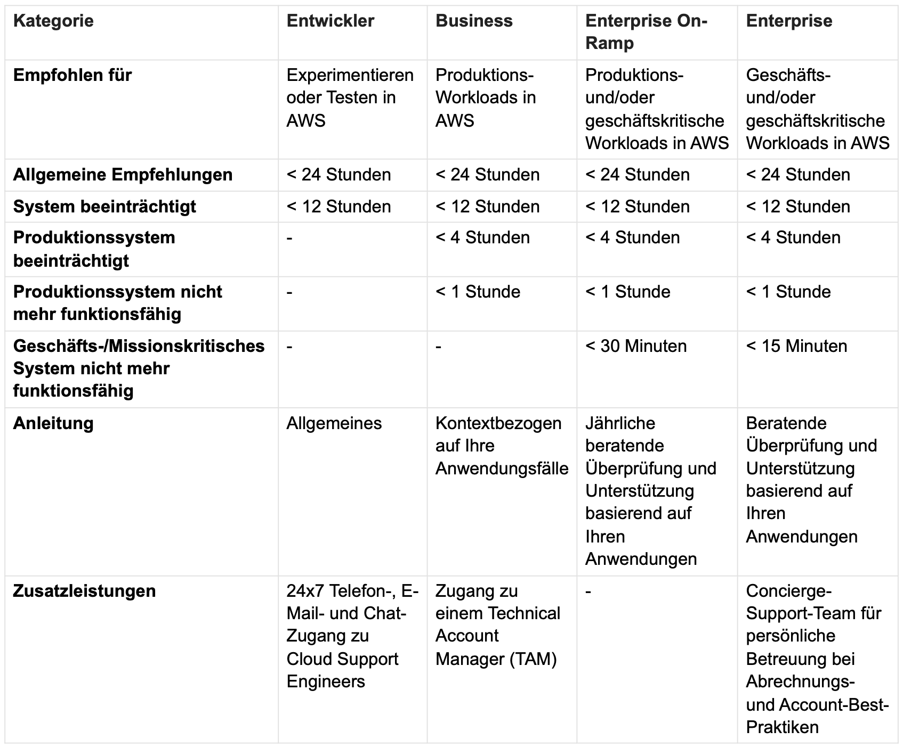

# Container-Dienste, Kundenbindung und Cloud Adaption Framework

---

# Fahrplan

1. Container-Dienste
  - ECR
  - ECS
  - EKS
  - Fargate
2. Kundenbindung
  - AWS Activate für Startups
  - AWS IQ + re:Post
  - AWS Managed Services (AMS)
  - AWS Support + Support-Plans
3. AWS Cloud Adoption Framework (AWS CAF)

---

# 1. Container-Dienste

---

# Was ist ein Container?
- **Definition**: Ein Container ist eine standardisierte Einheit für Software, die den Code und alle Abhängigkeiten zusammen *verpackt*, damit die Anwendung schnell und zuverlässig von einer Computerumgebung zur anderen läuft.
- **Vergleich**: *Ähnlich wie eine virtuelle Maschine (VM), aber ohne eigenen Kernel*
- Sind daher leichter und effizienter.

---

---

# Amazon Elastic Container Registry (Amazon ECR)
- **Definition**: Ein vollständig verwalteter Dienst von AWS, der *Docker-Container-Images speichert,verwaltet und bereitstellt*.
- **Container-Registry**: Ein Ort, an dem Container-Images gespeichert werden. Ähnlich wie ein App-Store, aber für Container.
- **Vorteile**:
  - Sichere Speicherung und Verwaltung von Container-Images.
  - Integration mit Amazon ECS, EKS und AWS Fargate.

---

---

# Amazon Elastic Container Service (Amazon ECS)

- erleichtert die *Ausführung und Verwaltung* von Docker-Containern auf einem Cluster von Amazon EC2-Instanzen 
- **Orchestrierungsdienst**: Ein Dienst, der die Verwaltung und Koordination von Containern übernimmt
- **Vorteile**:
  - Unterstützt Docker-Container.
  - Einfache Ausführung von Anwendungen auf einem verwalteten Cluster von Amazon EC2-Instanzen.
  - Integration mit AWS-Diensten wie VPC, ELB, IAM und CloudWatch.

---

---

# Amazon Elastic Kubernetes Service (Amazon EKS)
- **Definition**: Ein verwalteter Kubernetes-Dienst, der es ermöglicht, Kubernetes auf AWS auszuführen.
- **Kubernetes**: Eine *Open-Source-Plattform* zur Automatisierung der Bereitstellung, Skalierung und Verwaltung von containerisierten Anwendungen.
- **Analogie**: ein unsichtbarer Assistent, der dafür sorgt, dass deine Lieblingsrestaurants immer genau die richtige Menge an Essen auf Lager haben, egal wie viele Gäste kommen

---

# AWS Fargate
- **Definition**: Ein Serverless-Computing-Dienst für Container, der es ermöglicht, Container zu betreiben, *ohne Server oder Cluster zu verwalten*.
- **Fargate**:
  - Von AWS vollständig verwaltet, kein Cluster-Management erforderlich.
  - Automatische Skalierung und Verwaltung der Infrastruktur.
  - Geeignet für Benutzer, die sich *nicht um die Verwaltung der zugrunde liegenden Infrastruktur* kümmern möchten.

---

---

# 2. Kundenbindung
---

# AWS Activate für Startups
- **Definition**: Ein Unterstützungsprogramm von AWS speziell für *Startups*
- **Vorteile**:
  - Kostenlose Credits und technischer Support
  - Trainingsressourcen und spezielle Angebote
  - Netzwerk von Experten und Mentoren

---

# AWS IQ
- **Definition**: Eine Plattform, um qualifizierte *AWS-Experten* für Projekte zu finden und zu engagieren.
- **Vorteile**:
  - Zugang zu qualifizierten AWS-Experten.
  - Direkte Zusammenarbeit und Bezahlung über AWS.
  - Zeit- und kosteneffiziente Lösungen.

---

---

# AWS re:Post
- *Gemeinschaftsforum* für technische Fragen zu AWS
- Mitglieder können Fragen stellen, Antworten bewerten + Expertenstatus aufbauen
- Nicht geeignet für zeitkritische oder vorbereitende Anfragen.

---

# AWS Managed Services (AMS)

- **Definition**: Ein vollständig verwalteter Service, der den *Betrieb von AWS-Infrastrukturen* übernimmt.

- AMS bietet ein Team von AWS-Experten, die Infrastruktur verwalten und betreiben
- Hilft Unternehmen Verwaltungsaufgaben auszulagern 
- Unternehmen kann *sich auf Geschäftsziele konzentrieren*.
- AWS kümmert sich um allgemeine Aktivitäten wie Änderungsanfragen, Überwachung, Patch-Management, Sicherheit und Backup-Services
- Implementiert Best Practices und pflegt AWS-Infrastruktur

---

# AWS Support
- **Definition**: Unterstützung und Ressourcen für AWS-Kunden
- **Vorteile**:
  - Rund-um-die-Uhr technischer Support
  - Zugänglichkeit zu AWS-Experten
  - Verschiedene Support-Pläne, um den Anforderungen der Kunden gerecht zu werden

---

# Basic Support Plan (kostenlos)
- Rund um die Uhr Zugang zu:
  - Kundendienst
  - Dokumentation
  - Whitepapers
  - Support-Foren
- Personal Health Dashboard
- *Sieben Kernprüfungen* für Trusted Advisor

---

# Developer Support Plan
- Alles aus dem Basic Plan
- E-Mail-Zugriff auf Cloud Support Associates
- Unbegrenzte Fälle
- *Hauptkontakt* für Konto
- Antwortzeiten:
  - 24 Stunden für allgemeine Anfragen
  - 12 Stunden für beeinträchtigte Systeme

---

# Business Support Plan
- Alles aus dem Developer Plan
- Rund um die Uhr:
  - Telefon-Support
  - E-Mail-Support
  - Chat-Support
- API-Zugriff
- *Unbegrenzte* Fälle und Kontakte
- Antwortzeiten:
  - < 4 Stunden für beeinträchtigte Produktionssysteme
  - < 1 Stunde für Produktionsausfälle
- Zugang zu Infrastruktur-Event-Management (gegen Gebühr)

---

# Enterprise On-Ramp Support Plan
- Alles aus dem Business Plan
- *Pool technischer Account Manager*
- Concierge-Support-Team für:
  - Best Practices für Abrechnung und Konten
  - Betriebsüberprüfungen
- Antwortzeiten:
  - < 4 Stunden für beeinträchtigte Produktionssysteme
  - < 1 Stunde für Produktionsausfälle
  - < 30 Minuten für geschäftskritische Systemausfälle

---

# Enterprise Support Plan
- Alles aus dem Enterprise On-Ramp Plan
- *Dedizierter technischer Kundenbetreuer*
- Antwortzeiten:
  - < 4 Stunden für beeinträchtigte Systeme
  - < 1 Stunde für ausgefallene Systeme
  - < 15 Minuten für geschäftskritische Systemausfälle

---

---

# 3. AWS Cloud Adoption Framework (AWS CAF)

---

- **Definition**: Ein Framework, das *bewährte Methoden und Richtlinien* bietet
- unterstützt bei *Einführung von Cloud-Technologien* 

- **Vorteile**:
  - Geringeres Geschäftsrisiko durch die Implementierung *bewährter Methoden*
  - Umwelt, Soziales und Unternehmensführung: Nachhaltige + verantwortungsbewusste Geschäftspraktiken fördern

- **Komponenten**:
  - Geschäft: Strategie und Geschäftsfähigkeiten.
  - Technologie: Technologische Fähigkeiten und Prozesse.
  - Kultur: Organisationskultur und Veränderungsmanagement.

---

# Fragen?
