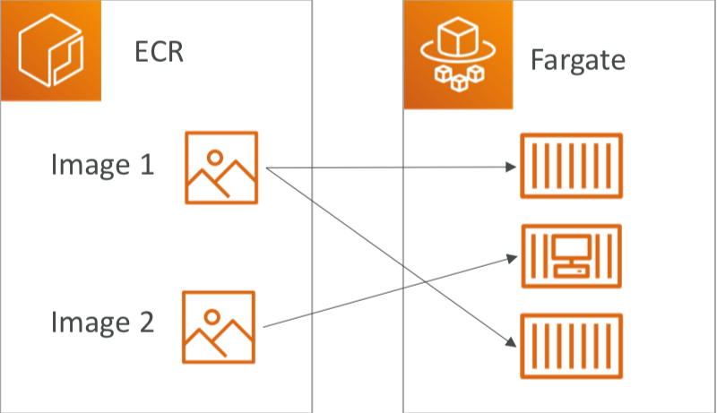
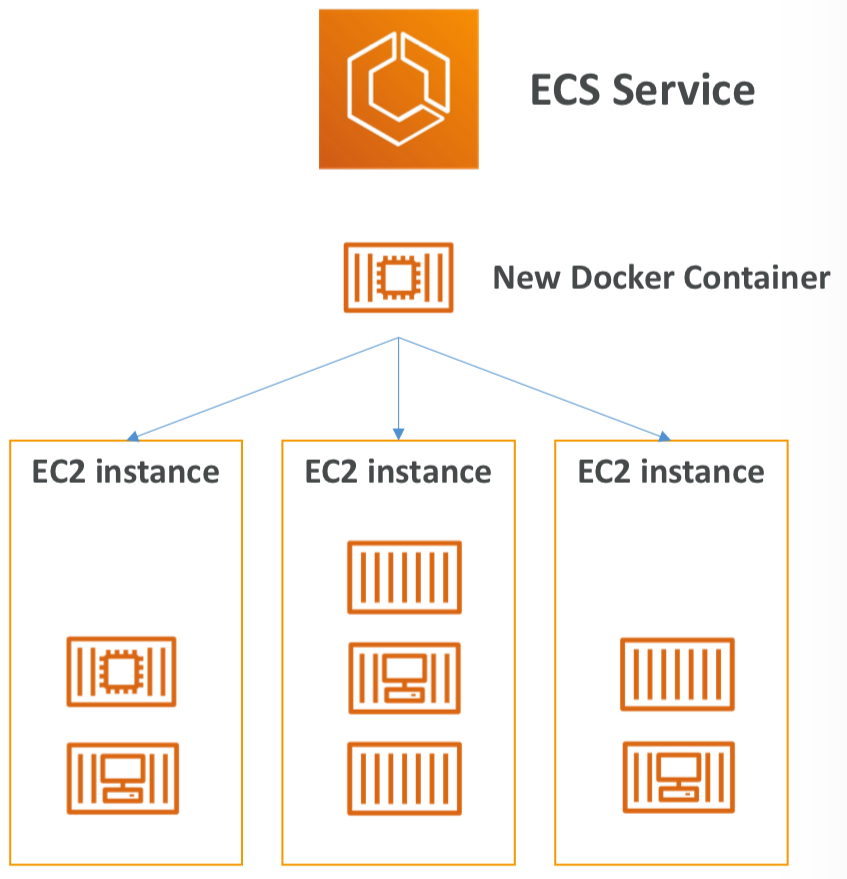
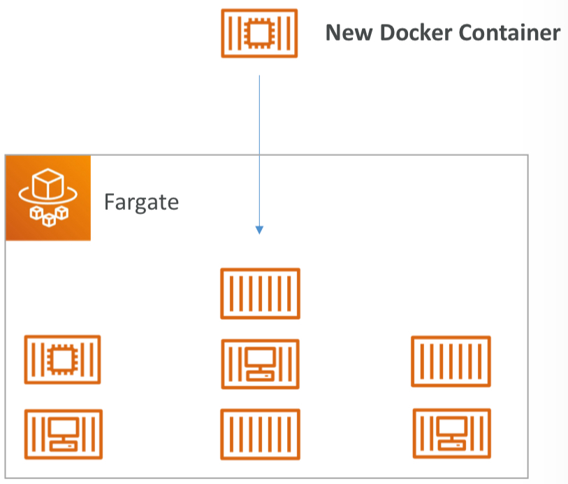
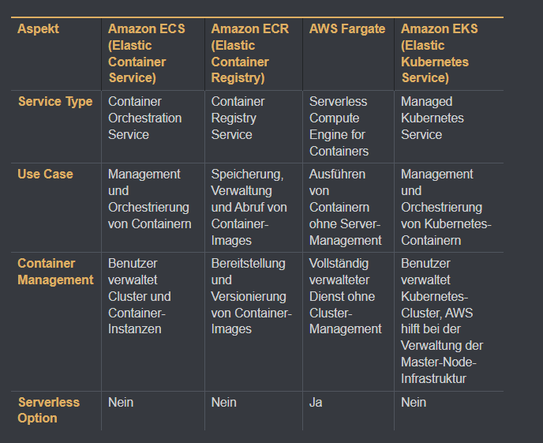
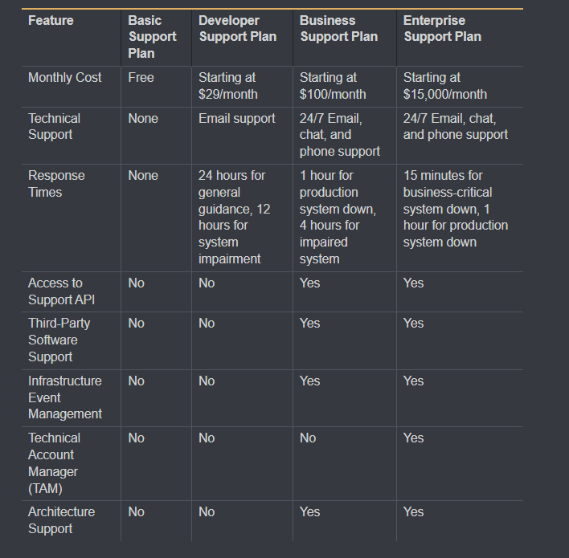
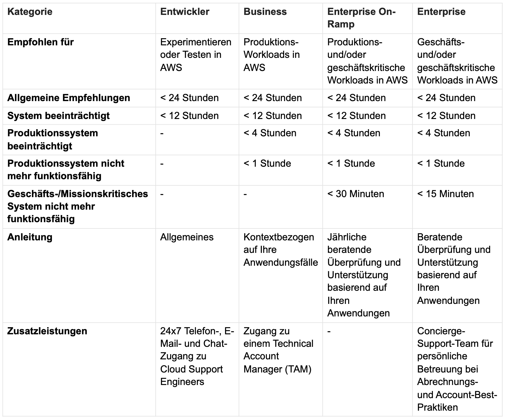

# Container-Dienste, Kundenbindung und Cloud Adaption Framework

---

# Container-Dienste

---

## Was ist ein Container?
- **Definition**: Standardisierte Einheit für Software, die Code und Abhängigkeiten zusammen *verpackt*.
- **Vergleich**: Leichter und effizienter als virtuelle Maschinen (VMs).

---

## Amazon Elastic Container Registry (Amazon ECR)
- **Definition**: Verwalteter Dienst für das *Speichern, Verwalten und Bereitstellen* von Docker-Container-Images.
- **Vorteile**: Sichere Speicherung, Integration mit ECS, EKS und Fargate.

---

## Amazon Elastic Container Service (Amazon ECS)
- **Definition**: Erleichtert *Ausführung und Verwaltung* von Docker-Containern auf einem Cluster.
- **Vorteile**: Unterstützt Docker-Container, Integration mit AWS-Diensten.

---

## Amazon Elastic Kubernetes Service (Amazon EKS)
- **Definition**: Verwalteter Kubernetes-Dienst für AWS.
- **Kubernetes**: Plattform zur Automatisierung der Bereitstellung, Skalierung und Verwaltung von containerisierten Anwendungen.

---

## AWS Fargate
- **Definition**: Serverless-Computing-Dienst für Container.
- **Vorteile**: Kein Cluster-Management erforderlich, automatische Skalierung und Verwaltung.

---

## Tabelle

#  Kundenbindung

---

## AWS Activate für Startups
- **Definition**: Unterstützungsprogramm für *Startups*.
- **Vorteile**: Kostenlose Credits, technischer Support, Trainingsressourcen.

---

## AWS IQ
- **Definition**: Plattform für *qualifizierte AWS-Experten*.
- **Vorteile**: Zugang zu Experten, direkte Zusammenarbeit und Bezahlung.

---

## AWS re:Post
- **Definition**: Gemeinschaftsforum für technische Fragen zu AWS.

---

## AWS Managed Services (AMS)
- **Definition**: Vollständig verwalteter Service für den Betrieb von AWS-Infrastrukturen.
- **Vorteile**: Verwaltung durch AWS-Experten, Konzentration auf Geschäftsziele.

---

# AWS Support
- **Definition**: Unterstützung und Ressourcen für AWS-Kunden
- **Vorteile**:
  - Rund-um-die-Uhr technischer Support
  - Zugänglichkeit zu AWS-Experten
  - Verschiedene Support-Pläne, um den Anforderungen der Kunden gerecht zu werden

---

## Basic Support Plan (kostenlos)
- Rund um die Uhr Zugang zu:
  - Kundendienst
  - Dokumentation
  - Whitepapers
  - Support-Foren
- Personal Health Dashboard
- *Sieben Kernprüfungen* für Trusted Advisor

---

## Developer Support Plan
- Alles aus dem Basic Plan
- E-Mail-Zugriff auf Cloud Support Associates
- Unbegrenzte Fälle
- *Hauptkontakt* für Konto
- Antwortzeiten:
  - 24 Stunden für allgemeine Anfragen
  - 12 Stunden für beeinträchtigte Systeme

---

## Business Support Plan
- Alles aus dem Developer Plan
- Rund um die Uhr:
  - Telefon-Support
  - E-Mail-Support
  - Chat-Support
- API-Zugriff
- *Unbegrenzte* Fälle und Kontakte
- Antwortzeiten:
  - < 4 Stunden für beeinträchtigte Produktionssysteme
  - < 1 Stunde für Produktionsausfälle
- Zugang zu Infrastruktur-Event-Management (gegen Gebühr)

---

## Enterprise On-Ramp Support Plan
- Alles aus dem Business Plan
- *Pool technischer Account Manager*
- Concierge-Support-Team für:
  - Best Practices für Abrechnung und Konten
  - Betriebsüberprüfungen
- Antwortzeiten:
  - < 4 Stunden für beeinträchtigte Produktionssysteme
  - < 1 Stunde für Produktionsausfälle
  - < 30 Minuten für geschäftskritische Systemausfälle

---

## Enterprise Support Plan
- Alles aus dem Enterprise On-Ramp Plan
- *Dedizierter technischer Kundenbetreuer*
- Antwortzeiten:
  - < 4 Stunden für beeinträchtigte Systeme
  - < 1 Stunde für ausgefallene Systeme
  - < 15 Minuten für geschäftskritische Systemausfälle

---

---

---

#  AWS Cloud Adoption Framework (AWS CAF)

---

- **Definition**: Framework mit bewährten Methoden und Richtlinien für die Einführung von Cloud-Technologien.
- **Vorteile**: Geringeres Geschäftsrisiko, Förderung nachhaltiger Geschäftspraktiken.

- **Komponenten**:
  - Geschäft: Strategie und Geschäftsfähigkeiten.
  - Technologie: Technologische Fähigkeiten und Prozesse.
  - Kultur: Organisationskultur und Veränderungsmanagement.

---

