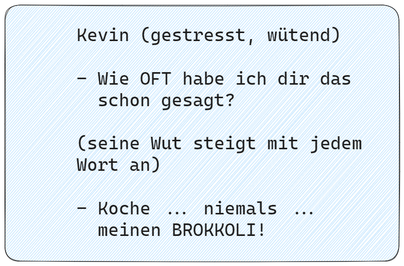
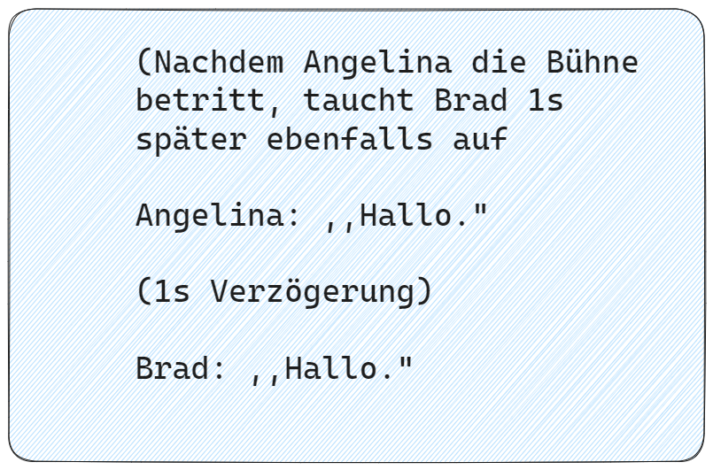
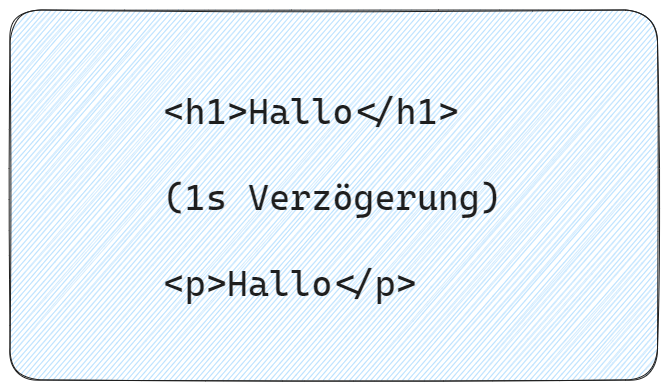
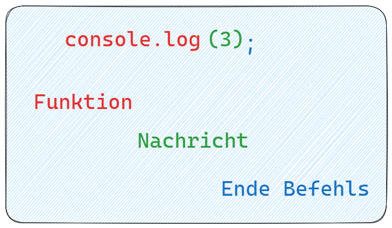
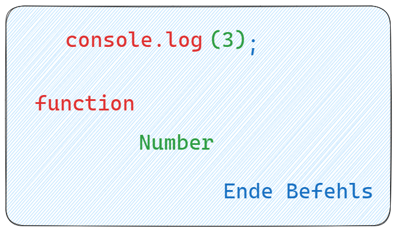
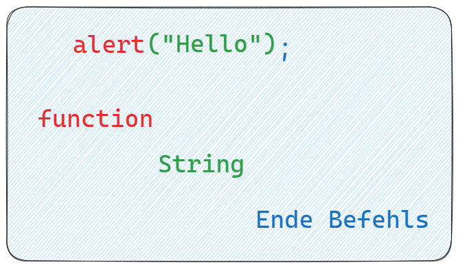
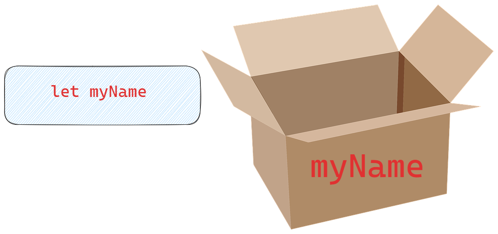
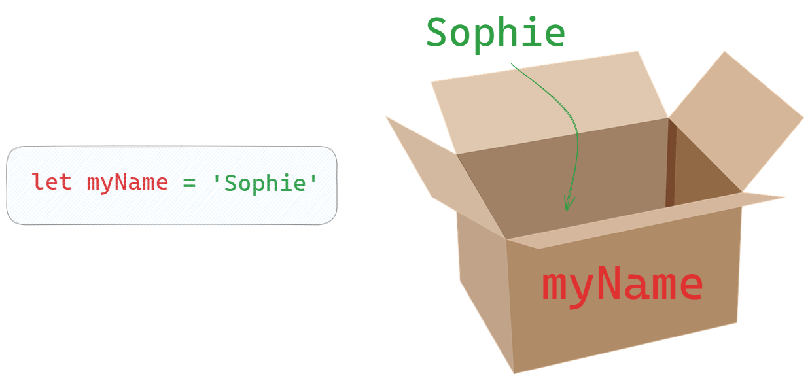
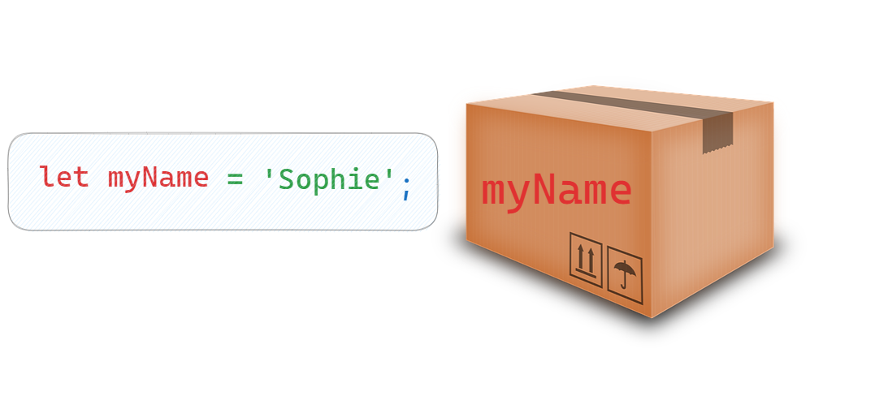
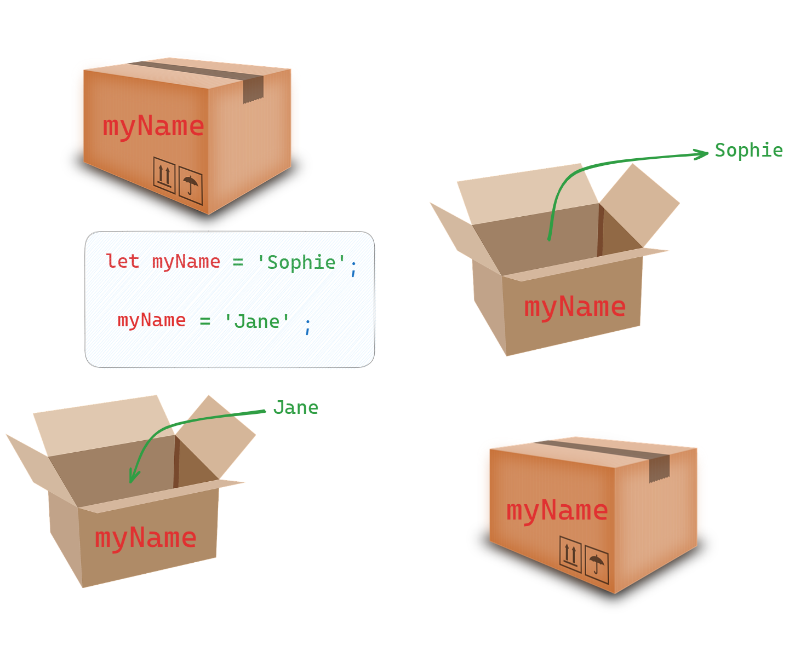

# Javascript

---

- ohne JS wäre Interaktivität nur möglich, wenn Browser mit Server kommuniziert
- JS ermöglicht Interaktivität im Browser

---

- Javascript --> Script = Skript
- ähnlich wie ein Drehbuch für ein Theaterstück

---

---

---

- Rückbezug Javascript
- Drehbuch = Javascript
- Schauspieler = HTML-Elemente

---

---

ZWECK Javascript

= Elementen mitteilen, was sie machen sollen

---

## Syntax

= Grammatik
- Funktion = Funktionalität, die der Browser kennt

---

## Datentypen

https://developer.mozilla.org/en-US/docs/Web/JavaScript/Data_structures

---

---

---

## Variablen

---

---

---

---

