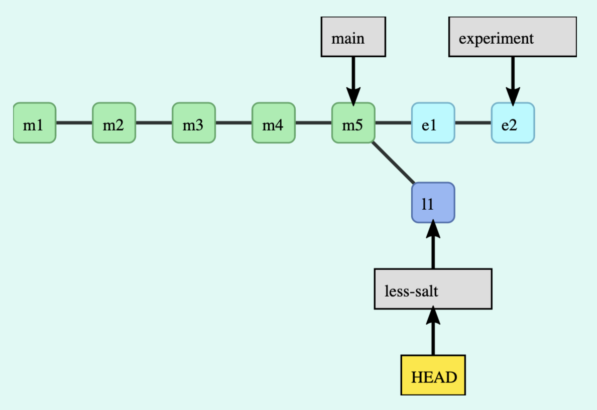
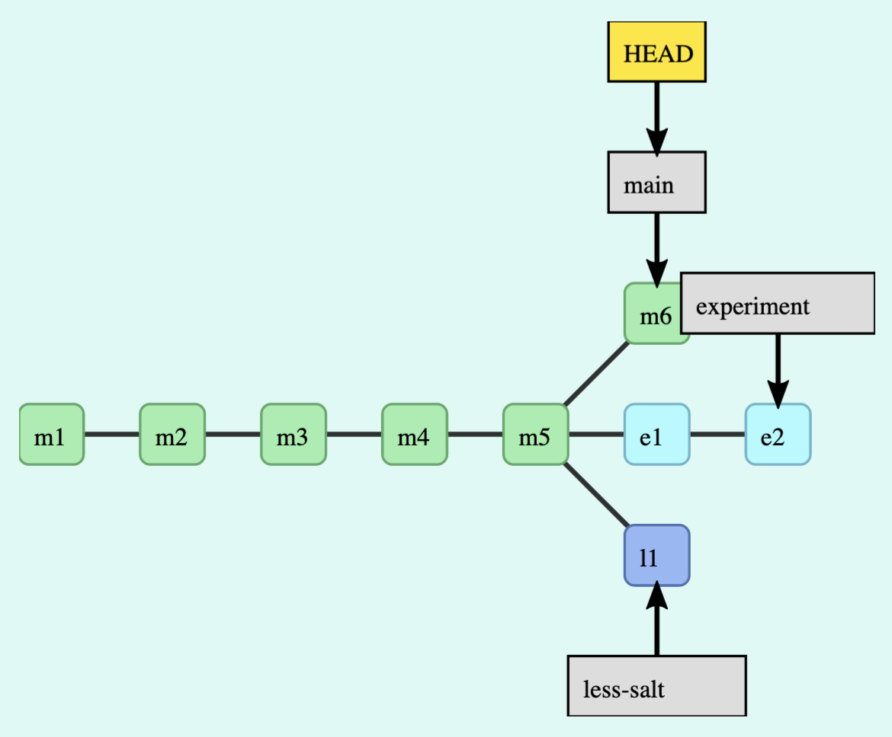
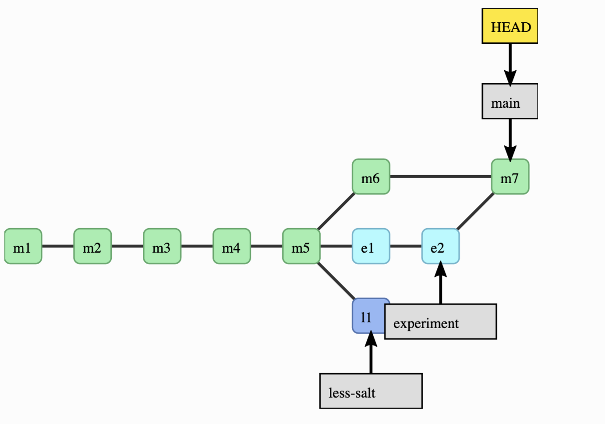
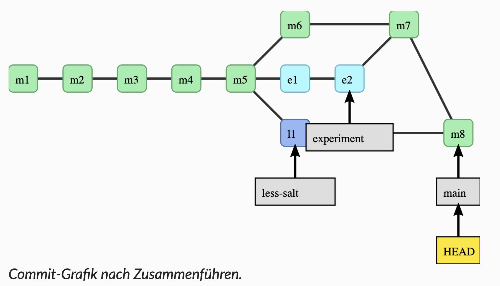
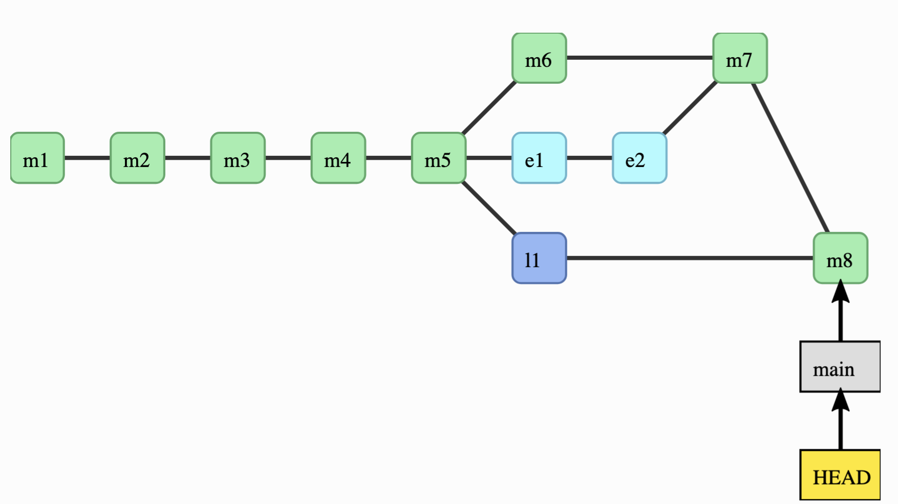

# Git Branches und Mergen

## ,,Vorarbeit"

### Befehl
```sh
git config --global alias.graph "log --all --graph --decorate --oneline"
```

### Was der Alias macht
Dieser Befehl erstellt einen Alias namens `graph`, der einen bestimmten Git-Befehl vereinfacht. 

### Details der Komponenten
- **git config --global**: Dieser Teil des Befehls konfiguriert Git global für alle Repositories auf deinem System.
- **alias.graph**: Dies erstellt einen Alias namens `graph`.
- **"log --all --graph --decorate --oneline"**: Dies ist der eigentliche Git-Befehl, der ausgeführt wird, wenn du `git graph` eingibst.

### Zusammenfassung
Wenn du `git graph` eingibst, zeigt Git eine kompakte, grafische Übersicht der Commit-Historie aller Branches deines Projekts an, einschließlich der Referenzen und mit jeder Commit-Nachricht in einer einzigen Zeile.

### Beispielausgabe
Wenn du `git graph` ausführst, könnte die Ausgabe so aussehen:

```bash
* e7cf023 (HEAD -> main) don't forget to enjoy
* 79161b6 add half an onion
* a3394e3 adding README
* 3696246 adding instructions
* f146d25 adding ingredients
```

Dies gibt einen schnellen und übersichtlichen Überblick über die Entwicklungsgeschichte deines Projekts.

## Erstellen eines neuen Branches in Git

Erstelle einen Ordner namens `guacamole` undi initialisiere mit `git init` dort ein Git-Verzeichnis.
### Schritt 1: Datei erstellen und hinzufügen

1. Erstelle eine neue Datei `zutaten.txt` mit folgendem Inhalt:

   ```plaintext
   Zutaten:
   - 3 reife Avocados
   - 1 Limette
   - 1 Teelöffel Salz
   - 1 Teelöffel Kreuzkümmel
   - 1 Teelöffel Cayennepfeffer
   - 1 Zwiebel
   - 1 Teelöffel Knoblauchpulver
```

2. Füge die Datei zum Staging-Bereich hinzu:

   ```sh
   git add zutaten.txt
   ```

### Schritt 2: Ersten Commit erstellen

1. Erstelle einen Commit mit der hinzugefügten Datei:
   ```sh
   git commit -m "feat: add zutaten.txt"
   ```

   Ausgabe:
   ```
   [main (Root-Commit) 0a20669] feat: add zutaten.txt
    1 file changed, 8 insertions(+)
    create mode 100644 zutaten.txt
   ```

### Schritt 3: Status und Historie überprüfen

1. Überprüfe den aktuellen Status:
   ```sh
   git status
   ```

   Ausgabe:
   ```
   Auf Branch main
   nichts zu committen, Arbeitsverzeichnis unverändert
   ```

2. Überprüfe die existierenden Branches:
   ```sh
   git branch
   ```

   Ausgabe:
   ```
   * main
   ```

3. Überprüfe die Commit-Historie mit dem `graph` Alias:
   ```sh
   git graph
   ```

   Ausgabe:
   ```
   * 0a20669 (HEAD -> main) feat: add initial zutaten.txt
   ```

### Schritt 4: Neuen Branch `experiment` erstellen

1. Erstelle den neuen Branch `experiment`:
   ```sh
   git branch experiment main
   ```

2. Überprüfe erneut die existierenden Branches:
   ```sh
   git branch
   ```

   Ausgabe:
   ```bash
     experiment
     * main
   ```

3. Überprüfe die Commit-Historie erneut:
   ```sh
   git graph
   ```

   Ausgabe:
   ```
   * 0a20669 (HEAD -> main, experiment) feat: add zutaten.txt
   ```


## Änderungen im Branch `experiment`

Nachdem du den neuen Branch `experiment` erstellt hast, kannst du weitere Änderungen vornehmen und diese committen. 

### Schritt 5: Zum Branch `experiment` wechseln

1. Wechsel zum Branch `experiment`:
   ```sh
   git switch experiment
   ```

   Ausgabe:
   ```
   Zu Branch 'experiment' gewechselt
   ```

2. Überprüfe die Commit-Historie im Branch `experiment`:
   ```sh
   git graph
   ```

   Ausgabe:
   ```
   * 0a20669 (HEAD -> experiment, main) feat: add zutaten.txt
   ```

3. Überprüfe die existierenden Branches:
   ```sh
   git branch
   ```

   Ausgabe:
   ```
   * experiment
     main
   ```

   Hinweis: Dieser Befehl zeigt, in welchem Branch du dich befindest. Er erstellt keinen neuen Branch.

### Schritt 6: Änderungen vornehmen und committen

1. Füge 2 Esslöffel Koriander zur `zutaten.txt` hinzu:
   - Öffne die Datei `zutaten.txt` und füge die Zeile mit dem Koriander hinzu:
     ```
     - 2 Esslöffel frischer Koriander
     ```

2. Füge die geänderte Datei zum Staging-Bereich hinzu:
   ```sh
   git add .
   ```

3. Erstelle einen Commit mit der Änderung:
   ```sh
   git commit -m "feat: Lass uns es mit etwas Koriander versuchen"
   ```

   Ausgabe:
   ```
   [experiment fe115b9] feat: Lass uns es mit etwas Koriander versuchen
    1 file changed, 2 insertions(+), 1 deletion(-)
   ```

4. Reduziere die Menge an Koriander auf 1 Esslöffel:
   - Öffnen Sie die Datei `zutaten.txt` erneut und ändern Sie die Zeile mit dem Koriander auf:
     ```
     - 1 Esslöffel frischer Koriander
     ```

5. Füge die geänderte Datei wieder zum Staging-Bereich hinzu:
   ```sh
   git add .
   ```

6. Erstelle einen weiteren Commit mit der Änderung:
   ```sh
   git commit -m "feat: vielleicht etwas weniger Koriander"
   ```

   Ausgabe:
   ```
   [experiment 9952ca4] feat: vielleicht etwas weniger Koriander
    1 file changed, 1 insertion(+), 1 deletion(-)
   ```

7. Überprüfe die Commit-Historie im Branch `experiment`:
   ```sh
   git graph
   ```

   Ausgabe:
   ```
   * 9952ca4 (HEAD -> experiment) feat: vielleicht etwas weniger Koriander
   * fe115b9 feat: Lass uns es mit etwas Koriander versuchen
   * 0a20669 (main) feat: add initial zutaten.txt
   ```
## Erstellen eines weiteren Branches und weiteren Commits

Nachdem du nun im Branch `experiment` Änderungen vorgenommen hast, kannst du einen neuen Branch erstellen und weitere Änderungen durchführen.

### Schritt 7: Einen neuen Branch `less-salt` erstellen

1. Erstelle einen neuen Branch `less-salt`, der von `main` abzweigt:
   ```sh
   git branch less-salt main
   ```

2. Überprüfe die existierenden Branches:
   ```sh
   git branch
   ```

   Ausgabe:
   ```
   * experiment
     less-salt
     main
   ```

### Schritt 8: Zum Branch `less-salt` wechseln und Änderungen vornehmen

1. Wechsel zum Branch `less-salt`:
   ```sh
   git switch less-salt
   ```

   Ausgabe:
   ```
   Zu Branch 'less-salt' gewechselt
   ```

2. Füge weitere Änderungen hinzu, z.B. weniger Salz in `zutaten.txt`:
   - Öffne die Datei `zutaten.txt` und ändere die Zeile mit dem Salz auf:
     ```
     - 1/2 Teelöffel Salz
     ```

3. Füge die geänderte Datei zum Staging-Bereich hinzu:
   ```sh
   git add .
   ```

4. Erstelle einen Commit mit der Änderung:
   ```sh
   git commit -m "feat: vielleicht etwas weniger Salz"
   ```

   Ausgabe:
   ```
   [less-salt 75684dc] feat: vielleicht etwas weniger Salz
    1 file changed, 1 insertion(+), 1 deletion(-)
   ```

### Schritt 9: Commit-Historie überprüfen

1. Überprüfe die Commit-Historie mit dem `graph` Alias:
   ```sh
   git graph
   ```

   Ausgabe:
   ```
   * 75684dc (HEAD -> less-salt) feat: vielleicht etwas weniger Salz
   | * 9952ca4 (experiment) feat: vielleicht etwas weniger Koriander
   | * fe115b9 feat: Lass uns es mit etwas Koriander versuchen
   |/  
   * 0a20669 (main) feat: add initial zutaten.txt
   ```





### Schritt 10: Zurück zum Branch `main` wechseln und Änderungen vornehmen

1. Wechsel zurück zum Branch `main`:
   ```sh
   git switch main
   ```

   Ausgabe:
   ```
   Zu Branch 'main' gewechselt
   ```

2. Füge weitere Änderungen hinzu, z.B. eine neue Datei `anleitung.txt`:
   - Erstelle eine neue Datei `anleitung.txt` und füge den Inhalt hinzu:


     Anleitung:
      1. Schneiden Sie die Avocados auf, entfernen Sie den Kern und schaufeln Sie das Fruchtfleisch heraus.
      2. Zerdrücken Sie das Avocadofleisch in einer Schüssel und fügen Sie den Saft einer Limette hinzu.
      3. Geben Sie Salz, Kreuzkümmel und Cayennepfeffer hinzu und vermischen Sie alles gut.
      4. Hacken Sie die Zwiebel und den frischen Koriander fein und fügen Sie sie zusammen mit dem Knoblauchpulver der Mischung hinzu.
      5. Rühren Sie alle Zutaten gründlich um, bis eine gleichmäßige Guacamole entsteht.
      6. Genießen Sie Ihre selbstgemachte Guacamole!
     
3. Füge die neue Datei zum Staging-Bereich hinzu:
   ```sh
   git add .
   ```

4. Erstelle einen Commit mit der neuen Datei:
   ```sh
   git commit -m "feat: add anleitung.txt"
   ```

   Ausgabe:
   ```
   [main 8c782d9] feat: add anleitung.txt
    1 file changed, 7 insertions(+)
    create mode 100644 anleitung.txt
   ```

### Schritt 11: Commit-Historie überprüfen

1. Überprüfe die Commit-Historie mit dem `graph` Alias:
   ```sh
   git graph
   ```

   Ausgabe:
   ```
   * 8c782d9 (HEAD -> main) feat: add anleitung.txt
   | * 75684dc (less-salt) feat: vielleicht etwas weniger Salz
   |/  
   | * 9952ca4 (experiment) feat: vielleicht etwas weniger Koriander
   | * fe115b9 feat: Lass uns es mit etwas Koriander versuchen
   |/  
   * 0a20669 feat: add initial zutaten.txt
   ```




## Die Branches zusammenführen

### Schritt 11: Merge

1. Führe den Branch `experiment` mit dem `main` Branch zusammen.

   ```bash
   git merge experiment
   ```

   Ausgabe (Beispiel):

   ```bash
   Merge made by the 'ort' strategy.
   zutaten.txt | 3 ++-
   1 file changed, 2 insertions(+), 1 deletion(-)
 ```


2. Überprüfen die Commit-Historie:

   Überprüfe die Commit-Historie, um sicherzustellen, dass der Merge korrekt in den `main`-Branch eingefügt wurde:

   ```sh
   git graph
   ```

   Ausgabe (Beispiel):

   ```bash
   *   220988b (HEAD -> main) Merge branch 'experiment'
   |\
   | * b79fcde (experiment) feat: vielleicht etwas weniger Koriander
   | * 8d7326b feat: Lass uns es mit etwas Koriander versuchen
   * | 61f284e feat: add anleitung.txt
   |/
   | * 71a6fac (less-salt) feat: vielleicht etwas weniger Salz
   |/
   * f904cf3 feat: add zutaten.txt
   ```




3. Mergen des less-salt Branches:

   ```bash
   git merge less-salt
   ```

   Ausgabe (Beispiel):

   ```bash
   Auto-merging zutaten.txt
   Merge made by the 'ort' strategy.
   zutaten.txt | 2 +-
   1 file changed, 1 insertion(+), 1 deletion(-)
 ```


4. Überprüfen der Commit-Historie:

   Überprüfe die Commit-Historie, um sicherzustellen, dass der Merge korrekt in den `main`-Branch eingefügt wurde:

   ```sh
   git graph
   ```

   Ausgabe (Beispiel):

   ```bash
   *   a0c12c8 (HEAD -> main) Merge branch 'less-salt'
   |\
   | * 71a6fac (less-salt) feat: vielleicht etwas weniger Salz
   * |   220988b Merge branch 'experiment'
   |\ \
   | * | b79fcde (experiment) feat: vielleicht etwas weniger Koriander
   | * | 8d7326b feat: Lass uns es mit etwas Koriander versuchen
   | |/
   * / 61f284e feat: add anleitung.txt
   |/
   * f904cf3 feat: add zutaten.txt
   ```




## Löschen der gemergten Branches 

Nachdem der Merge-Vorgang erfolgreich abgeschlossen wurde, kannst du die gemergten Branches `experiment` und `less-salt` löschen, wenn du diese nicht mehr benötigen. 

### Schritt 12: Überprüfen der gemergten Branches

   Verwende den Befehl `git branch --merged`, um sicherzustellen, dass die Branches `experiment` und `less-salt` erfolgreich in den `main`-Branch gemerged wurden.

   ```sh
   git branch --merged
   ```

   Ausgabe:

   ```
     experiment
     less-salt
   * main
   ```

   Dies zeigt an, dass die Branches `experiment` und `less-salt` gemergt sind und nicht mehr benötigt werden.

### Schritt 13: Löschen der gemergten Branches

   Verwende den Befehl `git branch -d` gefolgt vom Branch-Namen, um die gemergten Branches zu löschen.

   ```sh
   git branch -d experiment
   ```
   Ausgabe:

   ```
   Branch 'experiment' entfernt (war 9952ca4).
   ```

   überprüfen mit `git graph`

   Ausgabe (Beispiel):
   ```bash
   *   a0c12c8 (HEAD -> main) Merge branch 'less-salt'
   |\
   | * 71a6fac (less-salt) feat: vielleicht etwas weniger Salz
   * |   220988b Merge branch 'experiment'
   |\ \
   | * | b79fcde feat: vielleicht etwas weniger Koriander
   | * | 8d7326b feat: Lass uns es mit etwas Koriander versuchen
   | |/
   * / 61f284e feat: add anleitung.txt
   |/
   * f904cf3 feat: add zutaten.txt
   ```

   ```bash
   git branch -d less-salt
   ```

   Das Überprüfen mit `git graph`zeigt folgende Ausgabe:

   ```bash
   *   a0c12c8 (HEAD -> main) Merge branch 'less-salt'
   |\
   | * 71a6fac feat: vielleicht etwas weniger Salz
   * |   220988b Merge branch 'experiment'
   |\ \
   | * | b79fcde feat: vielleicht etwas weniger Koriander
   | * | 8d7326b feat: Lass uns es mit etwas Koriander versuchen
   | |/
   * / 61f284e feat: add anleitung.txt
   |/
   * f904cf3 feat: add zutaten.txt
   ```

