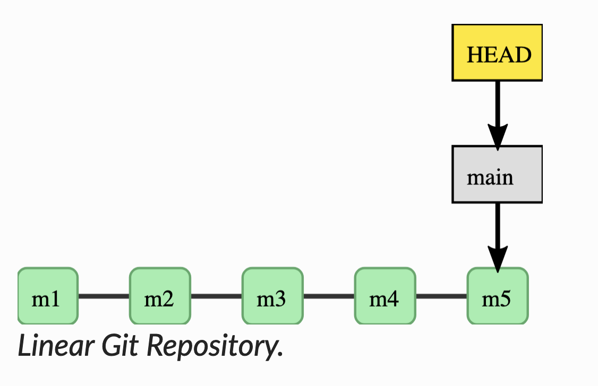
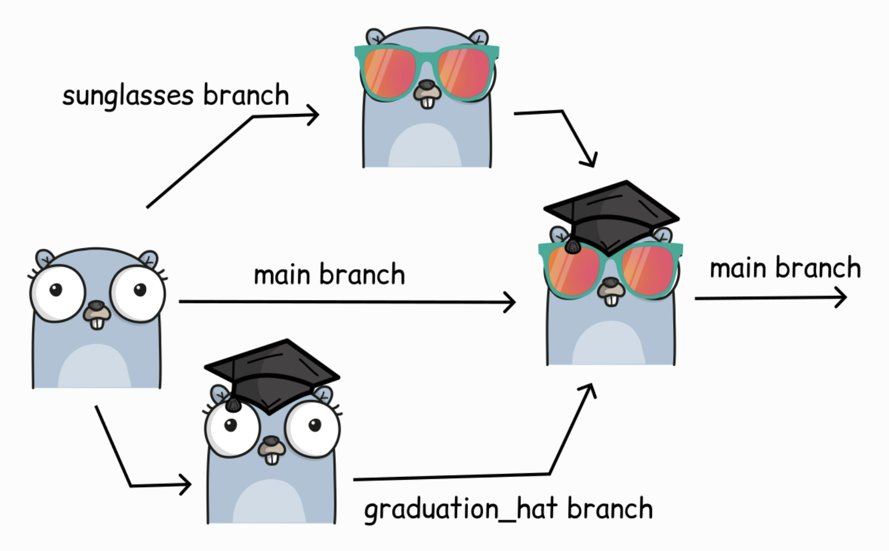

# Git branches 

---

# Begriffsdefinitionen

---

**HEAD**:
   - In Git ist `HEAD` wie ein Zeiger, der auf den aktuellen Stand deiner Arbeit zeigt
   
   - Analogie: wie der Lesekopf eines alten Bandrekorders, der zeigt, wo auf dem Band man gerade ist

   - Wenn wir `HEAD` sagen, meinen wir genau dieses Wort – es steht nicht für etwas anderes.

  ---

**Zweige und Commits**:
   - Ein Zweig (Branch) in Git ist wie ein Pfad mit vielen Punkten (Commits), die zeigen, wie ein Projekt entwickelt hat.

   - Wenn wir über Zweige sprechen, meinen wir oft nicht nur den letzten Punkt (Commit), sondern alle Punkte (Commits) davor, die zu diesem Zweig gehören.

---

---

**Softwareentwicklung ist oft nicht linear**

- in der Regel mindestens eine Version des Codes, um zu „arbeiten“ (um zu kompilieren, um die erwarteten Ergebnisse zu geben, ...).

- gleichzeitige Arbeit an neuen Features
- oft mehrere Funktionen gleichzeitig => Stichwort: Teamwork

- Wir müssen in der Lage sein, verschiedene Arbeitslinien wirklich gut zu trennen

---

---

# Git Konflikte

---

Was bedeutet es, wenn zwei Personen dasselbe auf zwei unterschiedliche Arten tun?

Was wäre, wenn du etwas tust, es sechs Monate lang niemandem erzählst und es dann mit der Arbeit anderer Leute kombinieren würdest?

Wie werden Konflikte bei anderen Arbeiten vermieden? 

Arbeitet nur eine Person gleichzeitig? Wenn die Möglichkeit besteht, dass jemand anderes dasselbe tut, ist es hilfreich, vor Beginn zu erklären, was wer macht.
