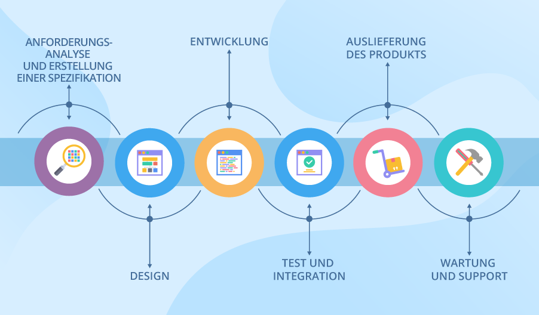
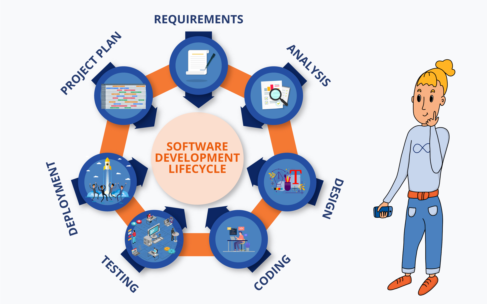

## 1. Grundlagen des Testens
### 1.1 Was ist Testen?

- **Zweck von Softwaretests**: Bewertung der Softwarequalität und Reduzierung des Fehlerrisikos.
- **Missverständnisse**:
  - Testen besteht nicht nur aus dem Ausführen von Tests (dynamisches Testen).
  - Testen umfasst auch Verifizierung (Erfüllen von Anforderungen) und Validierung (Erfüllung der Benutzerbedürfnisse).
- **Testarten**:
  - **Dynamisches Testen**: Software wird ausgeführt, um ihr Verhalten zu überprüfen.
  - **Statisches Testen**: Software wird ohne Ausführung geprüft (z. B. durch Reviews und statische Analysen).
- **Planung und Management**: Testen muss über den gesamten Softwareentwicklungslebenszyklus (SDLC) hinweg geplant, gesteuert und verwaltet werden.
- **Intellektuelle Aktivität**: Testen erfordert Fachwissen, analytisches Denken, kritische Überlegungen und Systemdenken.

#### 1.1.1 Testziele:
- **Bewertung von Arbeitsergebnissen** (z. B. Anforderungen, Entwürfe, Code).
- **Fehler finden**: Auslösen von Fehlerwirkungen und Aufdecken von Fehlerzuständen.
- **Testabdeckung sicherstellen**: Überprüfung der vollständigen Testabdeckung.
- **Risikominderung**: Verringerung des Risikos unzureichender Softwarequalität.
- **Verifizierung**: Prüfung, ob spezifizierte Anforderungen erfüllt wurden.
- **Regulatorische Vorgaben**: Überprüfung, ob das Testobjekt rechtliche und vertragliche Anforderungen erfüllt.
- **Informationsbereitstellung**: Bereitstellen von Informationen für Stakeholder zur Entscheidungsfindung.
- **Vertrauensaufbau**: Aufbau von Vertrauen in die Qualität des Testobjekts.
- **Validierung**: Sicherstellung, dass die Software aus Sicht der Stakeholder wie erwartet funktioniert.

#### Kontextabhängigkeit:
- Testziele variieren je nach Arbeitsergebnis, Teststufe, Risiken, SDLC-Phase und geschäftlichem Kontext.
#### 1.1.2 Testen und Debugging 

- **Testen**:
  - Findet Fehlerzustände oder löst Fehlerwirkungen aus.
  - Dynamisches Testen: Software wird ausgeführt, um Fehlerwirkungen zu provozieren.
  - Statisches Testen: Findet Fehlerzustände direkt ohne Ausführung der Software.

- **Debugging**:
  - Identifiziert, analysiert und behebt Fehlerzustände nach dem Testen.
  - **Prozess bei dynamischem Testen**:
    1. **Reproduktion des Fehlers**: Fehlerwirkung wird erneut provoziert.
    2. **Diagnose**: Ursache des Fehlers wird ermittelt.
    3. **Behebung**: Fehlerzustand wird behoben.
  - **Fehlernachtest**: Überprüfung, ob der Fehler behoben wurde.
  - **Regressionstests**: Überprüfung, ob die Korrektur keine neuen Fehler verursacht.

- **Statisches Testen**:
  - Findet Fehlerzustände direkt (z. B. durch Code-Reviews).
  - Kein Reproduzieren oder Diagnostizieren notwendig, da keine Fehlerwirkungen ausgelöst werden.
### 1.2 Warum ist Testen notwendig? 

#### 1.2.1 Der Beitrag des Testens zum Erfolg
- **Testen als Mittel zur Qualitätssicherung**:
  - Identifizierung von Fehlerzuständen.
  - Indirekter Beitrag zur Verbesserung der Softwarequalität (Fehlerbehebung durch Debugging).
  - Bewertung der Softwarequalität in verschiedenen SDLC-Phasen.
- **Entscheidungsunterstützung**: Testergebnisse helfen bei Freigabeentscheidungen und Übergang zu nächsten Phasen.
- **Berücksichtigung von Benutzeranforderungen**:
  - Tester stellen sicher, dass die Benutzerbedürfnisse während der Entwicklung berücksichtigt werden.
  - Alternative zur direkten Einbindung von Benutzern (kostspielig und schwer umsetzbar).
- **Erfüllung gesetzlicher und regulatorischer Anforderungen**.

#### 1.2.2 Testen und Qualitätssicherung
- **Unterschied zwischen Testen und Qualitätssicherung (QS)**:
  - **Testen**: Form der Qualitätssteuerung (QC), produktorientiert, korrigierend.
  - **Qualitätssicherung (QS)**: Prozessorientiert, präventiv, zielt auf die Verbesserung von Entwicklungs- und Testprozessen ab.
- **Testen**:
  - Korrigierende Maßnahme, um Fehler in einem Produkt zu finden.
- **Qualitätssicherung**:
  - Stellt sicher, dass durch gut definierte Prozesse ein qualitativ hochwertiges Produkt entsteht.
- **Feedback durch Testergebnisse**:
  - **QC**: Testergebnisse helfen, Fehler zu beheben.
  - **QS**: Testergebnisse zeigen, wie gut die Entwicklungs- und Testprozesse funktionieren.

#### 1.2.3 Fehlhandlungen, Fehlerzustände, Fehlerwirkungen und Grundursachen
- **Fehlhandlungen (Irrtümer)**: Menschliche Fehler führen zu Fehlerzuständen (Defekten).
- **Fehlerzustände**: Fehler in Artefakten (z. B. Code, Dokumentation) können zu Fehlerwirkungen führen.
- **Fehlerwirkungen**: Das System tut etwas Falsches oder unterlässt eine erwartete Aktion.
  - Nicht jeder Fehlerzustand führt zu einer Fehlerwirkung (abhängig von den Bedingungen).
- **Umwelteinflüsse**: Fehlerwirkungen können auch durch äußere Faktoren (z. B. Strahlung) ausgelöst werden.
- **Grundursachenanalyse**:
  - Ziel: Identifikation der Ursachen von Fehlerzuständen und deren Vermeidung in der Zukunft.

### 1.3 Grundsätze des Testens

#### 1. Testen zeigt die Anwesenheit von Fehlern
- Finden von Fehlern, aber keine Garantie auf vollständige Fehlerfreiheit.
- **Beispiel**: Taschenlampen-App; Ein gefundener Fehler bedeutet nicht, dass keine weiteren bestehen.

#### 2. Exhaustives Testen ist unmöglich
- Alle Eingabekombinationen können nicht getestet werden.
- Auswahl der Tests basierend auf Risiko und Wichtigkeit.
- **Beispiel**: Wetter-App; Tests konzentrieren sich auf häufige Wetterbedingungen statt aller möglichen Kombinationen.

#### 3. Frühzeitiges Testen
- Frühes Testen hilft, Fehler kostengünstig zu beheben.
- **Beispiel**: Fehler in der Planungsphase einer Online-Banking-Software vermeiden spätere teure Anpassungen.

#### 4. Defekte Häufung
- Fehler sind oft in bestimmten Bereichen der Software konzentriert.
- **Beispiel**: Spiele-App; Highscore-Verwaltung könnte fehleranfälliger sein als der Startbildschirm.

#### 5. Das Pesticide-Paradoxon
- Wiederholte Nutzung der gleichen Tests findet keine neuen Fehler.
- Tests regelmäßig aktualisieren und erweitern.
- **Beispiel**: Foto-App; Grundfunktionstests finden keine Fehler in neuen Filtern oder Bearbeitungswerkzeugen.

#### 6. Testen ist kontextabhängig
- Testansatz hängt von der Art der Anwendung ab.
- **Beispiel**: Herzmonitor-App; Höhere Testanforderungen an Genauigkeit und Zuverlässigkeit im Vergleich zur Schrittzähler-App.

#### 7. Irrtum ist menschlich
- Tester können Fehler machen; Tests sollten von verschiedenen Personen geplant und überprüft werden.
- **Beispiel**: E-Mail-App; Testplan von einem anderen Tester überprüfen lassen, um keine wichtigen Testfälle zu übersehen.
### 1.4 Testaktivitäten, Testmittel und Rollen des Testens

#### 1.4.1 Testaktivitäten und Aufgaben
1. **Testplanung**:
   - Definieren von Testzielen und Vorgehensweise.
   - Berücksichtigung von Zeit, Ressourcen und Risiken.
   - Entwicklung einer Teststrategie.

2. **Testüberwachung und -steuerung**:
   - Fortlaufende Bewertung der Testaktivitäten.
   - Anpassungen vornehmen (Prioritätsänderungen, Ressourcenanpassungen).

3. **Testanalyse**:
   - Identifizieren der Testbasis (z.B. Anforderungen).
   - Bestimmen der zu testenden Bereiche und Risiken.

4. **Testentwurf**:
   - Entwickeln von Testfällen, Testdaten und Testumgebungen.
   - Festlegen von Ressourcen und Werkzeugen.

5. **Testrealisierung**:
   - Erstellen von Testmitteln wie Testdaten und -skripten.
   - Organisieren der Testabläufe.

6. **Testdurchführung**:
   - Ausführen der Tests (manuell oder automatisiert).
   - Aufzeichnen und Analysieren der Testergebnisse.

7. **Testabschluss**:
   - Auswerten aller Testaktivitäten.
   - Dokumentieren ungelöster Fehler und Archivieren nützlicher Testmittel.
   - Formulieren von Verbesserungsvorschlägen.
#### 1.4.2 Testprozess im Kontext
- Anpassung an Projektbedürfnisse, Stakeholder-Erwartungen, Ressourcen, Softwareart und Projektgröße.
- Sicherheitskritische Systeme erfordern spezielle Testansätze.
#### 1.4.3 Testmittel
- **Testplanung**: Teststrategie, Zeitpläne, Risikobewertungen.
- **Testanalyse**: Priorisierte Testbedingungen, Fehlerberichte.
- **Testentwurf**: Testfälle, Testdatenanforderungen, Testumgebungsdesign.
- **Testrealisierung**: Testskripte, Testausführungspläne, Testsuiten.
- **Testdurchführung**: Testprotokolle, Fehlerberichte.
- **Testabschluss**: Abschlussberichte, Lessons Learned, Änderungsanträge.
#### 1.4.4 Verfolgbarkeit zwischen Testbasis und Testmitteln
- Sicherstellen, dass alle Anforderungen durch Tests abgedeckt sind.
- Verknüpfung von Testfällen mit Anforderungen und Testergebnissen mit Risiken.
#### 1.4.5 Rollen des Testens
1. **Testmanagement**:
   - Gesamtsteuerung des Testprozesses.
   - Testplanung, Überwachung, Steuerung, Abschluss.
   - In agilen Teams oft von mehreren übernommen, in großen Projekten von einem Testmanager.

2. **Testrolle**:
   - Operative Durchführung von Tests (Analyse, Entwurf, Realisierung, Durchführung).
   - Kann von verschiedenen Personen übernommen werden.
### 1.5 Wesentliche Kompetenzen und bewährte Praktiken beim Testen

#### 1.5.1 Allgemeine Kompetenzen für Tester

- **Testwissen**:
  - **Definition**: Umfassendes Verständnis der Testmethoden und -techniken.
  - **Beispiel**: Einsatz von Black-Box-Tests zur Überprüfung der Benutzeroberfläche und White-Box-Tests für die interne Logik.

- **Gründlichkeit und Detailgenauigkeit**:
  - **Definition**: Sorgfältiges Arbeiten und Augenmerk auf Details zur Erkennung schwer zu findender Fehler.
  - **Beispiel**: Prüfung aller möglichen Bestellprozesse in einer E-Commerce-Anwendung.

- **Kommunikationsfähigkeit und Teamarbeit**:
  - **Definition**: Effektive Kommunikation und Zusammenarbeit mit Stakeholdern.
  - **Beispiel**: Konstruktives Reporting eines kritischen Fehlers in der Zahlungsabwicklung an den Entwickler.

- **Analytisches und kritisches Denken**:
  - **Definition**: Systematische Analyse von Problemen und Entwicklung kreativer Lösungen.
  - **Beispiel**: Vorschlag einer neuen Teststrategie basierend auf den Ergebnissen der Analyse.

- **Technische Kenntnisse**:
  - **Definition**: Einsatz von Testwerkzeugen und -technologien zur Effizienzsteigerung.
  - **Beispiel**: Verwendung von Selenium zur Automatisierung von Regressionstests.

- **Wissen in der Anwendungsdomäne**:
  - **Definition**: Verständnis der spezifischen Anforderungen und Fachbegriffe.
  - **Beispiel**: Kenntnis medizinischer Vorschriften bei der Arbeit an einer medizinischen Software.

**Herausforderungen bei der Kommunikation**:
- Tester müssen häufig negative Ergebnisse konstruktiv und lösungsorientiert kommunizieren, um Missverständnisse und Widerstand zu vermeiden.

#### 1.5.2 Whole-Team-Ansatz

- **Gemeinsamer Arbeitsbereich**:
  - **Definition**: Physische oder virtuelle gemeinsame Arbeitsräume zur Förderung der Kommunikation.
  - **Beispiel**: Offene Büroräume oder virtuelle Kollaborationsplattformen für ein agiles Team.

- **Teildisziplinen**:
  - **Definition**: Alle Teammitglieder tragen zur Erreichung der Projektziele bei, unabhängig von ihrer spezifischen Rolle.
  - **Beispiel**: Designer, Entwickler und Tester arbeiten gemeinsam an der Entwicklung neuer Funktionalitäten.

- **Synergien schaffen**:
  - **Definition**: Nutzung der Stärken aller Teammitglieder zur Verbesserung der Projektqualität.
  - **Beispiel**: Enge Zusammenarbeit zur schnellen Reaktion auf Änderungswünsche und zur Entwicklung effizienter Lösungen.

**Einschränkungen**:
- In sicherheitskritischen Bereichen kann ein höheres Maß an Unabhängigkeit erforderlich sein, um objektive Bewertungen der Qualität zu gewährleisten.

#### 1.5.3 Unabhängigkeit des Testens

- **Vorteile der Unabhängigkeit**:
  - **Definition**: Unabhängige Tester erkennen oft andere Fehlerarten und vermeiden Voreingenommenheiten.
  - **Beispiel**: Ein unabhängiger Tester entdeckt eine Benutzeroberflächeninkonsistenz, die Entwicklern entgangen ist.

- **Multistufiges Testen**:
  - **Definition**: Kombination aus verschiedenen Unabhängigkeitsebenen zur umfassenden Testabdeckung.
  - **Beispiel**: Entwickler führen Unit-Tests durch, Testteam führt Systemtests durch, und Fachbereichsvertreter führen Abnahmetests durch.

**Nachteile der Unabhängigkeit**:
- Unabhängige Tester können isoliert sein, was zu Kommunikationsproblemen und möglichen Verzögerungen führen kann.
- **Beispiel**: Fehlende regelmäßige Kommunikation zwischen Testern und Entwicklern kann zu Missverständnissen und Verzögerungen führen.
---
## 2. Testen während des Softwareentwicklungslebenszyklus

### 1. Anforderungsanalyse
- **Ziel**: Verstehen der Systemanforderungen
- **Aktivitäten**:
  - Gespräche mit Stakeholdern
  - Erstellung von Anforderungsdokumenten
  - Analyse der Geschäftsbedürfnisse
- **Ergebnis**: Dokumente, die Benutzererwartungen und -bedürfnisse festhalten

### 2. Systemdesign
- **Ziel**: Technische Umsetzung der Anforderungen entwerfen
- **Aktivitäten**:
  - Architekturdesign (Softwarearchitektur und -struktur)
  - Entwurf von Datenbanken, Schnittstellen und Benutzerschnittstellen
  - Auswahl von Technologien und Werkzeugen
- **Ergebnis**: Design-Dokumente zur Struktur und Architektur der Software

### 3. Implementierung (Codierung)
- **Ziel**: Entwicklung der Software gemäß Design-Spezifikationen
- **Aktivitäten**:
  - Programmierung der Softwarekomponenten
  - Integration von Modulen und Funktionen
  - Erstellung von Testfällen zur Validierung
- **Ergebnis**: Funktionsfähige Softwarekomponenten

### 4. Testen
- **Ziel**: Sicherstellen, dass die Software die Anforderungen erfüllt und fehlerfrei ist
- **Aktivitäten**:
  - Durchführung von Unit-Tests, Integrationstests, Systemtests und Abnahmetests
  - Fehleridentifikation und -behebung
  - Validierung der Software gegen Anforderungen
- **Ergebnis**: Geprüfter und stabiler Softwarebuild

### 5. Bereitstellung (Deployment)
- **Ziel**: Software in Produktionsumgebung überführen
- **Aktivitäten**:
  - Installation und Konfiguration auf Zielsystemen
  - Schulung der Endbenutzer und Administratoren
  - Überwachung der ersten Nutzung zur Identifikation von Problemen
- **Ergebnis**: Live-Software für Endbenutzer

### 6. Wartung und Unterstützung
- **Ziel**: Software weiterhin effektiv halten und anpassen
- **Aktivitäten**:
  - Behebung von Fehlern und Problemen
  - Durchführung von Updates und Patches
  - Anpassung an veränderte Anforderungen oder Technologien
- **Ergebnis**: Gepflegte und aktuelle Softwarelösung

### Iterativer Ansatz und Agile Methoden
- **Ansatz**: Mehrere Iterationen oder Sprints durchlaufen
- **Methoden**: Agile wie Scrum oder Kanban
- **Vorteil**: Flexibilität und schnelle Reaktion auf Veränderungen und Feedback

### Zusammenfassung
- **Struktur**: Von Anforderungsanalyse bis Wartung
- **Ziel**: Softwareentwicklung, die den Benutzerbedürfnissen entspricht und hohe Qualität aufweist

### Testen im Kontext des Softwareentwicklungslebenszyklus (SDLC)

**2.1.1 Auswirkungen des SDLC auf das Testen**

- **Sequenzielle Entwicklungsmodelle** (z.B. Wasserfallmodell, V-Modell):
  - Testen beginnt nach Abschluss der Codierung.
  - Tester sind in den frühen Phasen beim Überprüfen von Anforderungen und Testdesign beteiligt.
  - Dynamische Tests (System- oder Integrationstests) erfolgen spät im Prozess.
  - **Beispiel**: Tests im Wasserfallmodell erfolgen nach vollständiger Entwicklung, was Nacharbeitsaufwand bei Fehlerentdeckung verursachen kann.

- **Iterative und inkrementelle Modelle** (z.B. Spiralmodell, Unified Process):
  - Software wird in funktionsfähigen Inkrementen entwickelt, kontinuierliches Testen möglich.
  - Regelmäßige Regressionstests erforderlich, um Auswirkungen neuer Änderungen zu prüfen.
  - **Beispiel**: Spiralmodell testet jede Iteration vor Fortsetzung, was frühe Fehlerentdeckung ermöglicht.

- **Agile Modelle** (z.B. Scrum, Kanban):
  - Kontinuierliche Entwicklung und Integration von Tests.
  - Fokus auf Testautomatisierung und schnelle Rückmeldungen.
  - Tests werden in jedem Sprint durchgeführt.
  - **Beispiel**: In Scrum werden Tests während jedes Sprints durchgeführt, Automatisierung stellt schnelle, zuverlässige Tests sicher.

**2.1.2 Gute Praktiken für das Testen im SDLC**

- **Korrelation von Entwicklungs- und Testaktivitäten**:
  - Jede Entwicklungsphase sollte eine entsprechende Testaktivität haben.
  - **Beispiel**: Testpläne werden während der Entwurfsphase erstellt, um sicherzustellen, dass das Design den Anforderungen entspricht.

- **Spezifische Testziele für verschiedene Teststufen**:
  - Unterschiedliche Teststufen (Unit-Tests, Integrationstests, Systemtests) haben spezifische Ziele.
  - **Beispiel**: Unit-Tests überprüfen einzelne Codeeinheiten; Systemtests testen die komplette Software.

- **Frühzeitige Testanalyse und -entwurf**:
  - Testanalyse und -entwurf beginnen bereits in der Entwicklungsphase.
  - **Beispiel**: Testpläne werden vor der Implementierung neuer Funktionen erstellt.

- **Frühe Einbindung der Tester**:
  - Tester sollten früh in die Überprüfung von Anforderungen und Entwürfen einbezogen werden.
  - **Beispiel**: Tester beteiligen sich an Anforderungsreviews zur Identifikation von Fehlern frühzeitig.

**2.1.3 Testen als Treiber für die Softwareentwicklung**

- **Testgetriebene Entwicklung (TDD)**:
  - Tests werden vor dem Code geschrieben.
  - Entwicklungsprozess: Tests schreiben → Code implementieren → Refactoring.
  - **Beispiel**: Ein Unit-Test wird geschrieben, bevor die Methode implementiert wird.

- **Abnahmetestgetriebene Entwicklung (ATDD)**:
  - Testfälle basieren auf Abnahmekriterien, die vor der Entwicklung erstellt werden.
  - **Beispiel**: Vor Implementierung einer Funktion werden Testfälle basierend auf Abnahmekriterien definiert.

- **Verhaltensgetriebene Entwicklung (BDD)**:
  - Testfälle beschreiben Verhalten in natürlicher Sprache, werden in ausführbare Tests übersetzt.
  - **Beispiel**: Ein Testfall beschreibt: „Gegeben eine registrierte Benutzerin, wenn sie sich einloggt, dann sollte sie auf die Startseite weitergeleitet werden.“

**2.1.4 DevOps und Testen**

- **Kontinuierliche Integration (CI) und kontinuierliche Auslieferung (CD)**:
  - CI automatisiert die Integration von Codeänderungen.
  - CD automatisiert die Auslieferung in die Produktionsumgebung.
  - Automatisierte Tests sind integraler Bestandteil, bieten schnelle Rückmeldungen.
  - **Beispiel**: Automatisierte Tests laufen bei jeder Codeänderung, um neue Fehler zu identifizieren.

- **Vorteile**:
  - Schnellere Rückmeldungen, erleichterte Testautomatisierung, kontinuierliche Verbesserung der Codequalität.
  - **Beispiel**: Automatisierte Testläufe in CI/CD-Pipelines prüfen Funktionalitäten und Anforderungen.

- **Herausforderungen**:
  - Komplexität der CI/CD-Tool-Einrichtung und Wartung, zusätzliche Ressourcen für Testautomatisierung erforderlich.
  - **Beispiel**: Einrichtung und Pflege von CI/CD-Tools können komplex sein und zusätzlichen Aufwand verursachen.

**2.1.5 Shift-Left-Ansatz**

- **Frühes Testen**:
  - Testen beginnt in frühen Phasen, wie der Anforderungsdefinition.
  - **Beispiel**: Spezifikationen und Entwürfe werden vor der Codierung geprüft.

- **Statische und dynamische Tests**:
  - Statische Code-Analyse vor dynamischen Tests durchgeführt.
  - **Beispiel**: Code wird durch statische Analysetools auf Syntaxfehler und Sicherheitsrisiken überprüft.

- **Vorteile**:
  - Reduziert Fehlerkosten, verbessert Produktqualität, frühzeitige Fehlererkennung und -behebung.
  - **Beispiel**: Frühe Fehlererkennung führt zu kostengünstigerer und einfacher Behebung.

**2.1.6 Retrospektiven und Prozessverbesserung**

- **Ziele**:
  - Reflexion der Entwicklungsarbeit, Identifikation von Verbesserungsmöglichkeiten.
  - **Beispiel**: Überprüfung der Testergebnisse und Testabdeckung zur Verbesserung der Teststrategien.

- **Vorteile**:
  - Kontinuierliches Lernen und Verbesserung der Testmethoden und Prozesse.
  - **Beispiel**: Neue Teststrategien oder Prozessoptimierungen werden basierend auf Retrospektivenergebnissen implementiert.

- **Herausforderungen**:
  - Effektivität nur bei regelmäßiger Durchführung und Umsetzung der identifizierten Maßnahmen.
  - **Beispiel**: Dokumentierte Maßnahmen aus Retrospektiven müssen in die Praxis umgesetzt werden.

Zusammenfassend hat der SDLC erheblichen Einfluss auf Testaktivitäten, und moderne Ansätze wie DevOps und der Shift-Left-Ansatz verbessern die Teststrategie und -durchführung erheblich. Gute Testpraktiken, Testmethoden wie TDD und BDD sowie regelmäßige Retrospektiven tragen zur Verbesserung der Qualität und Effizienz des Entwicklungsprozesses bei.

### 2.2 Teststufen und Testarten

**Teststufen** sind Phasen des Testprozesses, die sich auf spezifische Entwicklungsstadien einer Software beziehen. Diese Stufen werden in verschiedenen Phasen des Softwareentwicklungslebenszyklus (SDLC) durchgeführt. **Testarten** hingegen konzentrieren sich auf bestimmte Qualitätsmerkmale der Software und können in verschiedenen Teststufen eingesetzt werden.

#### 2.2.1 Teststufen

1. **Komponententest (Unit-Test)**
   - **Ziel**: Testen einzelner, isolierter Komponenten oder Module eines Systems.
   - **Durchführung**: Oft von Entwicklern durchgeführt, meist mit speziellen Testrahmen oder -frameworks.
   - **Beispiel**: Ein Unit-Test prüft, ob eine Methode zur Berechnung von Rabatten korrekt funktioniert, indem sie verschiedene Eingabewerte verarbeitet.

2. **Komponentenintegrationstest**
   - **Ziel**: Testen der Interaktionen und Schnittstellen zwischen mehreren Komponenten.
   - **Durchführung**: Abhängig von der Integrationsstrategie wie Bottom-up (von den kleineren Komponenten zu größeren), Top-down (von größeren zu kleineren Komponenten) oder Big-Bang (alles auf einmal).
   - **Beispiel**: Nach der Integration der Rabattberechnungsmethode mit dem Warenkorb-Modul wird getestet, ob die Rabattberechnung korrekt auf die Gesamtsumme des Warenkorbs angewendet wird.

3. **Systemtest**
   - **Ziel**: Überprüfung des gesamten Systems oder Produkts, sowohl funktional als auch nicht-funktional.
   - **Durchführung**: Oft von einem unabhängigen Testteam durchgeführt, umfasst Tests wie End-to-End-Funktionalität und nicht-funktionale Eigenschaften wie Leistung.
   - **Beispiel**: Testen, ob ein Online-Shop alle Bestellprozesse korrekt durchführt und gleichzeitig den Anforderungen an die Benutzerfreundlichkeit und Leistung entspricht.

4. **Systemintegrationstest**
   - **Ziel**: Testen der Schnittstellen zwischen dem getesteten System und externen Systemen oder Diensten.
   - **Durchführung**: Erfordert Testumgebungen, die der Produktionsumgebung möglichst nahekommen.
   - **Beispiel**: Testen der Integration eines Zahlungsdienstleisters mit dem Online-Shop, um sicherzustellen, dass Transaktionen korrekt verarbeitet werden.

5. **Abnahmetest**
   - **Ziel**: Validierung, dass das System die Geschäftsanforderungen erfüllt und einsatzbereit ist.
   - **Durchführung**: Idealerweise von den Endbenutzern oder Kunden durchgeführt, umfasst verschiedene Arten wie Benutzerabnahmetests, betriebliche Abnahmetests, und regulatorische Abnahmetests.
   - **Beispiel**: Ein Unternehmen führt einen Benutzerabnahmetest durch, um sicherzustellen, dass die neue CRM-Software alle Geschäftsanforderungen erfüllt.

#### 2.2.2 Testarten

1. **Funktionale Tests**
   - **Ziel**: Überprüfung der Funktionen eines Systems, also „was“ das System tun soll.
   - **Beispiel**: Testen, ob ein Benutzer sich erfolgreich anmelden kann und ob die Anmeldung die richtige Benutzerrolle zuweist.

2. **Nicht-funktionale Tests**
   - **Ziel**: Bewertung der Leistungsmerkmale eines Systems, also „wie gut“ es sich verhält. Dazu gehören Tests wie Performanz, Gebrauchstauglichkeit, Zuverlässigkeit, und Sicherheit.
   - **Beispiel**: Überprüfung, ob die Website innerhalb von 2 Sekunden lädt oder ob die Anwendung auf verschiedenen Geräten gut nutzbar ist.

3. **Black-Box-Tests**
   - **Ziel**: Tests basierend auf den Spezifikationen ohne Kenntnis der internen Struktur.
   - **Beispiel**: Testen, ob das Einloggen auf der Website mit den korrekten Anmeldedaten erfolgreich ist, ohne die interne Implementierung zu betrachten.

4. **White-Box-Tests**
   - **Ziel**: Tests basierend auf der internen Struktur oder Implementierung des Systems.
   - **Beispiel**: Testen der Codeabdeckung, um sicherzustellen, dass alle Pfade und Bedingungen im Quellcode durch Tests abgedeckt sind.

#### 2.2.3 Fehlernachtest und Regressionstest

1. **Fehlernachtest**
   - **Ziel**: Bestätigen, dass ein ursprünglich gemeldeter Fehler behoben wurde.
   - **Beispiel**: Nach der Behebung eines Fehlers in der Rabattberechnung wird getestet, ob der Fehler tatsächlich behoben ist, indem die spezifischen Szenarien erneut durchlaufen werden.

2. **Regressionstest**
   - **Ziel**: Sicherstellen, dass Änderungen am System keine negativen Auswirkungen auf bestehende Funktionen haben.
   - **Beispiel**: Nach einer Änderung an der Zahlungsabwicklung wird getestet, ob bestehende Funktionen wie die Bestellbestätigungen noch korrekt funktionieren.

#### 2.3 Wartungstest

Wartungstests umfassen Tests, die nach der ursprünglichen Implementierung durchgeführt werden, um sicherzustellen, dass Änderungen erfolgreich implementiert wurden und keine neuen Fehler eingeführt wurden. Die Kategorien umfassen:

1. **Korrigierende Wartung**
   - **Ziel**: Fehlerbehebung in der bestehenden Software.

2. **Adaptive Wartung**
   - **Ziel**: Anpassung an neue Umgebungen oder Technologien.

3. **Perfektionierende Wartung**
   - **Ziel**: Verbesserung der Leistung oder Wartbarkeit der Software.

4. **Einzelheiten zu Wartungstests**
   - **Auswirkungsanalyse**: Bevor Änderungen implementiert werden, wird analysiert, wie sich diese auf das System auswirken könnten.
   - **Beispiel**: Bei einem Systemupgrade auf eine neue Plattform wird getestet, ob die Software auf der neuen Plattform korrekt funktioniert und ob bestehende Daten korrekt migriert wurden.

Durch die Anwendung dieser Teststufen und -arten können Softwareprojekte sicherstellen, dass die Qualität der Software über den gesamten Entwicklungs- und Wartungszyklus hinweg gewährleistet wird.

---
### 3.1 Grundlagen des statischen Tests

- **Definition:** 
  - Statische Tests überprüfen Software ohne Ausführung.
  - Einsatz von manuellen Reviews oder automatischen Werkzeugen zur Analyse.

- **Ziele:**
  - Verbesserung der Softwarequalität.
  - Aufdeckung von Fehlerzuständen.
  - Bewertung von Merkmalen wie Lesbarkeit, Vollständigkeit, Korrektheit, Testbarkeit und Konsistenz.
  - Anwendung zur Verifizierung und Validierung.

#### 3.1.1 Arbeitsergebnisse für statische Tests

  - **Dokumente zur Spezifikation von Anforderungen:** Überprüfung auf Klarheit, Vollständigkeit und Konsistenz.
  - **Quellcode:** Aufdecken von Codefehlern wie undefinierte Variablen, nicht erreichbarer Code.
  - **Testkonzepte und Testfälle:** Sicherstellung von Vollständigkeit und Korrektheit.
  - **Produkt-Backlog-Elemente:** Überprüfung auf Vollständigkeit und Richtigkeit.
  - **Projektdokumentation und Verträge:** Überprüfung auf Konsistenz und Einhaltung von Standards.
  - **Modelle und formale Texte:** Analyse durch Werkzeuge zur Überprüfung der Struktur und Syntax.
  - **Nicht geeignet:** Ausführbarer Code von Drittanbietern (rechtliche Gründe), schwer interpretierbare Arbeitsergebnisse.

#### 3.1.2 Wert des statischen Tests

  - **Frühe Fehlererkennung:** Fehler früh im Entwicklungsprozess aufdecken, Kosten für Nacharbeiten vermeiden.
  - **Qualitätsbewertung:** Sicherstellung der Qualität und Klarheit, Förderung des gemeinsamen Verständnisses zwischen Stakeholdern.
  - **Kostenersparnis:** Geringere Gesamtkosten durch Vermeidung späterer Fehlerbehebungen.
  - **Effizienz:** Statische Analysewerkzeuge finden Fehler effizienter als dynamische Tests, was zu weniger Fehlern und reduziertem Entwicklungsaufwand führt.

#### 3.1.3 Unterschiede zwischen statischem und dynamischem Test

  - **Fehlererkennung:**
    - Statischer Test findet Fehler direkt.
    - Dynamischer Test findet Fehlerwirkungen, die anschließend analysiert werden.
  - **Erreichbarkeit von Codepfaden:**
    - Statischer Test kann schwer erreichbare Codepfade überprüfen.
    - Dynamischer Test kann nur die tatsächlich ausgeführten Pfade überprüfen.
  - **Anwendbarkeit auf Arbeitsergebnisse:**
    - Statischer Test auch auf nicht ausführbare Ergebnisse (Spezifikationen, Entwürfe).
    - Dynamischer Test nur auf ausführbare Ergebnisse.
  - **Messung von Qualitätsmerkmalen:**
    - Statischer Test für Merkmale wie Wartbarkeit.
    - Dynamischer Test für Merkmale wie Performanz.

- **Typische Fehler, die durch statische Tests leichter entdeckt werden:**
  - **Anforderungen:** Inkonsistenzen, Mehrdeutigkeiten, Widersprüche.
  - **Entwurf:** Ineffiziente Datenbankstrukturen, schlechte Modularität.
  - **Code:** Undefinierte Variablen, nicht deklarierte Variablen, unerreichbarer Code.
  - **Standards:** Verstöße gegen Programmierstandards.
  - **Sicherheit:** Schwachstellen wie Pufferüberläufe.
  - **Testbasis:** Fehlende Tests für Abnahmekriterien.

### 3.2 Feedback- und Reviewprozess

#### 3.2.1 Vorteile eines frühzeitigen und häufigen Stakeholder-Feedbacks
- **Frühzeitige Identifikation von Qualitätsproblemen:** Vermeidung kostspieliger Nacharbeiten und Verzögerungen.
- **Vermeidung von Missverständnissen:** Sicherstellen, dass Anforderungen korrekt verstanden und umgesetzt werden.
- **Besseres Verständnis des Entwicklungsteams:** Konzentration auf für Stakeholder wertvolle Features.
- **Beispiel:** Fehlende Kundenanforderungen im Endprodukt erkennen und frühzeitig nachbessern.

#### 3.2.2 Aktivitäten des Reviewprozesses
- **Planung:** Festlegung von Umfang, Zweck, zu überprüfendem Arbeitsergebnis, Qualitätsmerkmalen, Endekriterien, Aufwand und Zeitrahmen.
- **Reviewbeginn:** Sicherstellung, dass alle Teilnehmer vorbereitet sind, Zugang zum Arbeitsergebnis haben und ihre Rollen verstehen.
- **Individuelles Review:** Jeder Gutachter bewertet das Arbeitsergebnis, identifiziert Anomalien und macht Empfehlungen.
- **Kommunikation und Analyse:** Analyse und Diskussion der festgestellten Anomalien, Entscheidungen über Maßnahmen.
- **Behebung und Berichterstattung:** Erstellung von Fehlerberichten, Nachverfolgung der Korrekturmaßnahmen, Dokumentation der Ergebnisse.

#### 3.2.3 Rollen und Verantwortlichkeiten bei Reviews
- **Manager:** Bestimmt das zu prüfende Arbeitsergebnis und stellt Ressourcen bereit.
- **Autor:** Erstellt und überarbeitet das Arbeitsergebnis.
- **Moderator (Facilitator):** Leitet die Reviewsitzungen, Zeitmanagement, schafft eine offene Reviewumgebung.
- **Protokollant:** Dokumentiert Anomalien, Entscheidungen und neue Anomalien.
- **Gutachter:** Führt das Review durch, identifiziert Anomalien und gibt Empfehlungen.
- **Reviewleiter:** Gesamtverantwortung für das Review, einschließlich der Teilnehmerauswahl und Organisation.

#### 3.2.4 Arten von Reviews
- **Informelles Review:** Kein definierter Prozess, Ziel ist die schnelle Identifikation von Anomalien.
- **Walkthrough:** Vom Autor geleitet, dient der Bewertung der Qualität, Konsensfindung, Generierung neuer Ideen und Anomalienaufdeckung.
- **Technisches Review:** Von technisch qualifizierten Gutachtern durchgeführt, zielt auf Konsens und Entscheidungsfindung in technischen Fragen ab.
- **Inspektion:** Formalste Review-Art, umfassender Prozess zur maximalen Anomalienfindung, Qualitätsbewertung, Sammlung von Metriken zur Prozessverbesserung.

#### 3.2.5 Erfolgsfaktoren für Reviews
- **Klare Ziele und Endekriterien:** Eindeutige Definition der Review-Ziele.
- **Geeignete Reviewart:** Auswahl basierend auf Zielen, Arbeitsergebnisart und Projektanforderungen.
- **Kleinere Einheiten:** Durchführung der Reviews in überschaubaren Einheiten.
- **Feedback:** Rückmeldung der Ergebnisse an Stakeholder und Autoren.
- **Vorbereitungszeit:** Ausreichende Zeit für die Vorbereitung der Teilnehmer.
- **Managementunterstützung:** Unterstützung des Reviewprozesses durch das Management.
- **Unternehmenskultur:** Integration des Reviewprozesses in die Unternehmenskultur.
- **Schulungen:** Angemessene Schulung für alle Teilnehmer.
- **Moderation:** Effektive Moderation der Reviewsitzungen.