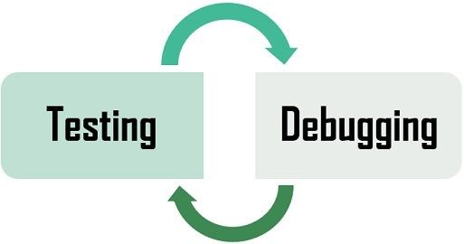

# ISTQB - Certified Tester Foundation Level v4.0

---

# Zu beantwortende Fragen nach Kapitel 1

1. **1.1** Was ist Testen?  
2. **1.2** Warum ist Testen notwendig?  
3. **1.3** Grundsätze des Testens  
4. **1.4** Testaktivitäten, Testmittel und Rollen des Testens  
5. **1.5** Grundlegende Kompetenzen und gute Praktiken beim Testen  

---

# 1.1 Was ist Testen?

- Softwaretests bewerten die Qualität der Software und helfen, das Risiko einer Fehlerwirkung im Betrieb zu verringern.
- Bewertung der Qualität von Softwareartefakten (Testobjekte).
- Muss auf den Softwareentwicklungslebenszyklus (SDLC) abgestimmt sein.

---

# Software Development Lifecycle (SDLC)

---

# Testziele

- Evaluieren von Arbeitsergebnissen wie Anforderungen, User Storys, Entwürfe und Code.
- Auslösen von Fehlerwirkungen und Finden von Fehlerzuständen.
- Sicherstellen der erforderlichen Überdeckung eines Testobjekts.
- Verringerung des Risikos unzureichender Softwarequalität.

---

# Weitere Testziele

- Verifizieren, ob spezifizierte Anforderungen erfüllt wurden.
- Verifizieren, ob ein Testobjekt den vertraglichen, rechtlichen und regulatorischen Anforderungen entspricht.
- Bereitstellen von Informationen für die Stakeholder zur Entscheidungsfindung.
- Vertrauen in die Qualität des Testobjekts aufbauen.

---

# Testing vs. Debugging

- Debugging-Prozess: Reproduzieren, Diagnose, Behebung der Ursache.
- Fehlernachtests prüfen, ob das Problem behoben wurde.

---

---

# 1.2 Warum ist Testen notwendig?

- Testen als Qualitätssteuerung hilft, die vereinbarten Ziele im vorgegebenen Rahmen (Zeit, Qualität, Budget) zu erreichen.
- Kosteneffizientes Mittel zur Erkennung von Fehlerzuständen.
- Direkte Bewertung der Qualität eines Testobjekts in verschiedenen Phasen des SDLC.

---

# 1.3 Grundsätze des Testens

- Testen zeigt das Vorhandensein, nicht die Abwesenheit von Fehlerzuständen.
- Vollständiges Testen ist unmöglich.
- Fehlerzustände treten gehäuft auf.
- Frühes Testen spart Zeit und Geld (The Rule of Ten).

---

# 1.4 Testaktivitäten

- **Testplanung**: Definition der Testziele und Auswahl der Testvorgehensweise.
- **Testentwurf**: Ausarbeitung der Testbedingungen.
- **Testüberwachung und -steuerung**: Überprüfung des Testfortschritts.
- **Testanalyse**: Analyse der Testbasis zur Bestimmung der Testbedingungen.

---

# 1.4 Weitere Testaktivitäten

- **Testrealisierung**: Erstellung oder Beschaffung der Testmittel.
- **Testdurchführung**: Ausführung der Tests gemäß dem Testausführungsplan.
- **Testabschluss**: Abschlussbericht und Verbesserungsvorschläge.

---

# 1.4.2 Testprozess im Kontext

- Der Testprozess hängt von verschiedenen Kontextfaktoren ab, wie z.B. den Bedürfnissen der Stakeholder, dem Budget und der Technologie.

---

# 1.4.3 Testmittel

- Zu den Arbeitsergebnissen gehören:
  - **Testplanung**: Testkonzept, Testzeitplan.
  - **Testüberwachung**: Testfortschrittsberichte.
  - **Testanalyse**: Priorisierte Testbedingungen.
  - **Testrealisierung**: Testabläufe, Testskripte, Testsuiten, Testdaten.

---

# 1.4.5 Rolle des Testmanagement vs. des Testens

- **Testmanagement**: Gesamtverantwortung für den Testprozess (Testplanung, Steuerung).
- **Testen**: Operative Durchführung der Tests (Analyse, Entwurf, Realisierung).

---

# 1.5 Erforderliche Kompetenzen für das Testen

- **Technische Kenntnisse**: Testwerkzeuge und Anwendungsdomäne.
- **Soft Skills**: Kommunikationsfähigkeit, Teamfähigkeit, analytisches Denken.
- **Whole-Team-Ansatz**: Alle Teammitglieder können testen, Synergien entstehen.

---

# Kapitel 1 - Schlüsselbegriffe

Testfall
Testdaten
Testabdeckung
Fehlerzustand
Fehlerwirkung
Qualitätssicherung
Testprozess
Testaktivitäten
Testrollen
Testautomatisierung