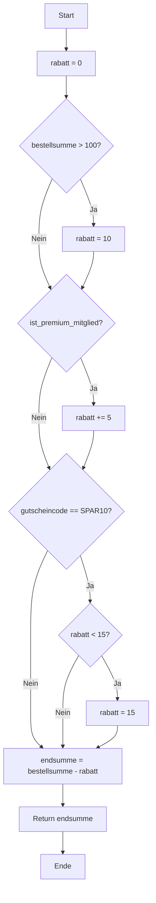
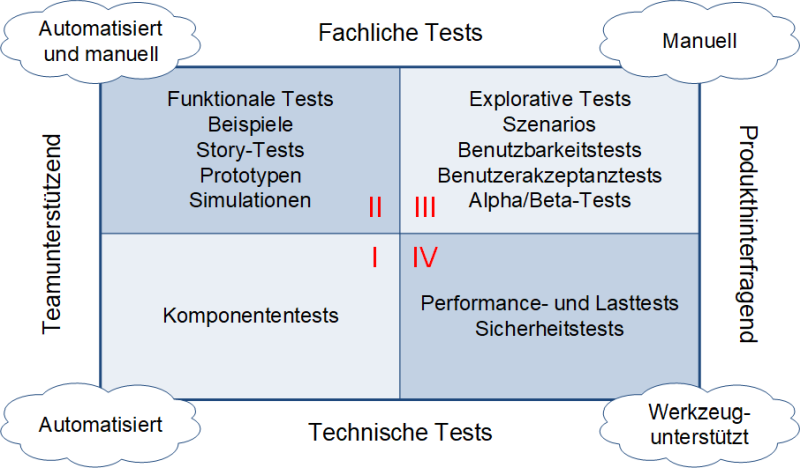

# Kapitel 4: Testanalyse und -entwurf

Kapitel 4 des ISTQB-Lehrplans befasst sich umfassend mit der Testanalyse und dem Testentwurf, die wichtige Phasen im Testprozess darstellen. Es beschreibt verschiedene Testverfahren und Techniken, die zur Ableitung von Testfällen verwendet werden, und erläutert deren Anwendung und Nutzen. Der Fokus liegt darauf, wie Testbedingungen identifiziert, spezifiziert und priorisiert werden, um die Softwarequalität systematisch zu bewerten.

## 4.1. **Testverfahren im Überblick**
Im Wesentlichen gibt es drei Kategorien von Testverfahren:
- **Black-Box-Testverfahren**: Hierbei wird die interne Struktur des Testobjekts nicht berücksichtigt. Testfälle werden ausschließlich auf der Grundlage von Spezifikationen und Anforderungen erstellt. Das Ziel ist es, das Verhalten der Software in Bezug auf diese Anforderungen zu überprüfen.
- **White-Box-Testverfahren**: Diese Methode berücksichtigt die interne Struktur des Systems. Ziel ist es, den Quellcode direkt zu testen und sicherzustellen, dass alle Anweisungen und Verzweigungen abgedeckt sind.
- **Erfahrungsbasierte Tests**: Hier basiert die Testfallermittlung auf der Erfahrung und Intuition der Tester. Diese Methode wird häufig bei explorativen Tests angewendet.

## 4.2. **Black-Box-Testverfahren**
Diese Testverfahren konzentrieren sich auf die Funktionalität des Systems und beinhalten:

- **Äquivalenzklassenbildung**: Bei dieser Technik werden Eingabedaten in verschiedene Klassen unterteilt. Jede Klasse repräsentiert eine Menge von Eingaben, die dasselbe Verhalten erwarten lassen. Beispielsweise können bei der Überprüfung eines Eingabefelds für das Geburtsdatum Äquivalenzklassen für gültige und ungültige Daten erstellt werden.
  
- **Grenzwertanalyse**: Diese Technik testet die Grenzen der Äquivalenzklassen, da an diesen Punkten Fehler häufig auftreten. Zum Beispiel wird in einem Bereich von 1 bis 100 überprüft, ob die Software bei 0 und 101 korrekt reagiert.
  
- **Entscheidungstabellentests**: In Entscheidungstabellen werden verschiedene Kombinationen von Bedingungen und Aktionen dargestellt, die zu verschiedenen Ergebnissen führen können. Diese Methode eignet sich gut, um komplexe Geschäftslogiken zu überprüfen.
  
- **Zustandsübergangstests**: Diese Methode wird verwendet, wenn ein System auf verschiedene Eingaben unterschiedlich reagiert, je nachdem, in welchem Zustand es sich gerade befindet. Ein Beispiel ist ein Bankautomat, der sich in den Zuständen „Karte eingesteckt“, „PIN eingegeben“ oder „Geld abgehoben“ befinden kann.

### Äquivalenzklassenbildung

**Definition:**  
Bei der Äquivalenzklassenbildung werden Eingabedaten in Gruppen (Klassen) eingeteilt, die jeweils ein gleiches Verhalten der Software erwarten lassen. Jede Klasse steht für eine Menge von Eingaben, die das gleiche Ergebnis erwarten lassen. Ein Test pro Äquivalenzklasse reicht oft aus, um das Verhalten für alle Eingaben in dieser Klasse zu überprüfen.

**Beispiel 1:**  
Stell dir ein Formular zur Eingabe des Alters eines Benutzers vor, das nur Werte zwischen 18 und 65 akzeptiert. Die Äquivalenzklassen wären:
- **Gültige Klasse:** 18 bis 65
- **Ungültige Klassen:** Unter 18 und über 65


**Beispiel 2: Berechne_Versicherungsprämie(Alter, Fahrerfahrung, Unfälle, Autoklasse)**

1. **Alter des Fahrers:**
   - Unter 18: Nicht versicherbar
   - 18-25: Hohe Prämie
   - 26-60: Normale Prämie
   - 61-80: Leicht erhöhte Prämie
   - Über 80: Nicht versicherbar

2. **Fahrerfahrung (in Jahren):**
   - 0-2: Anfängeraufschlag
   - 3-10: Normaltarif
   - Über 10: Erfahrungsrabatt

3. **Anzahl der Unfälle in den letzten 5 Jahren:**
   - 0: Kein Aufschlag
   - 1-2: Mittlerer Aufschlag
   - 3-5: Hoher Aufschlag
   - Über 5: Nicht versicherbar

4. **Autoklasse:**
   - Kleinwagen: Niedrige Prämie
   - Mittelklasse: Mittlere Prämie
   - Oberklasse: Hohe Prämie
   - Sportwagen: Sehr hohe Prämie

#### Äquivalenzklassen für die Parameter

| **Parameter**             | **Äquivalenzklasse** | **Beschreibung**                          |
|---------------------------|----------------------|------------------------------------------|
| **Alter des Fahrers**     | Ungültige Klasse 1   | < 18 (nicht versicherbar)               |
|                           | Gültige Klasse 1     | 18-25 (hohe Prämie)                      |
|                           | Gültige Klasse 2     | 26-60 (normale Prämie)                   |
|                           | Gültige Klasse 3     | 61-80 (leicht erhöhte Prämie)            |
|                           | Ungültige Klasse 2   | > 80 (nicht versicherbar)                |
| **Fahrerfahrung**         | Gültige Klasse 1     | 0-2 Jahre (Anfängeraufschlag)           |
|                           | Gültige Klasse 2     | 3-10 Jahre (Normaltarif)                 |
|                           | Gültige Klasse 3     | > 10 Jahre (Erfahrungsrabatt)            |
| **Anzahl der Unfälle**    | Gültige Klasse 1     | 0 (kein Aufschlag)                       |
|                           | Gültige Klasse 2     | 1-2 (mittlerer Aufschlag)                |
|                           | Gültige Klasse 3     | 3-5 (hoher Aufschlag)                     |
|                           | Ungültige Klasse      | > 5 (nicht versicherbar)                  |
| **Autoklasse**           | Gültige Klasse 1     | Kleinwagen (niedrige Prämie)             |
|                           | Gültige Klasse 2     | Mittelklasse (mittlere Prämie)           |
|                           | Gültige Klasse 3     | Oberklasse (hohe Prämie)                 |
|                           | Gültige Klasse 4     | Sportwagen (sehr hohe Prämie)            |

#### Testfälle basierend auf den Äquivalenzklassen

| **Testfall** | **Alter** | **Fahrerfahrung** | **Unfälle** | **Autoklasse** | **Erwartetes Ergebnis**              |
|--------------|-----------|-------------------|-------------|----------------|--------------------------------------|
| Testfall 1   | 22        | 1                 | 0           | Kleinwagen     | Hohe Prämie                          |
| Testfall 2   | 35        | 5                 | 1           | Mittelklasse   | Normale Prämie                       |
| Testfall 3   | 65        | 15                | 0           | Oberklasse     | Leicht erhöhte Prämie                |
| Testfall 4   | 30        | 8                 | 4           | Sportwagen     | Hohe Prämie                          |
| Testfall 5   | 18        | 0                 | 0           | Kleinwagen     | Hohe Prämie                          |
| Testfall 6   | 25        | 2                 | 2           | Mittelklasse   | Hohe Prämie                          |
| Testfall 7   | 26        | 3                 | 3           | Oberklasse     | Normale Prämie                       |
| Testfall 8   | 60        | 10                | 5           | Sportwagen     | Hohe Prämie                          |
| Testfall 9   | 61        | 11                | 0           | Kleinwagen     | Leicht erhöhte Prämie                |
| Testfall 10  | 80        | 40                | 1           | Mittelklasse   | Leicht erhöhte Prämie                |
| Testfall 11  | 17        | 0                 | 0           | Kleinwagen     | Nicht versicherbar (Alter < 18)      |
| Testfall 12  | 81        | 50                | 0           | Oberklasse     | Nicht versicherbar (Alter > 80)      |
| Testfall 13  | 40        | 5                 | 6           | Mittelklasse   | Nicht versicherbar (Unfälle > 5)     |

### Grenzwertanalyse

**Definition:**  
Bei der Grenzwertanalyse werden Testfälle an den Grenzen der Äquivalenzklassen erstellt, da an den Grenzwerten oft Fehler auftreten. Für jede Grenze einer Klasse wird ein minimaler gültiger und ein minimaler ungültiger Wert getestet.

**Beispiel:**  
Für das Beispiel des Alters (gültiger Bereich: 18 bis 65) testet man:
- Grenzwerte für die gültige Klasse: 18 und 65
- Grenzwerte außerhalb der gültigen Klasse: 17 (unterhalb) und 66 (oberhalb)

**Übung:**  
Du testest ein Bestellsystem, das Bestellungen nur für Mengen von 1 bis 100 Produkten zulässt:
- Bestimme Testfälle mit der Grenzwertanalyse.

**Lösung:**
- **Gültige Grenzwerte:** 1 und 100
- **Ungültige Grenzwerte:** 0 (unterhalb der Grenze), 101 (oberhalb der Grenze)

### Entscheidungstabellentest

**Definition:**  
Entscheidungstabellen werden verwendet, um komplexe Geschäftsregeln zu testen, die von mehreren Bedingungen und ihren Kombinationen abhängen. Jede Zeile einer Entscheidungstabelle enthält eine Kombination von Bedingungen und die dazugehörige Aktion.

**Beispiel:**  
Ein Online-Shop gewährt Rabatte je nach Kundentyp und Bestellwert:
- Wenn der Kunde ein **Stammkunde** ist und der Bestellwert **über 100 €** beträgt, gibt es 10 % Rabatt.
- Wenn der Kunde **kein Stammkunde** ist und der Bestellwert **über 100 €** beträgt, gibt es 5 % Rabatt.
- Andernfalls gibt es keinen Rabatt.

| Stammkunde? | Bestellwert > 100 € | Rabatt |
|-------------|---------------------|--------|
| Ja          | Ja                  | 10 %   |
| Nein        | Ja                  | 5 %    |
| Egal        | Nein                | 0 %    |

#### Entscheidungstabelle: Rabattsystem Online-Shop

##### Faktoren
1. **Bestellwert:**
   - Niedrig: < 50 €
   - Mittel: 50 € - 100 €
   - Hoch: > 100 €

2. **Kundenstatus:**
   - Neukunde
   - Bestandskunde
   - Premium-Kunde

3. **Saison:**
   - Normaler Verkauf
   - Schlussverkauf

##### Regeln
1. **Regel 1:** Premium-Kunden erhalten immer mindestens 5% Rabatt.
2. **Regel 2:** Bei hohem Bestellwert gibt es 10% Rabatt, außer im Schlussverkauf.
3. **Regel 3:** Neukunden erhalten bei mittlerem Bestellwert 5% Rabatt.
4. **Regel 4:** Im Schlussverkauf gibt es generell 15% Rabatt, außer bei niedrigem Bestellwert.
5. **Regel 5:** Bestandskunden erhalten bei mittlerem Bestellwert im normalen Verkauf 3% Rabatt.

##### Entscheidungstabelle

| Bestellwert | Kundenstatus    | Saison          | Rabatt |
|-------------|-----------------|------------------|--------|
| Niedrig     | Neukunde        | Normaler Verkauf  | 0%     |
| Niedrig     | Neukunde        | Schlussverkauf    | 0%     |
| Niedrig     | Bestandskunde   | Normaler Verkauf  | 0%     |
| Niedrig     | Bestandskunde   | Schlussverkauf    | 0%     |
| Niedrig     | Premium-Kunde   | Normaler Verkauf  | 5%     |
| Niedrig     | Premium-Kunde   | Schlussverkauf    | 5%     |
| Mittel      | Neukunde        | Normaler Verkauf  | 5%     |
| Mittel      | Neukunde        | Schlussverkauf    | 15%    |
| Mittel      | Bestandskunde   | Normaler Verkauf  | 3%     |
| Mittel      | Bestandskunde   | Schlussverkauf    | 15%    |
| Mittel      | Premium-Kunde   | Normaler Verkauf  | 5%     |
| Mittel      | Premium-Kunde   | Schlussverkauf    | 15%    |
| Hoch        | Neukunde        | Normaler Verkauf  | 10%    |
| Hoch        | Neukunde        | Schlussverkauf    | 15%    |
| Hoch        | Bestandskunde   | Normaler Verkauf  | 0%     |
| Hoch        | Bestandskunde   | Schlussverkauf    | 15%    |
| Hoch        | Premium-Kunde   | Normaler Verkauf  | 10%    |
| Hoch        | Premium-Kunde   | Schlussverkauf    | 15%    |

##### Erläuterung der Rabatte:
- **Niedriger Bestellwert (<50 €):** Kein Rabatt für Neukunden und Bestandskunden. Premium-Kunden erhalten jedoch einen Rabatt von **5%**.
- **Mittlerer Bestellwert (50 € - 100 €):** 
  - Neukunden erhalten **5%** im normalen Verkauf und **15%** im Schlussverkauf.
  - Bestandskunden erhalten **3%** im normalen Verkauf und **15%** im Schlussverkauf.
- **Hoher Bestellwert (>100 €):**
  - Neukunden erhalten **10%** im normalen Verkauf und **15%** im Schlussverkauf.
  - Bestandskunden erhalten keinen Rabatt im normalen Verkauf, aber **15%** im Schlussverkauf.
  
### Zustandsübergangstest

**Definition:**  
Beim Zustandsübergangstest wird überprüft, wie sich ein System je nach seinem aktuellen Zustand verhält, wenn bestimmte Ereignisse eintreten. Das System kann je nach aktuellem Zustand und Eingabe unterschiedliche Reaktionen zeigen.

**Beispiel 1:**  
Stell dir einen Bankautomaten vor:

**Zustände**
1. Karte eingesteckt
2. Zugriff auf Konto

**Ereignisse**
- PIN Korrekt, PIN falsch

- **Zustand 1:** Karte eingesteckt
  - Ereignis: PIN korrekt -> **Zustand 2:** Zugriff auf Konto
  - Ereignis: PIN falsch -> **Zustand 1:** Karte eingesteckt
- **Zustand 2:** Zugriff auf Konto
  - Ereignis: Abhebung erfolgreich -> **Zustand 1:** Karte eingesteckt
  - Ereignis: Abbruch -> **Zustand 1:** Karte eingesteckt

Hier ist ein weiteres Beispiel für einen Zustandsübergang mit 3 Zuständen und 3 Ereignissen, diesmal für einen einfachen Aufzug:

**Beispiel 2: 

Stelle dir einen Aufzug vor

**Zustände:**
1. Stillstand
2. Aufwärtsfahrt 
3. Abwärtsfahrt

**Ereignisse:**
1. Etagenruf von oben
2. Etagenruf von unten
3. Zielstockwerk erreicht

**Zustandstabelle**

| Aktueller Zustand | Ereignis | Neuer Zustand |
|-------------------|----------|---------------|
| Stillstand | Etagenruf von oben | Aufwärtsfahrt |
| Stillstand | Etagenruf von unten | Abwärtsfahrt |
| Stillstand | Zielstockwerk erreicht | Stillstand |
| Aufwärtsfahrt | Etagenruf von oben | Aufwärtsfahrt |
| Aufwärtsfahrt | Etagenruf von unten | Aufwärtsfahrt |
| Aufwärtsfahrt | Zielstockwerk erreicht | Stillstand |
| Abwärtsfahrt | Etagenruf von oben | Abwärtsfahrt |
| Abwärtsfahrt | Etagenruf von unten | Abwärtsfahrt |
| Abwärtsfahrt | Zielstockwerk erreicht | Stillstand |

**Erläuterungen:**

1. Im Zustand "Stillstand":
   - Bei einem Ruf von oben oder unten fährt der Aufzug in die entsprechende Richtung.
   - Das Erreichen des Zielstockwerks ändert nichts am Zustand.

2. Im Zustand "Aufwärtsfahrt":
   - Weitere Rufe (von oben oder unten) ändern nichts an der Fahrtrichtung.
   - Bei Erreichen des Zielstockwerks geht der Aufzug in den Stillstand.

3. Im Zustand "Abwärtsfahrt":
   - Weitere Rufe (von oben oder unten) ändern nichts an der Fahrtrichtung.
   - Bei Erreichen des Zielstockwerks geht der Aufzug in den Stillstand.

### Fazit
Diese vier Testverfahren helfen, die Funktionalität und Stabilität von Software gezielt zu überprüfen. Jedes Verfahren hat seine eigenen Stärken, und durch eine Kombination können möglichst viele Fehlerquellen in der Software abgedeckt werden.

## 4.3. **White-Box-Testverfahren**
Die White-Box-Testverfahren gehen ins Detail der Systemlogik. Sie konzentrieren sich auf die Abdeckung des Codes und beinhalten:

- **Anweisungstest und Anweisungsüberdeckung**: Diese Technik überprüft, ob jede Anweisung im Code mindestens einmal ausgeführt wird. Es stellt sicher, dass keine Teile des Codes ungetestet bleiben.
  
- **Zweigtest und Zweigüberdeckung**: Hierbei werden die Verzweigungen innerhalb des Codes getestet, um sicherzustellen, dass jede Bedingung (z. B. ein "if-else"-Statement) mindestens einmal in beiden Richtungen (wahr und falsch) durchlaufen wird.

**Beispiel**

Angenommen wir haben folgenden Code:

```python

def bearbeite_bestellung(bestellsumme, ist_premium_mitglied, gutscheincode):
    rabatt = 0
    if bestellsumme > 100:
        rabatt = 10
    
    if ist_premium_mitglied:
        rabatt += 5
    
    if gutscheincode == "SPAR10":
        if rabatt < 15:
            rabatt = 15
    
    endsumme = bestellsumme - rabatt
    return endsumme
```

**Anweisungstest:**

Für den Anweisungstest reicht ein einziger Testfall aus:
- `bearbeite_bestellung(150, True, "SPAR10")`

Dieser Testfall durchläuft alle Anweisungen im Code, erreicht aber nicht alle möglichen Verzweigungen.

**Zweigtest**



Für den Zweigtest benötigen wir mehrere Testfälle, um alle Verzweigungen abzudecken:

1. `bearbeite_bestellung(150, True, "SPAR10")` - Hoher Betrag, Premium-Mitglied, mit Gutschein
2. `bearbeite_bestellung(50, False, "")` - Niedriger Betrag, kein Premium-Mitglied, ohne Gutschein
3. `bearbeite_bestellung(120, False, "SPAR10")` - Hoher Betrag, kein Premium-Mitglied, mit Gutschein
4. `bearbeite_bestellung(80, True, "FALSCH")` - Niedriger Betrag, Premium-Mitglied, falscher Gutschein

Diese Testfälle decken alle möglichen Verzweigungen ab:
- `bestellsumme > 100` wird sowohl für true als auch false getestet
- `ist_premium_mitglied` wird sowohl für true als auch false getestet
- `gutscheincode == "SPAR10"` wird sowohl für true als auch false getestet
- `rabatt < 15` wird sowohl für true als auch false getestet

Der Zweigtest ist gründlicher und deckt mehr potenzielle Fehler auf als der Anweisungstest, da er alle möglichen Entscheidungspfade im Code berücksichtigt.

### Unterschiede zwischen Anweisungs- und Zweigüberdeckung
- **Anweisungsüberdeckung**: Hier wird nur überprüft, ob alle Anweisungen ausgeführt wurden, unabhängig davon, ob alle möglichen Verzweigungen getestet wurden.
- **Zweigüberdeckung**: Hier wird jede Bedingung sowohl im wahren als auch im falschen Fall getestet, um sicherzustellen, dass jede mögliche Ausführung des Codes berücksichtigt wurde.

### Fazit
White-Box-Tests sind sehr effektiv, um sicherzustellen, dass der gesamte Code abgedeckt ist. Sie sind besonders nützlich in sicherheitskritischen Systemen, wo es entscheidend ist, dass alle Anweisungen und Bedingungen überprüft werden. Übungen wie die obigen helfen, das Verständnis für die unterschiedlichen Testmethoden zu vertiefen und zu erkennen, wo in der Software mögliche Fehlerquellen liegen könnten.

## 4.4 **Erfahrungsbasierte Testverfahren**
Diese Verfahren verlassen sich auf die Fachkenntnisse und Intuition der Tester:

- **Explorativer Test**: Tester verwenden keine vorab erstellten Testfälle, sondern erkunden das System aktiv und passen ihre Tests in Echtzeit an. Dies ist besonders nützlich, um unvorhersehbare Fehler zu finden.
  
- **Checklistenbasierter Test**: Eine vordefinierte Checkliste dient als Leitfaden, der sicherstellt, dass alle wichtigen Aspekte der Software überprüft werden, ohne strenge Testfälle zu verwenden.

### Erfahrungsbasierte Testverfahren: Erklärung mit Beispielen und Übungen

Erfahrungsbasierte Testverfahren verlassen sich auf das Wissen, die Intuition und die Erfahrung der Tester, um Fehler zu identifizieren. Im Gegensatz zu methodischen, formellen Ansätzen wie den White- oder Black-Box-Tests, bieten erfahrungsbasierte Verfahren eine flexiblere und oft schnellere Methode, um potenzielle Probleme zu finden, die in formalen Tests übersehen werden könnten.

#### Exploratives Testen

**Definition:**  
Beim explorativen Testen wird die Software ohne vorab erstellte Testfälle getestet. Der Tester "erkundet" das System, indem er spontane Testideen entwickelt und diese sofort durchführt. Dabei werden die Tests in Echtzeit angepasst, je nachdem, wie sich das System verhält und welche potenziellen Fehler entdeckt werden. Diese Methode eignet sich besonders, um unerwartete Fehler zu finden, die nicht in den Spezifikationen beschrieben sind.

**Beispiel:**  
Stell dir vor, du testest eine neue mobile App, die es Nutzern ermöglicht, Events zu erstellen und zu verwalten. Statt Testfälle im Voraus zu definieren, erkundest du verschiedene Bereiche der App:
- **Schritt 1:** Melde dich als neuer Benutzer an und prüfe, ob die Registrierung funktioniert.
- **Schritt 2:** Versuche, ein Event ohne Titel zu erstellen. Siehst du eine Fehlermeldung?
- **Schritt 3:** Bearbeite ein bereits erstelltes Event und ändere das Datum. Prüfe, ob die Änderung gespeichert wird.
- **Schritt 4:** Wechsle zwischen verschiedenen Menüs und beobachte, ob die App abstürzt oder Performance-Probleme auftreten.

Hierbei passt du deine Tests laufend an, basierend auf den gefundenen Ergebnissen und Unregelmäßigkeiten.

#### Checklistenbasiertes Testen

**Definition:**  
Beim checklistenbasierten Testen verwendet der Tester eine vordefinierte Checkliste, um sicherzustellen, dass alle wichtigen Aspekte der Software überprüft werden. Im Gegensatz zu formalen Testfällen sind Checklisten flexibler und weniger detailliert, ermöglichen jedoch eine schnelle Überprüfung der Kernfunktionen oder kritischen Bereiche eines Systems.

**Beispiel:**  
Du testest eine Hotelbuchungsplattform. Deine Checkliste könnte folgende Punkte umfassen:
- **Benutzerregistrierung funktioniert korrekt** (Ja/Nein)
- **Verfügbarkeit von Zimmern wird richtig angezeigt** (Ja/Nein)
- **Preise ändern sich bei Auswahl unterschiedlicher Daten** (Ja/Nein)
- **Buchungsbestätigung wird per E-Mail gesendet** (Ja/Nein)
- **Zahlung mit Kreditkarte und PayPal möglich** (Ja/Nein)

Du gehst die Checkliste durch und markierst jeden Punkt als bestanden oder nicht bestanden. So kannst du schnell einen Überblick gewinnen, ob alle kritischen Funktionen wie erwartet arbeiten.
#### Unterschiede und Einsatzbereiche

- **Exploratives Testen** ist besonders geeignet, wenn es keine klaren Spezifikationen gibt oder wenn schnelle Rückmeldungen über die Funktionsweise des Systems benötigt werden. Es ist nützlich in frühen Entwicklungsphasen oder wenn das Ziel ist, kreative Tests durchzuführen, um unvorhergesehene Fehler zu finden.
  
- **Checklistenbasiertes Testen** eignet sich gut für Bereiche, in denen eine schnelle, aber nicht zu detaillierte Überprüfung der Kernfunktionen erforderlich ist. Es ist ideal, um sicherzustellen, dass alle wichtigen Funktionen in einer frühen Version oder einem Prototypen einer Software überprüft werden.

### Fazit
Erfahrungsbasierte Testverfahren bieten Flexibilität und nutzen die Expertise der Tester optimal aus. Sie sind besonders in agilen Projekten oder bei unvollständigen Spezifikationen von Vorteil. Das explorative Testen ermöglicht eine kreative Erkundung des Systems, während das checklistenbasierte Testen eine strukturierte, aber flexible Methode zur schnellen Bewertung der Kernfunktionen bietet.

## 4.5. Auf Zusammenarbeit basierende Testansätze
In diesem Abschnitt werden Ansätze beschrieben, bei denen die Zusammenarbeit im Team gefördert wird, um die Qualität der Tests zu verbessern:

- **Gemeinsames Schreiben von User Storys**: In agilen Projekten werden User Storys oft vom gesamten Team (einschließlich Testern) erstellt, um sicherzustellen, dass die Akzeptanzkriterien klar und testbar sind.
  
- **Abnahmekriterien**: Diese Kriterien bestimmen, ob eine User Story oder ein Feature erfolgreich implementiert wurde und ob es die Anforderungen erfüllt.
  
- **Abnahmetestgetriebene Entwicklung (ATDD)**: Bei dieser Methode schreiben Entwickler, Tester und Kunden gemeinsam die Tests für die Akzeptanzkriterien. Diese Tests müssen vor dem Schreiben des Codes erstellt werden, um sicherzustellen, dass der Code die Anforderungen erfüllt.

### 4.5.1 Gemeinsames Schreiben von User Stories

Eine **User Story** beschreibt ein Feature aus Sicht des Endnutzers oder Kunden. Sie enthält drei wesentliche Elemente, die auch als "3 C's" bekannt sind:
- **Karte (Card):** Ein Medium (wie eine Karteikarte oder ein Eintrag in einem elektronischen System), das die User Story beschreibt.
- **Konversation (Conversation):** Erläutert, wie die Software genutzt werden soll, oft durch mündliche oder dokumentierte Diskussionen.
- **Bestätigung (Confirmation):** Die Abnahmekriterien, die festlegen, wann die Story als abgeschlossen gilt.

Das gängige Format einer User Story lautet:  
*„Als [Rolle] möchte ich [Ziel], damit ich [Nutzen]“*.

Durch die Zusammenarbeit bei der Erstellung der User Stories werden verschiedene Perspektiven – Fachlichkeit, Entwicklung und Testen – einbezogen. So entsteht ein gemeinsames Verständnis über die zu liefernden Funktionen. Methoden wie **Brainstorming** und **Mind-Mapping** können diesen Prozess unterstützen.

Gute User Stories folgen dem **INVEST-Prinzip**:  
- **I**ndependent (unabhängig)
- **N**egotiable (verhandelbar)
- **V**aluable (nützlich)
- **E**stimable (schätzbar)
- **S**mall (klein)
- **T**estable (testbar)

Falls ein Stakeholder nicht weiß, wie eine User Story getestet werden soll, kann dies darauf hinweisen, dass die Story entweder nicht klar genug ist oder keinen wirklichen Mehrwert bietet.

### 4.5.2 Abnahmekriterien

**Abnahmekriterien** (auch **Akzeptanzkriterien**) definieren, unter welchen Bedingungen eine User Story als fertig gilt und von den Stakeholdern akzeptiert wird. Diese Kriterien werden während der Diskussion der User Story erarbeitet und dienen als Basis für die Erstellung von Testfällen.

Die Abnahmekriterien:
- Definieren den Umfang der User Story.
- Stellen einen Konsens zwischen Stakeholdern her.
- Beschreiben positive und negative Szenarien.
- Dienen als Grundlage für die Abnahmetests.
- Ermöglichen eine genaue Planung und Schätzung.

Zwei gängige Formate für Abnahmekriterien sind:
- **Szenario-orientiert** (z.B. das Gegeben/Wenn/Dann-Format aus der **verhaltensgetriebenen Entwicklung (BDD)**).
- **Regelorientiert** (z.B. Checklisten oder Tabellen mit Input-Output-Zuordnungen).

Diese Kriterien helfen sicherzustellen, dass die Anforderungen klar und vollständig sind.

### 4.5.3 Abnahmetestgetriebene Entwicklung (ATDD)

**ATDD** ist ein **Test-First-Ansatz**, bei dem die Testfälle vor der Implementierung der User Story erstellt werden. Dies geschieht durch Teammitglieder mit unterschiedlichen Perspektiven, darunter Kunden, Entwickler und Tester. Der Prozess beginnt oft mit einem **Spezifikationsworkshop**, in dem die User Story und deren Abnahmekriterien diskutiert werden. Eventuelle Unklarheiten oder Fehlerzustände in der Story können so frühzeitig erkannt und behoben werden.

Die Erstellung von Testfällen basiert auf den Abnahmekriterien und bildet konkrete Beispiele für die Funktionsweise der Software. Die Testfälle sollten positiv beginnen (also Fälle abdecken, in denen alles wie erwartet funktioniert) und dann auch negative Szenarien und nicht-funktionale Anforderungen wie Leistung und Usability umfassen. Diese Testfälle müssen für die Stakeholder verständlich sein und sollten die User Story vollständig abdecken, ohne darüber hinauszugehen.

Falls die Testfälle in einem Format vorliegen, das von einem Testautomatisierungs-Framework unterstützt wird, können die Entwickler diese automatisieren und die Abnahmetests so zu **ausführbaren Anforderungen** machen.

### Zusammenfassung

Auf Zusammenarbeit basierende Testansätze stellen sicher, dass alle relevanten Beteiligten frühzeitig in den Entwicklungsprozess eingebunden werden. Die gemeinsame Erstellung von User Stories sorgt für Klarheit über die Anforderungen und deren Testbarkeit, während Abnahmekriterien einen klaren Maßstab für die Fertigstellung bieten. ATDD hilft, durch die frühe Definition von Tests sicherzustellen, dass die Implementierung korrekt und vollständig erfolgt, bevor die Entwicklung beginnt. Diese Methoden tragen zur Vermeidung von Fehlern bei und fördern die Kommunikation zwischen den Teammitgliedern.

---
# Kapitel 5: **Management der Testaktivitäten**

Kapitel 5 des ISTQB Lehrplans befasst sich mit der Organisation und Verwaltung von Testaktivitäten im Softwareentwicklungsprozess. Es behandelt wesentliche Konzepte wie Testplanung, Schätzverfahren, Priorisierung von Testfällen sowie Modelle zur Testautomatisierung, darunter die **Testpyramide** und die **Testquadranten**.

## 5.1. **Testplanung**
Die Testplanung ist der Startpunkt des Testprozesses und definiert die Testziele, Testressourcen und den Zeitplan. Wesentliche Elemente der Testplanung umfassen:
- **Testziele:** Was soll durch das Testen erreicht werden?
- **Teststrategie:** Welche Methoden und Ansätze werden verwendet, um die Ziele zu erreichen?
- **Ressourcenplanung:** Festlegen der benötigten Ressourcen (z. B. Testumgebungen, Werkzeuge, Personal).
- **Zeitplan und Meilensteine:** Festlegung von Deadlines für Testphasen.
  
Beispiel: Ein Softwareprojekt plant die Testaktivitäten über einen Zeitraum von sechs Monaten. Dabei wird festgelegt, dass in der ersten Phase Unittests durchgeführt werden, gefolgt von Integrationstests in der zweiten Phase und Systemtests in der dritten Phase.

### 5.1.1 Zweck und Inhalt eines Testkonzepts
Ein Testkonzept dient der Beschreibung der Ziele, Ressourcen und Prozesse eines Testprojekts. Es stellt sicher, dass die Testaktivitäten die festgelegten Kriterien erfüllen und dient als Kommunikationsmittel zwischen Teammitgliedern und Stakeholdern. Außerdem dokumentiert es die Mittel und den Zeitplan zur Erreichung der Testziele. Es wird verwendet, um sicherzustellen, dass die Tests den Richtlinien und Strategien der Organisation entsprechen oder erklärt Abweichungen davon.

Typische Inhalte eines Testkonzepts:
- Testkontext (z. B. Testziele, Einschränkungen)
- Annahmen und Einschränkungen
- Stakeholder (Rollen und Verantwortlichkeiten)
- Kommunikation (z. B. Formen der Kommunikation)
- Risikoanalyse (Produkt- und Projektrisiken)
- Testansatz (z. B. Teststufen, Testarten, Testumgebung)
- Budget und Zeitplan

### 5.1.2 Beitrag des Testers zur Iterations- und Releaseplanung
In agilen Entwicklungsprozessen gibt es zwei zentrale Planungsarten: Releaseplanung und Iterationsplanung.

- **Releaseplanung**: Umfasst die Bereitstellung des Produkts und die Anpassung des Produkt-Backlogs. Tester helfen bei der Erstellung testbarer User Stories und Abnahmekriterien. Sie schätzen den Testaufwand, legen den Testansatz fest und planen die Tests für das Release.
  
- **Iterationsplanung**: Bezieht sich auf die Planung einer einzelnen Iteration und das dazugehörige Iterations-Backlog. Tester analysieren die Risiken der User Stories, schätzen den Testaufwand und spezifizieren funktionale und nicht-funktionale Testaspekte.

### 5.1.3 Eingangskriterien und Endekriterien
- **Eingangskriterien**: Dies sind die Voraussetzungen, die erfüllt sein müssen, bevor eine Testaktivität starten kann. Typische Kriterien umfassen Verfügbarkeit von Ressourcen (z. B. Personal, Tools, Testumgebungen), Testbasis (z. B. User Stories, Testfälle) und die Qualität des Testobjekts.
  
- **Endekriterien**: Diese legen fest, wann eine Testaktivität abgeschlossen ist. Metriken wie Testabdeckung, Fehlerdichte und die Anzahl der ausgeführten Tests werden berücksichtigt. Auch Zeit- und Budgetvorgaben können als Endekriterien dienen, besonders wenn Stakeholder das Risiko akzeptieren. In der agilen Entwicklung werden Endekriterien oft als „Definition-of-Done“ bezeichnet, während Eingangskriterien als „Definition-of-Ready“ gelten.
- 
### 5.1.4 **Schätzverfahren**
Die **Schätzung des Testaufwands** ist ein entscheidender Faktor in der Testplanung. Es gibt verschiedene Verfahren zur Aufwandsschätzung:

- **Verhältnisbasierte Schätzung:** Hier werden Daten aus früheren Projekten verwendet, um den Testaufwand für das neue Projekt abzuleiten. Beispiel: Wenn in einem früheren Projekt das Verhältnis zwischen Entwicklungs- und Testaufwand 3:2 war, kann man für ein neues Projekt mit 600 Entwicklerpersonentagen etwa 400 Testpersonentage ansetzen.
  
- **Extrapolation:** Basierend auf frühen Messungen im Projekt wird der Aufwand für zukünftige Aufgaben geschätzt. Diese Methode ist besonders nützlich in agilen Entwicklungsmodellen, wo wiederholte Iterationen stattfinden.

- **Breitband-Delphi-Methode:** Eine iterative Schätzung, bei der mehrere Experten unabhängig voneinander den Aufwand schätzen. Danach werden die Schätzungen verglichen und diskutiert, bis ein Konsens erreicht ist.

- **Drei-Punkt-Schätzung:** Experten geben drei Schätzungen ab: die optimistischste (a), die wahrscheinlichste (m) und die pessimistischste (b). Das Ergebnis wird durch eine gewichtete Durchschnittsformel berechnet: E = (a + 4\*m + b) / 6. 
	- Beispiel: Wenn a = 6 Stunden, m = 9 Stunden und b = 18 Stunden sind, ergibt sich ein Schätzwert von 10 Stunden, mit einer Standardabweichung von 2 Stunden.

###  Verhältnisbasierte Schätzung

**Definition:**  
Die verhältnisbasierte Schätzung basiert auf historischen Daten und Erfahrungswerten aus ähnlichen Projekten. Der Testaufwand wird in Relation zum Entwicklungsaufwand oder zu ähnlichen Projekten geschätzt.

**Anwendung:**  
Wenn in einem früheren Projekt das Verhältnis zwischen Entwicklungsaufwand und Testaufwand bekannt ist, kann dieses Verhältnis auf das neue Projekt übertragen werden. Beispielsweise könnte ein typisches Verhältnis von 60 % Entwicklung und 40 % Testen verwendet werden.

**Beispiel:**  
Angenommen, in einem ähnlichen Projekt wurden 400 Entwicklerpersonentage für das Coding benötigt und 200 Testpersonentage für das Testen. Wenn das neue Projekt 600 Entwicklerpersonentage umfasst, könnte der Testaufwand auf 300 Personentage geschätzt werden, da das Verhältnis 2:1 beträgt.

### Extrapolation

**Definition:**  
Bei der Extrapolation wird der Testaufwand basierend auf Messungen in den frühen Projektphasen geschätzt. Dies ist besonders nützlich in Projekten mit sich wiederholenden Phasen (z. B. in agilen Projekten), da aus den frühen Testphasen auf den Gesamtaufwand geschlossen werden kann.

**Anwendung:**  
Diese Methode wird verwendet, wenn erste Messungen über den Fortschritt und den Aufwand vorliegen. Diese Informationen können dann genutzt werden, um den Rest des Projekts zu schätzen.

**Beispiel:**  
In einer frühen Phase eines agilen Projekts wurden in zwei Sprints jeweils 50 Testpersonentage benötigt. Wenn das Projekt zehn Sprints umfasst, kann der Testaufwand für das gesamte Projekt auf etwa 250 Personentage extrapoliert werden.

### Expertenschätzung

**Definition:**  
Bei der Expertenschätzung wird der Aufwand basierend auf dem Fachwissen und der Erfahrung von Experten geschätzt. Mehrere Experten geben unabhängig voneinander Schätzungen ab, die dann zusammengefasst und verglichen werden.

**Anwendung:**  
Diese Methode ist besonders nützlich, wenn keine vergleichbaren historischen Daten vorliegen oder wenn das Projekt besondere Komplexität aufweist, die erfahrene Fachkräfte besser einschätzen können.

**Beispiel:**  
Drei Experten werden gebeten, den Testaufwand für ein neues E-Commerce-System zu schätzen. Der erste Experte schätzt den Aufwand auf 100 Personentage, der zweite auf 120 und der dritte auf 110. Der Durchschnitt dieser Schätzungen (110 Personentage) wird als der wahrscheinlichste Aufwand betrachtet.

### Breitband-Delphi-Methode

**Definition:**  
Die Breitband-Delphi-Methode ist eine erweiterte Form der Expertenschätzung. Hierbei werden Schätzungen in mehreren Runden durchgeführt. Die Experten geben ihre Schätzungen anonym ab, und die Ergebnisse werden nach jeder Runde diskutiert. Ziel ist es, durch Feedback und Diskussion einen Konsens zu erreichen.

**Anwendung:**  
Diese Methode ist ideal, wenn es zu Beginn des Projekts Unsicherheiten gibt oder wenn die Schätzungen der Experten stark voneinander abweichen. Durch die iterative Diskussion wird eine genauere Schätzung erreicht.

**Beispiel:**  
In der ersten Runde schätzen drei Experten den Testaufwand auf 80, 120 und 150 Personentage. Nach einer Diskussion über die unterschiedlichen Schätzungen wird in der zweiten Runde der Aufwand auf 110, 115 und 120 Personentage geschätzt. Schließlich einigt man sich in der dritten Runde auf 115 Personentage.

### Drei-Punkt-Schätzung

**Definition:**  
Die Drei-Punkt-Schätzung kombiniert optimistische, pessimistische und wahrscheinlichste Szenarien, um eine ausgewogene Schätzung zu erhalten. Diese Schätzungen werden durch eine gewichtete Formel kombiniert, um den erwarteten Aufwand zu berechnen.

Die Formel lautet:
$$\text{Erwarteter Aufwand (E)} = \frac{a + 4m + b}{6} $$
- **a**: Optimistische Schätzung (Minimalaufwand)
- **m**: Wahrscheinlichste Schätzung (Normalfall)
- **b**: Pessimistische Schätzung (Maximalaufwand)

**Anwendung:**  
Dieses Verfahren wird eingesetzt, wenn Unsicherheiten bestehen und der Testaufwand stark variieren könnte. Es hilft, eine realistische Schätzung zu erhalten, die Risiken berücksichtigt.

**Beispiel:**  
Ein Tester gibt folgende Schätzungen ab:
- Optimistische Schätzung (a): 8 Tage
- Wahrscheinlichste Schätzung (m): 12 Tage
- Pessimistische Schätzung (b): 20 Tage

Die erwartete Schätzung (E) lautet:

$$E = \frac{8 + 4(12) + 20}{6} = \frac{8 + 48 + 20}{6} = \frac{76}{6} = 12,67 \text{ Tage} $$


Die Schätzung ergibt also, dass der Testaufwand etwa 12,67 Tage betragen wird.

**Beispiel**

### Aufgabe: Testaufwandsschätzung für ein Softwareprojekt

Sie sind als Testmanager für die Schätzung des Testaufwands eines neuen Projekts verantwortlich, das ein Online-Buchungssystem für ein Fitnessstudio entwickelt. Dabei nutzen Sie die **Drei-Punkt-Schätzung**, um für drei unterschiedliche Testszenarien den Aufwand zu ermitteln: Funktionale Tests, Performanztests und Sicherheitstests.

#### Gegebene Informationen:
- Das System umfasst wesentliche Funktionen wie **Kursreservierungen**, **Mitgliederverwaltung** und **Zahlungsabwicklung**.
- Das **Entwicklungsteam** besteht aus 5 Entwicklern.
- Der geplante Entwicklungszeitraum beträgt **3 Monate**.

#### Aufgabenstellung:

1. **Schätzungen für die Testszenarien:**
   Für jedes der folgenden Testszenarien geben Sie drei Schätzungen ab:
   - **Optimistische Schätzung (a):** Wie lange dauert es im besten Fall?
   - **Wahrscheinlichste Schätzung (m):** Wie lange dauert es unter normalen Bedingungen?
   - **Pessimistische Schätzung (b):** Wie lange dauert es im schlechtesten Fall?

   Die Szenarien sind:
   a) Funktionale Tests  
   b) Performanztests  
   c) Sicherheitstests  

2. **Berechnung des erwarteten Aufwands (E):**  
   Verwenden Sie die Formel der Drei-Punkt-Schätzung:
   $$ E = \frac{a + 4m + b}{6}$$
   um für jedes Szenario den erwarteten Aufwand zu berechnen.

3. **Gesamttestaufwand ermitteln:**  
   Addieren Sie die erwarteten Aufwände (E) der drei Szenarien, um den Gesamttestaufwand zu berechnen.

4. **Anzahl der benötigten Tester:**  
   Nehmen wir an, der Testzeitraum beträgt **1 Monat (20 Arbeitstage)**. Ermitteln Sie, wie viele Tester benötigt werden, um den berechneten Gesamttestaufwand innerhalb dieses Testzeitraums zu bewältigen.

---

#### Beispiel zur Veranschaulichung:

**Schätzungen für die Testszenarien:**

a) **Funktionale Tests:**
- Optimistisch (a): 10 Personentage  
- Wahrscheinlich (m): 15 Personentage  
- Pessimistisch (b): 25 Personentage

b) **Performanztests:**
- Optimistisch (a): 5 Personentage  
- Wahrscheinlich (m): 10 Personentage  
- Pessimistisch (b): 20 Personentage

c) **Sicherheitstests:**
- Optimistisch (a): 7 Personentage  
- Wahrscheinlich (m): 12 Personentage  
- Pessimistisch (b): 18 Personentage

**Berechnung des erwarteten Aufwands (E):**

1. **Funktionale Tests:**  
   $$E = \frac{10 + 4 \times 15 + 25}{6} = \frac{10 + 60 + 25}{6} = \frac{95}{6} = 15.83 \text{ Personentage}$$

2. **Performanztests:**  
   $$ E = \frac{5 + 4 \times 10 + 20}{6} = \frac{5 + 40 + 20}{6} = \frac{65}{6} = 10.83 \text{ Personentage} $$

3. **Sicherheitstests:**  
   $$ E = \frac{7 + 4 \times 12 + 18}{6} = \frac{7 + 48 + 18}{6} = \frac{73}{6} = 12.17 \text{ Personentage}$$

**Gesamttestaufwand:**  
Addieren Sie die Aufwände der einzelnen Szenarien:  
$$\text{Gesamtaufwand} = 15.83 + 10.83 + 12.17 = 38.83 \text{ Personentage} $$

**Anzahl der benötigten Tester:**  
Wenn der Testzeitraum 20 Arbeitstage beträgt, müssen Sie den Gesamttestaufwand auf die zur Verfügung stehenden Tage verteilen:  
$$ \frac{38.83 \text{ Personentage}}{20 \text{ Arbeitstage}} \approx 1.94 \text{ Tester} $$

Da Sie keine 1,94 Tester haben können, sollten Sie mindestens **2 Tester** einplanen.

### Analogieschätzung

**Definition:**  
Die Analogieschätzung vergleicht das aktuelle Projekt mit ähnlichen abgeschlossenen Projekten und verwendet deren Daten als Basis für die Schätzung. Dies setzt voraus, dass genügend Vergleichsprojekte existieren und deren Daten verfügbar sind.

**Anwendung:**  
Diese Methode ist besonders nützlich in Organisationen, die eine Historie von ähnlichen Projekten haben und ihre Daten systematisch speichern.

**Beispiel:**  
Ein Unternehmen hat ein ähnliches Web-Entwicklungsprojekt abgeschlossen, bei dem der Testaufwand 300 Personentage betrug. Da das neue Projekt ähnliche Komplexität und Umfang hat, wird der Testaufwand auf 300 Tage geschätzt.

### Fazit

Die Schätzverfahren im Softwaretest ermöglichen es, den Testaufwand möglichst genau zu bestimmen. Je nach Projekttyp und verfügbarem Erfahrungswissen kann eine oder mehrere der oben genannten Methoden verwendet werden. Die Schätzung ist ein kontinuierlicher Prozess, der im Laufe des Projekts immer wieder angepasst wird, um den tatsächlichen Aufwand so präzise wie möglich vorherzusagen.

## 5.1.5 Priorisierung von Testfällen
Die Priorisierung von Testfällen ist ein wichtiger Aspekt des Testmanagements, der dazu beiträgt, die begrenzten Ressourcen effektiv zu nutzen und die kritischsten Bereiche einer Software zuerst zu testen. Hier eine ausführlichere Erklärung der verschiedenen Ansätze:

### Risikobasierte Priorisierung

Dieser Ansatz konzentriert sich darauf, die Testfälle nach dem potenziellen Risiko zu ordnen, das sie für das System oder das Geschäft darstellen.

- **Risikoidentifikation**: Zunächst werden potenzielle Risiken identifiziert, z.B. Datenverlust, Systemabsturz, Sicherheitslücken.
- **Risikobewertung**: Jedes Risiko wird nach Eintrittswahrscheinlichkeit und Auswirkung bewertet.
- **Priorisierung**: Testfälle, die hohe Risiken abdecken, erhalten höchste Priorität.

**Beispiel**: In einer Bankanwendung würden Testfälle für Finanztransaktionen und Datensicherheit höher priorisiert als Tests für die Benutzeroberfläche.

### Überdeckungsbasierte Priorisierung

Dieser Ansatz zielt darauf ab, möglichst schnell eine hohe Testabdeckung zu erreichen.

- **Codeüberdeckung**: Testfälle werden so angeordnet, dass sie möglichst viele Codebereiche abdecken.
- **Anforderungsüberdeckung**: Priorisierung basiert auf der Anzahl der abgedeckten Anforderungen.
- **Funktionsüberdeckung**: Fokus auf Testfälle, die viele verschiedene Funktionen testen.

**Beispiel**: Bei einer E-Commerce-Plattform könnten Testfälle, die den gesamten Kaufprozess abdecken, höher priorisiert werden als einzelne Funktionstest.

### Anforderungsbasierte Priorisierung

Hier werden Testfälle basierend auf der Wichtigkeit der zugrunde liegenden Anforderungen priorisiert.

- **Stakeholder-Input**: Geschäftsanforderungen werden mit Stakeholdern priorisiert.
- **Kritikalität**: Anforderungen werden nach ihrer Bedeutung für den Geschäftserfolg bewertet.
- **Abhängigkeiten**: Anforderungen mit vielen Abhängigkeiten werden oft höher priorisiert.

**Beispiel**: Bei einer Medizin-App könnten Testfälle für lebenskritische Funktionen (z.B. Medikamentendosierung) höchste Priorität erhalten.

### Implementierung der Priorisierung

1. **Bewertungsmatrix erstellen**: Kriterien wie Risiko, Überdeckung und Anforderungspriorität werden gewichtet.
2. **Scoring-System**: Jeder Testfall erhält Punkte basierend auf den Kriterien.
3. **Rangfolge erstellen**: Testfälle werden nach ihrem Gesamtscore sortiert.
4. **Flexibilität bewahren**: Die Priorisierung sollte regelmäßig überprüft und angepasst werden.

Durch eine effektive Priorisierung können Testteams sicherstellen, dass die wichtigsten Aspekte der Software gründlich getestet werden, selbst wenn Zeit- oder Ressourcenbeschränkungen vorliegen. Dies erhöht die Qualität des Endprodukts und minimiert potenzielle Risiken.

## 5.1.6 Testpyramide
Die **Testpyramide** ist ein Modell, das die Verteilung des Testaufwands darstellt. Es zeigt, dass verschiedene Testarten unterschiedliche Granularität haben und in einer hierarchischen Struktur angeordnet sind:

- **Unit-Tests (Basis):** Kleine, schnelle Tests, die isolierte Funktionen oder Module prüfen. Sie bilden die Basis der Pyramide und sollten automatisiert und häufig ausgeführt werden.
  
- **Integrationstests (Mitte):** Tests, die überprüfen, wie verschiedene Module zusammenarbeiten. Sie sind komplexer als Unit-Tests und erfordern mehr Zeit.
  
- **End-to-End-Tests (Spitze):** Diese testen das gesamte System oder große Teile davon. Sie sind langsamer, umfassender und oft schwieriger zu automatisieren.

Beispiel: Ein Online-Shop verwendet Unit-Tests, um sicherzustellen, dass Funktionen wie das Hinzufügen von Artikeln zum Warenkorb korrekt arbeiten, bevor Integrationstests die Kommunikation zwischen dem Warenkorb und der Zahlungsplattform prüfen.

## 5.1.7 Testquadranten
Die **Testquadranten** sind ein weiteres Modell, das verschiedene Testarten kategorisiert. Es wurde von Brian Marick entwickelt und dient dazu, Tests in der agilen Entwicklung zu organisieren:
- **Quadrant 1 (technologieorientiert, unterstützend):** Hierbei handelt es sich um Komponenten- und Integrationstests, die häufig automatisiert werden, um das Team bei der Entwicklung zu unterstützen.
  
- **Quadrant 2 (geschäftsorientiert, unterstützend):** Diese Tests konzentrieren sich auf Funktionalität und User Stories, oft basierend auf Abnahmekriterien. Beispiele sind API-Tests und Simulationen.

- **Quadrant 3 (geschäftsorientiert, kritisch):** Tests, die die Produktqualität aus der Sicht des Endbenutzers kritisch prüfen, wie Benutzerakzeptanztests oder Usability-Tests.
  
- **Quadrant 4 (technologieorientiert, kritisch):** Tests, die technische Details und Performance hinterfragen, wie Sicherheits- und Lasttests.

Beispiel: In einem agilen Projekt wird in Quadrant 2 getestet, ob ein Benutzer eine Bestellung auf der Website korrekt aufgeben kann, während in Quadrant 4 Sicherheits- und Performance-Tests die Serverlast prüfen.

### Testquadranten im Detail



#### 1. Quadrant 1 (Technologieorientiert, unterstützend)
- **Beschreibung:** Dieser Quadrant umfasst Tests, die die technische Qualität der Software sicherstellen. Dazu gehören vor allem automatisierte Tests, die von Entwicklern geschrieben werden, um die korrekte Funktionsweise einzelner Komponenten und deren Integration zu überprüfen.
  
- **Testarten:** 
  - Unit-Tests: Testen einzelne Funktionen oder Methoden.
  - Integrationstests: Überprüfen, wie verschiedene Komponenten oder Module zusammenarbeiten.
  - API-Tests: Testen die Schnittstellen zwischen verschiedenen Softwarekomponenten.

- **Beispiele:**
  - Ein Entwickler schreibt Unit-Tests für eine Funktion, die Benutzeranmeldedaten validiert.
  - Integrationstests überprüfen, ob die Anbindung einer neuen Zahlungs-Gateway-Bibliothek korrekt funktioniert.

- **Übung:**
  1. **Unit-Test Schreiben:** Erstellen Sie Unit-Tests für eine einfache Funktion, die die Eingabe eines Benutzers überprüft, um sicherzustellen, dass sie die richtige Ausgabe liefert.
  2. **API-Test Entwickeln:** Entwickeln Sie einen Test für eine REST-API, um zu überprüfen, ob eine GET-Anfrage die korrekten Daten zurückgibt.

#### 2. Quadrant 2 (Geschäftsorientiert, unterstützend)
- **Beschreibung:** Tests in diesem Quadranten konzentrieren sich auf die Überprüfung der Funktionalität der Software aus Sicht der Geschäftsanforderungen. Sie sind oft automatisiert und basieren auf den Akzeptanzkriterien und User Stories.

- **Testarten:**
  - Funktionale Tests: Verifizieren, dass die Software die Geschäftsanforderungen erfüllt.
  - Abnahmetests: Bestätigen, dass die Software die definierten Anforderungen und Kriterien erfüllt.

- **Beispiele:**
  - Testen, ob ein Benutzer erfolgreich eine Bestellung aufgeben kann, basierend auf den definierten User Stories.
  - Überprüfen, ob die Suchfunktion in einer E-Commerce-Anwendung die erwarteten Ergebnisse liefert.

- **Übung:**
  1. **Funktionale Testfälle Entwerfen:** Erstellen Sie Testfälle für eine Funktionalität, z.B. eine "Passwort zurücksetzen"-Funktion, die alle Akzeptanzkriterien erfüllt.
  2. **Abnahmetests Schreiben:** Entwickeln Sie Tests, die sicherstellen, dass die gesamte Benutzerregistrierung gemäß den Geschäftsanforderungen funktioniert.

#### 3. Quadrant 3 (Geschäftsorientiert, kritisch)
- **Beschreibung:** Dieser Quadrant beinhaltet Tests, die sich auf die Benutzererfahrung und die Qualität der Software aus der Sicht des Endbenutzers konzentrieren. Diese Tests sind oft manuell und können komplex sein.

- **Testarten:**
  - Benutzerakzeptanztests (UAT): Verifizieren, dass die Software den Erwartungen der Endbenutzer entspricht.
  - Usability-Tests: Überprüfen die Benutzerfreundlichkeit der Software und deren Bedienbarkeit.

- **Beispiele:**
  - Durchführung von Usability-Tests, um sicherzustellen, dass die Benutzeroberfläche intuitiv und einfach zu bedienen ist.
  - Benutzerakzeptanztests, bei denen Endbenutzer die Software testen, um sicherzustellen, dass sie ihre Aufgaben effizient erledigen können.

- **Übung:**
  1. **Usability-Test Planen:** Entwerfen Sie einen Usability-Test für eine neue Funktion auf einer Website, z.B. die Benutzerführung durch den Kaufprozess.
  2. **UAT-Szenarien Erstellen:** Entwickeln Sie Szenarien für einen Benutzerakzeptanztest, der sicherstellt, dass eine mobile App für die Zielgruppe benutzerfreundlich ist.

#### 4. Quadrant 4 (Technologieorientiert, kritisch)
- **Beschreibung:** Tests in diesem Quadranten überprüfen die technische Leistung und Sicherheit der Software. Sie sind oft komplex und erfordern tiefgehende technische Kenntnisse.

- **Testarten:**
  - Leistungstests: Evaluieren die Leistungsfähigkeit der Software unter verschiedenen Lastbedingungen.
  - Sicherheitstests: Überprüfen die Sicherheit der Software, um Schwachstellen und Sicherheitsrisiken zu identifizieren.
  - Last- und Stresstests: Testen, wie die Software unter hoher Last oder extremen Bedingungen reagiert.

- **Beispiele:**
  - Durchführung von Lasttests, um zu prüfen, wie gut eine Website mit einer hohen Anzahl von gleichzeitigen Nutzern umgeht.
  - Sicherheitstests zur Identifizierung von Sicherheitslücken, z.B. SQL-Injection-Schwachstellen.

- **Übung:**
  1. **Leistungstest Durchführen:** Erstellen und führen Sie einen Leistungstest durch, um die Antwortzeiten einer Webanwendung unter hoher Last zu messen.
  2. **Sicherheitstest Durchführen:** Führen Sie einen grundlegenden Sicherheitstest durch, um Schwachstellen in der Authentifizierungslogik einer Anwendung zu identifizieren.

### Fazit
Die Testquadranten bieten eine strukturierte Methode, um Testaktivitäten zu kategorisieren und sicherzustellen, dass sowohl funktionale als auch technische Aspekte der Software umfassend geprüft werden. Durch die Anwendung der Testquadranten können Teams sicherstellen, dass alle relevanten Testbereiche abgedeckt werden und die Software sowohl funktional als auch qualitativ hochwertig ist.